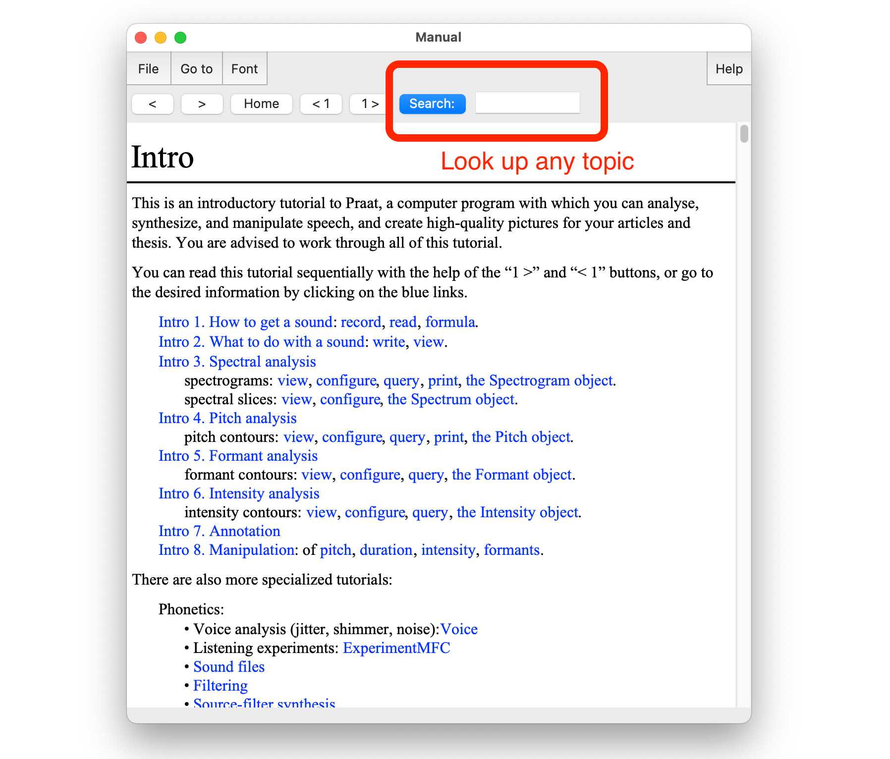
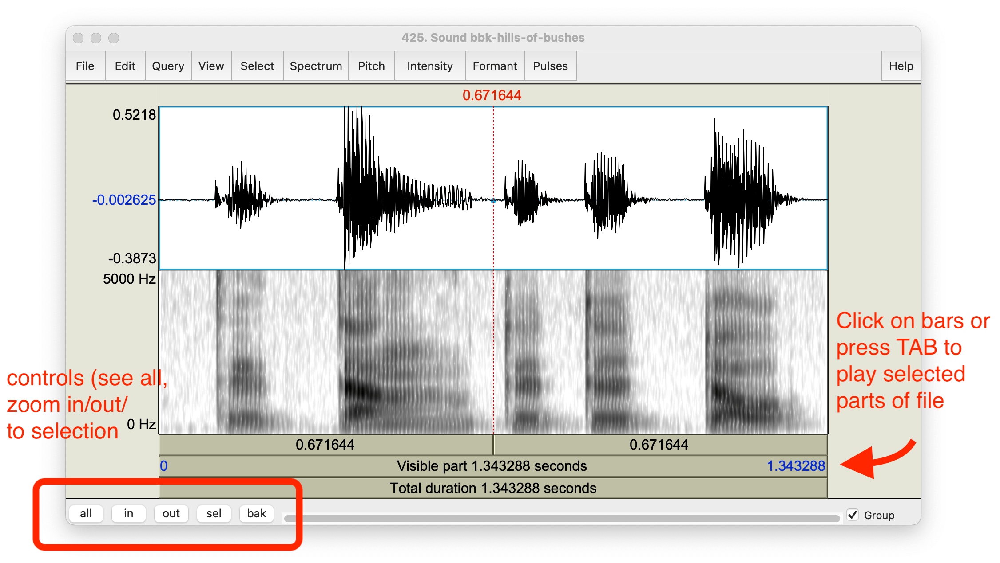

% [verb]ing phonetics: workshop 1
% Banto1d, 23 March 2022
% Universität Hamburg 
  Matthew Faytak 
  Katie Franich

## Overview

Part 1:

* Assumptions
* Why (instrumental) phonetics?
* Acoustic data
	* Using Praat
	* Types of measurements

Part 2:

* Articulatory data
* Data management
* Using the data
* Open discussion period

## About the slides

These slides are a **web page**

* Use right, left arrow keys to navigate (or click to advance)
* Press "A" to see all slides at once, and "A" again to go back to slide view
* Links are formatted like <a href="https://www.youtube.com/watch?v=eVaUDAqrpKk">this</a>
* References look like This (1985)
* All references have links provided in the bibliography

The slides are hosted <a href="https://github.com/mfaytak/afriphon">here</a> on GitHub

* Along with all associated media
* This slideshow's URL is <a href="https://mfaytak.github.io/afriphon/btd-1.html">mfaytak.github.io/afriphon/btd-1.html</a>

# Some assumptions

## Participants

We presume that you are:

* Employed by, or trained at, a university on the African continent (sub-Sahara)
* Researching in a low-resource context
	* External grants are uncommon
	* Institutional support is low
* Familiar with phonetics in theory, but not necessarily in practice

If you are not in this group, we ask that you **prioritize** those in this group for questions and feedback

## All of us

Let's assume that we are all committed to:

* Improving empirical **coverage** of African languages' sound structures
* Building speech data **resources** for African languages
	* Ethos: "some data is better than no data"
	* Important as starting point for technical development
* Developing **capacity** for an African phonetics practice
* Doing these in a way which is adapted to local needs and demands

# Why phonetics?

## Definitions

This workshop is an introduction to **instrumental** phonetics

* Relying on instrumental readouts for analysis
* Not exclusively **impressionistic**: using the ear and transcribing speech sounds

"Phonetic" work may also refer to non-contrastive **subphonemic detail**

* *The specific way* a phonemic contrast is produced
* This is also important here, but we are focusing on instrumental methods

## Why instrumental phonetics?

Several practical advantages over impressionistic approaches

* **Neutrality** in the face of analytical and perceptual bias
* **Precision** and reliability in detecting  contrasts
* **Community use** of the created data

## Neutrality

In impressionistic phonological description, all presentation of data is filtered through the worker's theoretical analysis 

* For example: autosegmental representations often make transcriptions more abstract Hyman (2014):545

Phonetic recordings allow better testing of hypotheses about phonological structure

* Recordings do not intrinsically involve an analysis, and can be reanalyzed at a later date
* Transcribed data (being analyzed) is much harder to use for this purpose

## Neutrality

Even a trained phonetic ear is prone to making occasional mistakes based on **perceptual bias**

* For example: nasal consonant codas are more often misidentified after non-low vowels Zee (1981)

* Transcription mistakes permanently enter the record

## Precision

Not all contrasts can be easily described by the analyst's ear, especially in the moment 

* Fine vowel contrasts (especially central vowels)
* Diphthongs versus consonant secondary articulation
* Prenasalization versus N+C clusters
* Subtle differences in tone level and contour
* Multiple downsteps/upsteps

Recordings allow for careful listening later

## Community use

Recordings are required for instrumental phonetic work: many incidental benefits

* Speaker community may access the data
	* Literacy development (teaching tools)
	* Technical development (speech resources)
* Community of scientific researchers may access the data
	* New analyses
	* Comparative work
* Analysis may be replicated

## Complementary methods

The aim is not to *displace* impression-based methods, but to *complement* them

* Transcription will always be needed at some level
* Our point is that it should not be *exclusively* relied on as the analytical object
* Whenever possible, transcriptions ought to be supplemented with recordings, visualizations of recordings, or instrumental measures as evidence
* Instrumental measures as "second opinion" for analysis

# Recording acoustic data

## Desired qualities

We always want acoustic speech data to be:

* Low in background **noise**
* Sufficiently **loud** against background noise, but not too loud
* Free of **echo**

Certain details of format are also important: 

* Record using a high **sampling rate**, at least 22.1 kHz
* Save in **non-compressed** format (such as **.WAV**; avoid .MP3)

## Good recording

<audio id="good" src="./assets/media/best-quality.wav"></audio>

Here is an example of a good recording

* <button onclick="document.getElementById('good').play()">"La plume de ma tante"</button>
* Speaker's voice is much louder than background, but is not *too* loud
* Background is free of avoidable noise
* Practically no echo

The following slides contain recordings which fail on one of the points above

## Too noisy

Recordings should not contain excessive background noise 

<audio id="noise2" src="./assets/media/noisy2.wav"></audio>
<audio id="scuff" src="./assets/media/scuffing.wav"></audio>

* <button onclick="document.getElementById('noise2').play()">Continuous noise</button> from a fan
* <button onclick="document.getElementById('scuff').play()">Intermittent noise</button> from touching the microphone

Any noise, however quiet to your ears in the moment, will be much louder in the recording later

## How to improve

Listen carefully to your surroundings, and avoid:

* Rain on the roof (especially metal roofs)
* Appliances (refrigerators, any motors or fans)
* Busy roads (trucks, taxis)
* Chickens, goats, children, etc.

Speaker should also minimize non-speech noise:

* Touching or scratching  microphone, or contacting shirt collar
* Producing background noises when emphatic (striking chest or table, clapping hands)
* Phone ringing or vibrating

## Too much echo

<audio id="echo1" src="./assets/media/echo1.wav"></audio>
<audio id="echo2" src="./assets/media/echo2.wav"></audio>

If echo is strong, speech ends up overlapping itself; problem for listening and analysis later

* <button onclick="document.getElementById('echo1').play()">Slight echo</button> (in tiled hallway)
* <button onclick="document.getElementById('echo2').play()">More echo</button>(in concrete stairwell)

How to improve: listen for echo and choose surroundings which have less

* "Soft" rooms reduce echo (couches, carpets, pillows, hanging clothes); tile, stone, and cement produce echo
* Record in the back seat of a car (motor off) if available
* Record outside if no suitable room exists

## Too loud (clipped)

<audio id="clip" src="./assets/media/clipping.wav"></audio>
<audio id="pop" src="./assets/media/popping.wav"></audio>

If the speaker is too loud and/or too close to the microphone, the device cannot respond enough; **clipping** results

* <button onclick="document.getElementById('clip').play()">Clipping of whole utterance</button>
* This can also happen for <button onclick="document.getElementById('pop').play()"> stops and fricatives only</button>, where the releases "pop" in the microphone

How to improve: make test recordings after you position your microphones

* If there is general clipping, microphone needs to be further away or speaker needs to be quieter
* If stops "pop", position microphone to the side of the mouth
* **Gain** can often be adjusted if you are using a recorder

## Equipment

Not much equipment required: something to make recordings on

* Laptop computer 
* Smartphone with recording app
	* "Awesome Voice Recorder X" (free with ads) is a good app
	* Others must definitely exist
* Hand recorder/memo recorder
* Professional recorder (Zoom H4N, etc)

A way of transferring files off of the device and storing for future analysis:

* SD card
* USB drive or external drive

Headphones, to check recording quality

## Equipment

External microphones can increase the quality of acoustic data by recording less echo and background noise

* Look for **cardioid** or **unidirectional** in the description if you are recording single speakers
* Recording public events may require an **omnidirectional** microphone

An acoustic baffle can reduce echo

* Soft, fluffy objects: blankets, sofas, etc.
* This can also be achieved by selecting the recording setting carefully, and using a cardioid microphone

## Other tips

Do not use computer noise reduction/filtering in general

* Go into your computer's sound settings and *turn this off*; make sure apps (i.e. Zoom) don't have separate filters
* Normal to hear slight "fuzz" in background, or very slight echo

Recording over **Zoom** works surprisingly well, if all else fails Ge, Mok, & Xiong (2021); Sanker et al (2021)

* Some *small* effects on the recording are noted
* Turn noise cancellation off if using to record (switch to "original sound")
* Better still to use the speaker's phone on their end to record, and use Zoom to supervise the process

# Basic Praat (tutorial)

## Downloading and configuring

Download Praat from <a href="https://fon.hum.uva.nl">fon.hum.uva.nl</a> or <a href="https://praat.org">praat.org</a>

* Mac: the .dmg file contains Praat.app (which you can run immediately) and the option to install
* If you have issues opening, see <a href="https://www.fon.hum.uva.nl/praat/download_mac.html">2. "How to Start"</a> here
* Windows: the .zip file contains Praat.exe, which you simply double-click to run (instructions <a href="https://www.fon.hum.uva.nl/praat/download_win.html">here</a> if needed)

## Help pages

Basic issues can often be solved using the manual

 

* The manual is also available online <a href="https://www.fon.hum.uva.nl/praat/manual/Manual.html">here</a>
* Other introductory guides can be found <a href="https://www.fon.hum.uva.nl/praat/manualsByOthers.html">here</a>

## First recording

Let's record ourselves saying a "good day, good afternoon" greeting in whichever language you would like

 

* Make sure you "save to list" before closing the recorder!

## Stored sound

You should now have a Sound in your **objects** window

* Select the Sound object and a menu will appear to the right
* Click "Play" to hear your sound

## Saving your recording

We'll end this by saving our work as a .WAV file (the standard format for phonetics work)

* The file is not yet saved, only *stored* in Praat
* If you close Praat without saving the file, it will vanish

## Importing a sound file

<audio id="bush" src="./assets/media/bbk-hills-of-bushes.wav"></audio>

We might also **import** sounds which have already been recorded

* Download <a href="./assets/media/bbk-files.zip">this ZIP file</a> (673 KB), which contains all of the files we'll use
* Use the "Open" dialogue to open **bbk-hills-of-bushes.wav**
* That file contains one utterance of Babanki <button onclick="document.getElementById('bush').play()"> [tə̀tāŋ tə́ tə́ꜜtóʔ]</button> "hills of bushes" from Faytak & Akumbu (2021)

# Making and using TextGrids

## Viewing a sound file

We'll start by viewing Babanki <button onclick="document.getElementById('bush').play()"> [tə̀tāŋ tə́ tə́ꜜtóʔ]</button> "hills of bushes"

* Select the Sound and click "View and Edit" in the right menu
* Note controls (zoom in, zoom out, scroll)
* Select by clicking, SHIFT-clicking, or clicking and dragging in sound
* Press TAB to play, or click bar below window

We lack useful landmarks at this point

* Each "blob" is a syllable
* We may wish to know where the words and segments are
* No indication of tones (yet)

## Making a TextGrid

**TextGrids** are one of the most useful features of Praat: annotate and organize your audio files

* Using the menu as shown below, we'll make a TextGrid for our Babanki sound object

 

## Interval tiers

Let's use the **interval tier** "sentence" and use it to transcribe the utterance

* Contains a list of ranges in time separated by boundaries
* Useful for marking off words, utterances, and some vowels and consonants
* Here, click before the beginning and after the end of the utterance, then type a transcription or translation in the middle

## Point tiers

Let's use the **point tier** "stop" to mark off where each [t] release happens

* Contains a list of points in time
* Useful for instantaneous events
* Note that *intervals are generally more useful* for most segments
* Can't click and highlight range like interval tier 

## Adding and removing tiers

We might be dissatisfied with how the tone marks are displaying; we could make a new tier for tones (autosegmental style)

 

Amending the TextGrid using the new tier:

## Saving TextGrids

Using CTRL+S or the menu shown below, you must *save* your TextGrid when you are done

* If you close Praat without saving your TextGrid, it will vanish
* Much like recorded audio files which are stored in the object list

# Reading our data

## Data displays

We may wish to provide further details in our TextGrids, but we encounter another problem here: how to interpret the data?

* Praat shows **waveforms** and **spectrograms**
* Note the simpler TextGrid (segments, tones); **bbk-hills-of-bushes.TextGrid** in downloaded files

## Waveforms

Sound pressure vs. time

* The pressure the sound waves make on the microphone
* We expect any sound signal to *oscillate*

Sometimes this is **periodic** (repeating pattern); other times this is **aperiodic** (no clear pattern)

## Sonority

Sounds produced with a more open mouth are *louder* and  more sonorous Parker (2008) ; these are *thicker* on the waveform

## Interpreting waveforms

Durational measures (trivially)

Voicing

## Spectrograms

We can also show the **spectrogram** for our recording

* Breaks down our waveform to give us information about the **sound spectrum**

Spectrograms show time vs. **frequency** vs. sound pressure (color) 

* The darker the region, the more energy there is

## Interpreting spectrograms

**Vowels**, **semivowels**, and **approximants** have characteristic striping, horizontally and vertically

* Voicing cycle is visible vertically
* **Formants** are clearly visible horizontally

**Fricatives** have high-frequency or low-frequency noise

* Dark smudges across entire portions of spectrogram
* The further back the fricative, the lower the frequency

**Stops** show an absence of (most) energy followed by a **burst** across the whole spectrum

## Interpreting spectrograms

**Nasals** look somewhat like vowels, with "smudged" formants and less energy (darkness)

# Exporting data objects

## Picture window

Spectrograms and waveforms can be **drawn** in the picture window

## Drawing

## Painting

## "Garnishing"

## Drawing TextGrid annotation

## Saving figures

# Duration

## What is it for?

Duration of segments, subsegments; timing of tones

Laryngeal contrasts (how long is aspiration of stop), gemination, vowel length, etc.

## How to

Get times; log as tabular data (t1, t2, dur)

## Example

Pius data?

# Pitch and intensity

## What are they for?

f0 signals pitch (tone) - all sorts of phenomena

* Downstep, downdrift, pitch reset, lexical tone contrasts, intonation, etc

intensity is useful for a range of properties (cons lenition, stress, etc)

## How to

Turn on "show pitch"; query pitch (f0)

Exactly parallel for intensity

Pius examples

* Change defaults to 70-140 Hz to reflect speaker's pitch range

## Drawing figures

f0 and intensity tracks can be added to figures

* Suggest not overlapping, but rather putting above/below
* Annotation with TextGrids like before

# Formants

## What are they for?

Formant frequencies provide **vowel quality** and other contrasts

* F1 inversely relates to height
* F2 inversely relates to backness
* F3 directly relates to retroflexion, etc.

Formant transitions; lateral and nasal quality, etc.

## How to

Turn on "show formants"

Query formant listing

## Formant estimation

Unlike the other measures, formant estimation often requires calibration to individuals

* Speakers with low f0 need different settings compared to speakers with higher f0
* Children (with very high f0) can be especially difficult
* Often, different settings are needed for front and back vowels (especially back rounded vowels)

Adjust ceiling, adjust number of formants

## Formant figures

Formants work best in an F1-F2 plot (which is not made in Praat), but formant tracks can be drawn like any other measure

## References {.bib}

Faytak, M., & Akumbu, P. W. (2021). Kejom (Babanki). *Journal of the International Phonetic Association*, 51(2), 333-354. <a href="https://doi.org/10.1017/S0025100319000264">Article</a>

Ge, C., Xiong, Y., & Mok, P. (2021). How reliable are phonetic data collected remotely? Comparison of recording devices and environments on acoustic measurements. In *Proc Interspeech 2021*, 1683-1687. <a href="http://ling.cuhk.edu.hk/people/peggy/GeXiongMok_Interspeech2021.pdf">PDF</a>

Hyman, L. (2014). How to study a tone language. *Language Documentation & Conservation*, 8, 525-562. <a href="https://scholarspace.manoa.hawaii.edu/handle/10125/24624">Article</a>

Parker, S. (2008). Sound level protrusions as physical correlates of sonority. *Journal of Phonetics*, 36(1), 55-90. <a href="https://doi.org/10.1016/j.wocn.2007.09.003">Abstract</a>

Sanker, C., Babinski, S., Burns, R., Evans, M., Johns, J., Kim, J., Smith, S., Weber, N., & Bowern, C. (2021). (Don't) try this at home! The effects of recording devices and software on phonetic analysis. *Language*, 97(4), e360-e382. <a href="https://muse.jhu.edu/article/840967/pdf">PDF</a>

Zee, E. (1981). Effect of vowel quality on perception of post–vocalic nasal consonants in noise. *Journal of Phonetics*, 9(1), 35-48. <a href="https://doi.org/10.1016/S0095-4470(19)30925-8">Abstract</a>
