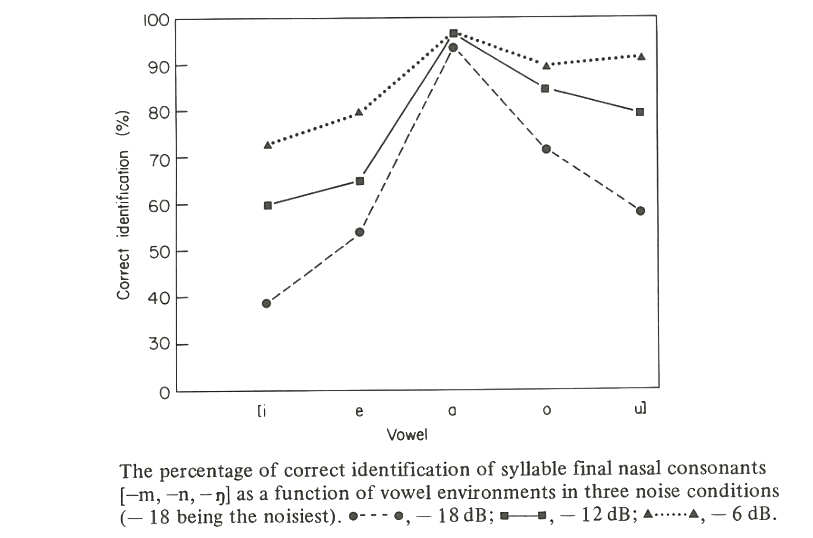
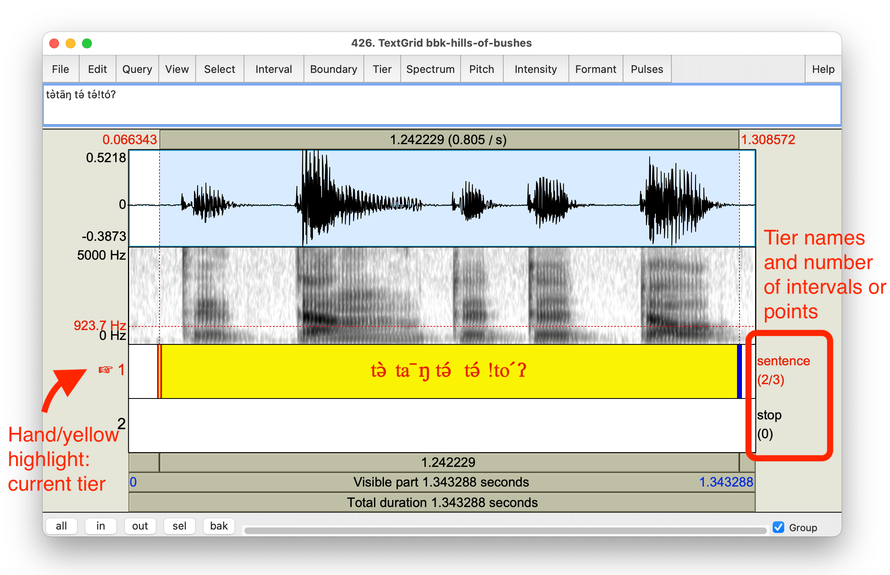
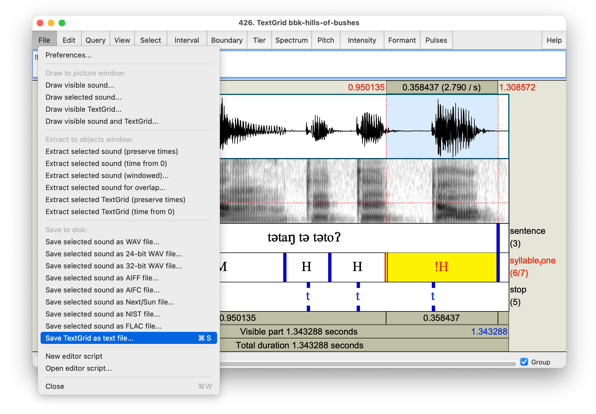
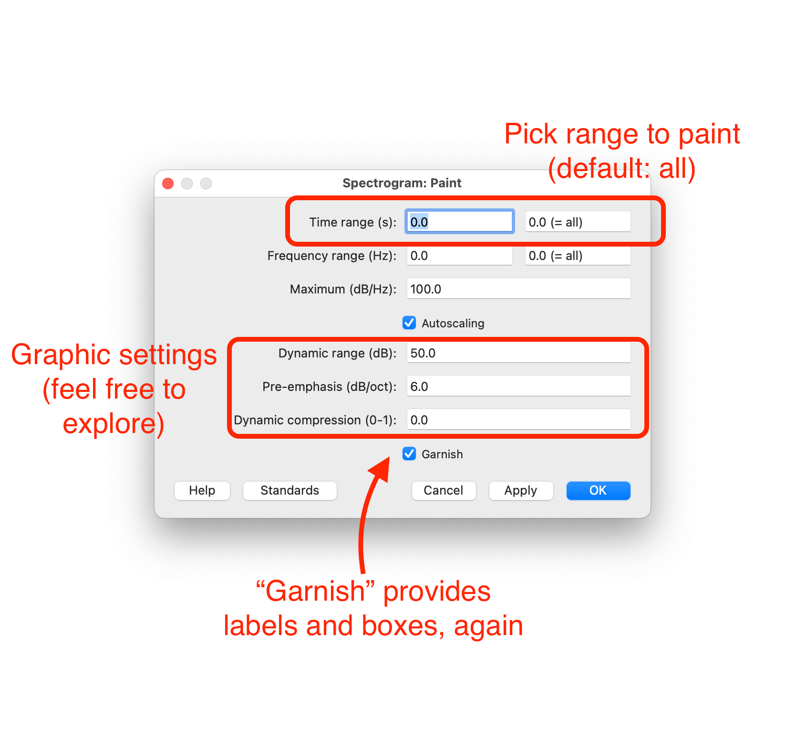
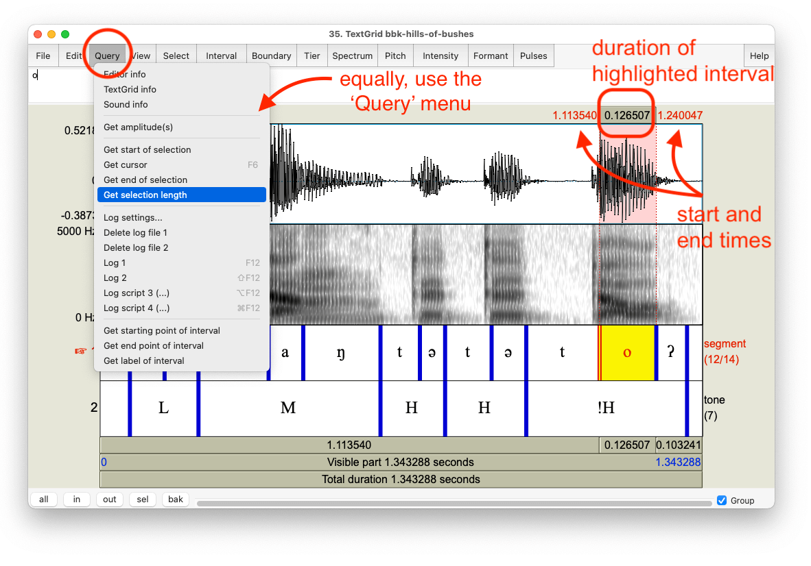
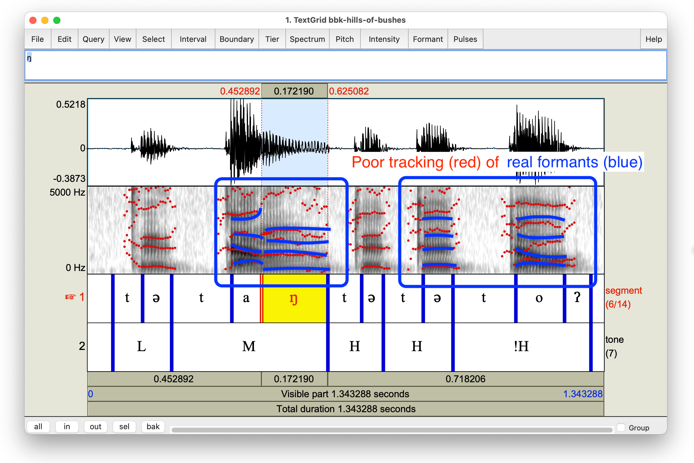
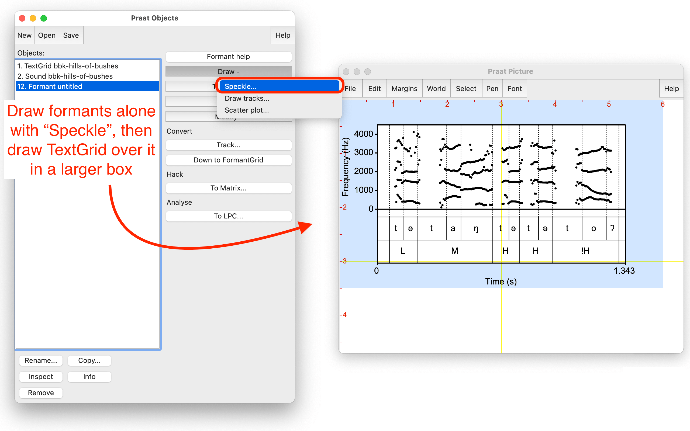

% [verb]ing phonetics: workshop 1
% Banto1d, 23 March 2022
% Universität Hamburg 
  Matthew Faytak 
  Katie Franich

## Overview

Part 1:

* Assumptions
* Why (instrumental) phonetics?
* Acoustic data
	* Using Praat
	* Types of measurements

Part 2:

* Articulatory data
* Data management
* Using the data
* Open discussion period

## About the slides

These slides are a **web page**

* Use right, left arrow keys to navigate (or click to advance)
* Press "A" to see all slides at once, and "A" again to go back to slide view
* Links are formatted like <a href="https://www.youtube.com/watch?v=eVaUDAqrpKk">this</a>
* References look like This (1985)
* All references have links provided in the bibliography

The slides are hosted <a href="https://github.com/mfaytak/afriphon">here</a> on GitHub

* Along with all associated media
* This slideshow's URL is <a href="https://mfaytak.github.io/afriphon/btd-1.html">mfaytak.github.io/afriphon/btd-1.html</a>

# Some assumptions

## Participants

We presume that you are:

* Employed by, or trained at, a university on the African continent (sub-Sahara)
* Researching in a low-resource context
	* External grants are uncommon
	* Institutional support is low
* Familiar with phonetics in theory, but not necessarily in practice

If you are not in this group, we ask that you **prioritize** those in this group for questions and feedback

## All of us

Let's assume that we are all committed to:

* Improving empirical **coverage** of African languages' sound structures
* Building speech data **resources** for African languages
	* Ethos: "some data is better than no data"
	* Important as starting point for technical development
* Developing **capacity** for an African phonetics practice
* Doing these in a way which is adapted to local needs and demands

# Why phonetics?

## Definitions

This workshop is an introduction to **instrumental** phonetics

* Relying on instrumental readouts for analysis
* Not exclusively **impressionistic**: using the ear and transcribing speech sounds

"Phonetic" work may also refer to non-contrastive **subphonemic detail**

* *The specific way* a phonemic contrast is produced
* This is also important here, but we are focusing on instrumental methods

## Why instrumental phonetics?

Several practical advantages over impressionistic approaches

* **Neutrality** in the face of analytical and perceptual bias
* **Precision** and reliability in detecting  contrasts
* **Community use** of the created data

## Neutrality

In impressionistic phonological description, all presentation of data is filtered through the worker's theoretical analysis 

* For example: autosegmental representations often make transcriptions more abstract Hyman (2014):545

Phonetic recordings allow better testing of hypotheses about phonological structure

* Recordings do not intrinsically involve an analysis, and can be reanalyzed at a later date
* Transcribed data (being analyzed) is much harder to use for this purpose

## Neutrality

Even a trained phonetic ear is prone to making occasional mistakes based on **perceptual bias**

* For example: nasal consonant codas are more often misidentified after non-low vowels Zee (1981)

* Transcription mistakes permanently enter the record

## Precision

Not all contrasts can be easily described by the analyst's ear, especially in the moment 

* Fine vowel contrasts (especially central vowels)
* Diphthongs versus consonant secondary articulation
* Prenasalization versus N+C clusters
* Subtle differences in tone level and contour
* Multiple downsteps/upsteps

Recordings allow for careful listening later

## Community use

Recordings are required for instrumental phonetic work: many incidental benefits

* Speaker community may access the data
	* Literacy development (teaching tools)
	* Technical development (speech resources)
* Community of scientific researchers may access the data
	* New analyses
	* Comparative work
* Analysis may be replicated

## Complementary methods

The aim is not to *displace* impression-based methods, but to *complement* them

* Transcription will always be needed at some level
* Our point is that it should not be *exclusively* relied on as the analytical object
* Whenever possible, transcriptions ought to be supplemented with recordings, visualizations of recordings, or instrumental measures as evidence
* Instrumental measures as "second opinion" for analysis

# Recording acoustic data

## Desired qualities

We always want acoustic speech data to be:

* Low in background **noise**
* Sufficiently **loud** against background noise, but not too loud
* Free of **echo**

Certain details of format are also important: 

* Record using a high **sampling rate**, at least 22.1 kHz
* Save in **non-compressed** format (such as **.WAV**; avoid .MP3)

## Good recording

<audio id="good" src="./assets/media/best-quality.wav"></audio>

Here is an example of a good recording

* <button onclick="document.getElementById('good').play()">"La plume de ma tante"</button>
* Speaker's voice is much louder than background, but is not *too* loud
* Background is free of avoidable noise
* Practically no echo

The following slides contain recordings which fail on one of the points above

## Too noisy

Recordings should not contain excessive background noise 

<audio id="noise2" src="./assets/media/noisy2.wav"></audio>
<audio id="scuff" src="./assets/media/scuffing.wav"></audio>

* <button onclick="document.getElementById('noise2').play()">Continuous noise</button> from a fan
* <button onclick="document.getElementById('scuff').play()">Intermittent noise</button> from touching the microphone

Any noise, however quiet to your ears in the moment, will be much louder in the recording later

## How to improve

Listen carefully to your surroundings, and avoid:

* Rain on the roof (especially metal roofs)
* Appliances (refrigerators, any motors or fans)
* Busy roads (trucks, taxis)
* Chickens, goats, children, etc.

Speaker should also minimize non-speech noise:

* Touching or scratching  microphone, or contacting shirt collar
* Producing background noises when emphatic (striking chest or table, clapping hands)
* Phone ringing or vibrating

## Too much echo

<audio id="echo1" src="./assets/media/echo1.wav"></audio>
<audio id="echo2" src="./assets/media/echo2.wav"></audio>

If echo is strong, speech ends up overlapping itself; problem for listening and analysis later

* <button onclick="document.getElementById('echo1').play()">Slight echo</button> (in tiled hallway)
* <button onclick="document.getElementById('echo2').play()">More echo</button>(in concrete stairwell)

How to improve: listen for echo and choose surroundings which have less

* "Soft" rooms reduce echo (couches, carpets, pillows, hanging clothes); tile, stone, and cement produce echo
* Record in the back seat of a car (motor off) if available
* Record outside if no suitable room exists

## Too loud (clipped)

<audio id="clip" src="./assets/media/clipping.wav"></audio>
<audio id="pop" src="./assets/media/popping.wav"></audio>

If the speaker is too loud and/or too close to the microphone, the device cannot respond enough; **clipping** results

* <button onclick="document.getElementById('clip').play()">Clipping of whole utterance</button>
* This can also happen for <button onclick="document.getElementById('pop').play()"> stops and fricatives only</button>, where the releases "pop" in the microphone

How to improve: make test recordings after you position your microphones

* If there is general clipping, microphone needs to be further away or speaker needs to be quieter
* If stops "pop", position microphone to the side of the mouth
* **Gain** can often be adjusted if you are using a recorder

## Equipment

Not much equipment required: something to make recordings on

* Laptop computer 
* Smartphone with recording app
	* "Awesome Voice Recorder X" (free with ads) is a good app
	* Others must definitely exist
* Hand recorder/memo recorder
* Professional recorder (Zoom H4N, etc)

A way of transferring files off of the device and storing for future analysis:

* SD card
* USB drive or external drive

Headphones, to check recording quality

## Equipment

External microphones can increase the quality of acoustic data by recording less echo and background noise

* Look for **cardioid** or **unidirectional** in the description if you are recording single speakers
* Recording public events may require an **omnidirectional** microphone

An acoustic baffle can reduce echo

* Soft, fluffy objects: blankets, sofas, etc.
* This can also be achieved by selecting the recording setting carefully, and using a cardioid microphone

## Other tips

Do not use computer noise reduction/filtering in general

* Go into your computer's sound settings and *turn this off*; make sure apps (i.e. Zoom) don't have separate filters
* Normal to hear slight "fuzz" in background, or very slight echo

Recording over **Zoom** works surprisingly well, if all else fails Ge, Mok, & Xiong (2021); Sanker et al (2021)

* Some *small* effects on the recording are noted
* Turn noise cancellation off if using to record (switch to "original sound")
* Better still to use the speaker's phone on their end to record, and use Zoom to supervise the process

# Basic Praat (tutorial)

## Downloading and configuring

Download Praat from <a href="https://fon.hum.uva.nl">fon.hum.uva.nl</a> or <a href="https://praat.org">praat.org</a>

* Mac: the .dmg file contains Praat.app (which you can run immediately) and the option to install
* If you have issues opening, see <a href="https://www.fon.hum.uva.nl/praat/download_mac.html">2. "How to Start"</a> here
* Windows: the .zip file contains Praat.exe, which you simply double-click to run (instructions <a href="https://www.fon.hum.uva.nl/praat/download_win.html">here</a> if needed)

## Windows and manual

Both the **object window** (shown below) and **picture window** appear when you open Praat (we'll ignore the picture window for now)

Basic issues can often be solved using the manual

 

* The manual is also available online <a href="https://www.fon.hum.uva.nl/praat/manual/Manual.html">here</a>
* Other introductory guides can be found <a href="https://www.fon.hum.uva.nl/praat/manualsByOthers.html">here</a>

## First recording

Let's record ourselves saying a "good day, good afternoon" greeting in whichever language you would like

 

* Make sure you "save to list" before closing the recorder!

## Stored sound

You should now have a Sound in your **objects** window

* Select the Sound object and a menu will appear to the right
* Click "Play" to hear your sound

## Saving your recording

We'll end this by saving our work as a .WAV file (the standard format for phonetics work)

* The file is not yet saved, only *stored* in Praat
* If you close Praat without saving the file, it will vanish

## Importing a sound file

<audio id="bush" src="./assets/media/bbk-hills-of-bushes.wav"></audio>

We might also **import** sounds which have already been recorded

* Download <a href="./assets/media/bbk-files.zip">this ZIP file</a> (673 KB), which contains all of the files we'll use
* Use the "Open" dialogue to open **bbk-hills-of-bushes.wav**
* That file contains one utterance of Babanki <button onclick="document.getElementById('bush').play()"> [tə̀tāŋ tə́ tə́ꜜtóʔ]</button> "hills of bushes" from Faytak & Akumbu (2021)

# Making and using TextGrids

## Viewing a sound file

We'll start by viewing Babanki <button onclick="document.getElementById('bush').play()"> [tə̀tāŋ tə́ tə́ꜜtóʔ]</button> "hills of bushes"

* Select the Sound and click "View and Edit" in the right menu

Viewer window has button and keyboard controls

* Select by clicking, SHIFT-clicking, or clicking and dragging in sound
* Press TAB to play selected sound, or click bar below window
* Control buttons (zoom in, zoom out, scroll) are at lower left
* Keyboard shortcuts: CTRL+ (PC) or Command+ (Mac)...
	* A: zoom out to all
	* N: zoom to selection
	* I: zoom in
	* O: zoom out

We may wish to know where the words and segments are, but we lack useful landmarks at this point

* Each "blob" is a syllable
* No indication of tones (yet)

## Making a TextGrid

**TextGrids** are one of the most useful features of Praat: annotate and organize your audio files

* Using the menu as shown below, we'll make a TextGrid for our Babanki sound object

 

## Interval tiers

Let's use the **interval tier** "sentence" and use it to transcribe the utterance

* Contains a list of ranges in time separated by boundaries
* Useful for marking off words, utterances, and some vowels and consonants
* Here, click before the beginning and after the end of the utterance, then type a transcription or translation in the middle

## Point tiers

Let's use the **point tier** "stop" to mark off where each [t] release happens

* Contains a list of points in time
* Useful for instantaneous events
* Note that *intervals are generally more useful* for most segments
* Can't click and highlight range like interval tier 

## Adding and removing tiers

We might be dissatisfied with how the tone marks are displaying; we could make a new tier for tones (autosegmental style)

 

Amending the TextGrid using the new tier:

## Saving TextGrids

Using CTRL+S or the menu shown below, you must *save* your TextGrid when you are done

* If you close Praat without saving your TextGrid, it will vanish
* Much like recorded audio files which are stored in the object list

# Reading our data

## Data displays

We may wish to provide further details in our TextGrids, but we encounter another problem here: how to interpret the data?

* Praat shows **waveforms** and **spectrograms**
* Note the simpler TextGrid (segments, tones); **bbk-hills-of-bushes.TextGrid** in downloaded files

## Waveforms

**Waveforms** show sound pressure (the pressure that sound waves make on the microphone) versus time

* We expect any **voiced** speech signal to *oscillate* because the vocal folds open and close in a repeating pattern
* Other **voiceless** sounds show no movement away from "zero line" and no clear oscillation

## Sonority

Sounds produced with a more open mouth are *louder* and  more sonorous Parker (2008) ; these are *thicker* on the waveform

## Spectrograms

We can also show the **spectrogram** for our recording

* Breaks down our waveform to give us information about the **sound spectrum** and where its energy is (high or low frequency)

Spectrograms are three-dimensional, and show time vs. **frequency** vs. sound pressure (color) 

* The darker the spectrogram (and the thicker the waveform), the more sound pressure there is

* Think of it as an elevation map (Mt. Cameroon pictured)

## Interpreting spectrograms

**Vowels**, **semivowels**, and **approximants** have characteristic striping, horizontally and vertically

* Voicing is visible as vertical stripes in vowels, and as a small "bar" at bottom
* **Formants** are clear horizontal bands above the voicing bar

## Interpreting spectrograms

**Nasals** look somewhat like vowels, with "smudged" formants and less energy (darkness)

* Due to the opening of the velum: nasal cavity "muffles" the sound
* Much like soft objects in a room muffle echo

## Interpreting spectrograms

**Fricatives** have high-frequency or low-frequency noise

* Dark irregular smudges across entire areas of spectrogram
* The further back the fricative, the lower the average frequency
* Compare [s] and [ʒ]: [s] is further front, has higher frequency, sits higher on spectrogram

## Interpreting spectrograms

**Stops** show an absence of (most) energy followed by a **burst** across the whole spectrum

**Affricates** look similar, but as if they were followed by a fricative

* From Babanki [kə̀dʒóm] 'Babanki' Faytak & Akumbu (2021)

## Prenasalized segments

Prenasalized stops and affricates often have a *long nasal closure* followed by a *short oral closure* which we can see clearly in the spectrogram

* Note the "smudged" energy goes away when oral closure begins in [ⁿpfʲ] below
* From Babanki [kə̀ⁿpfʲɨ́ŋ] 'owl' Faytak & Akumbu (2021)

# Drawing figures

## Why make figures?

Figures are an easy way to present a small amount of phonetic data in scientific papers

* Give support to phonological judgments
* Support particular transcriptions
* Provide more detail for any especially unusual sounds or sound contrasts

This section: professional-looking and informative data displays

## Picture window

Waveforms and spectrograms can be "drawn" or "painted" (respectively) in the **picture window**

* This also opened when you open Praat; we'll stop ignoring it now
* The blue rectangle indicates the *plot area* where the figure will be drawn: change size by clicking and dragging as needed

## Drawing a waveform

"Draw" (in the object window) is for any line-based drawings, including waveforms

* Select a Sound to draw its waveform

The result: a waveform drawn within the plot area

## Drawing a TextGrid

TextGrids can be drawn as well, using the same menu as Sounds

* By default, they appear with an empty space above them

## Combining TextGrids and waveforms

A Sound and TextGrid can be drawn together very easily: simply **select both** and choose the Draw menu as before

* Adds TextGrid annotation to the waveform drawing

## Extracting a spectrogram

"Paint" is for drawing spectrograms and other objects, but: we need the right **object** to do this

* Select Sound and click "View and Edit"
* Select from the Spectrum menu "Extract visible spectrogram"

## Painting a spectrogram

This sends a Spectrogram object to the object list; when we select this we get a "Paint" option under Draw

The result: as expected, but a bit too tall for its width (make plot area wider/shorter)

## Spectrograms and TextGrids

Drawing a spectrogram and a TextGrid at the same time is a bit more complicated

1. Paint the spectrogram, but **uncheck "Garnish"**
2. Add the Y axis marks using the "Margins" menu

 

3. Add a Y axis label, usually "Frequency (Hz)"
* I've also added a box around the plot here with "Margins" > "Draw Inner Box"

 

## Spectrograms and TextGrids

3. **Resize** plot area to be  taller than spectrogram (pictured), and Draw the TextGrid

The result: TextGrid annotations on top of the spectrogram

## Saving

As with everything else in Praat, you must **save** before closing the picture window or you will lose your work

* If you don't keep the plot area in the same place (covering your figure or margins), you won't save the entire figure

# Measuring phonetic properties

## Why numerical measurements?

Now we'll turn to **taking numerical measurements** in Praat

* Actual calculation
* Displaying **figures** of these measurements
* Storing measurements as **tabular data** (at the end)

More than showing an entire sound file as a waveform or spectrogram, focusing on a specific phonetic property can be useful

* Make a figure for this specific property 
* Focus on topic of interest for your discussion
* Display with a TextGrid, a waveform, etc.

## Why numerical measurements?

Also lets us measure many utterances and **summarize**, which also allows us to handle **phonetic variation**

* Languages differ in their phonetic implementation of the "same" segments
* Speakers of the same language produce it differently depending on their history, social stance, etc
* Even phonologically identical words can differ slightly phonetically Gahl (2008)

Because of this it's best to collect **many observations** and **average** or **model** the data to remove noise and variation

* Multiple speakers
* Multiple repetitions
* Multiple words

## Duration

One of the simplest measures: **duration** of segments or words

* Simply ending time of the interval minus its starting time ($t_2 - t_1$), in seconds
* Two ways to acquire this in Praat: 
	* Displayed in viewing window when you select an interval
	* If you use the "Query" menu, a text box appears which you can copy-paste the value from

## Model use

Duration of segments and subsegments

* Duration of closure vs. release (voice onset time)
* Gemination and vowel length

An example from Babanki (**bbk-prenas.wav**): proportion of prenasalized consonants which is nasal Faytak & Akumbu (2021)

* Not uncommon for continuants to stop up when prenasalized, e.g. /ⁿz/ > [ndz]
* But /ⁿz/ and /ⁿdz/ (etc.) are contrastive in Babanki
* Babanki speakers produce *shorter, lighter prenasalization* before continuants
* This may help to avoid merger of continuants and non-continuants

## Model use

(other papers - prosodic factors?)

## Pitch (fundamental frequency, f0)

Pitch (and all other measurements we'll talk about) have a dedicated **menu** 

* Turn on "show pitch" to use all other options
* **f0 track** appears over spectrogram (below) when "showing"

## Pitch settings

**Settings** for pitch are important

* If pitch range is not suited to the speaker, fake jumps in pitch can appear
* Below, the low-falling tone has a fake jump, well above H for this speaker!
* From our prior knowledge of the language we should **overrule** Praat

## Pitch settings

A quick change to pitch range fixes the jump issue 

* In "Settings..." under the Pitch menu
* The pitch range was too high for the speaker, so we lower the pitch floor

* This handles the low tones better

* If jumps don't go away, the "Advanced pitch settings..." window offers some options

## Model use

<audio id="schwa" src="./assets/media/bbk-schwa.wav"></audio>

All tonal phenomena involve f0

* Lexical tone, downstep, downdrift, pitch reset, tone depression, lexical tone contrasts
* Intonation (question formation, etc)

Babanki example in <button onclick="document.getElementById('schwa').play()"> bbk-schwa.wav</button>: 

* Prefixal L ( və̀-lɨ́m "males") behave differently from stem L (bə̀lâŋ "plank") when between two Hs
	* Third word is bə́lə̀ŋ "groundnut"
* HL(prefix)H raises to mid: HM(prefix)H Akumbu (2019)

## Model use

<audio id="aboro" src="./assets/media/Part2_5_Rialland_Embosi_fig01.wav"></audio>

Sub-phonemic effects of intonation on tonemes can be examined figure from Rialland & Aborobongui (2016)

* Boundary tones (%) indicate sentence type
* Effect of L% on lexical H in <button onclick="document.getElementById('aboro').play()"> the example below</button>

(other papers)

## Intensity

A measure of **loudness**, measured in decibels (dB)

* Intensity menu and settings are exactly parallel to Pitch menu and settings

* The yellow intensity track can be hard to spot
* Higher parts of track match darker parts of spectrogram and thicker parts of waveform

## Model use

Intensity is useful for measuring degree of constriction

* Degree of consonant constriction (or lenition)
* Prosodic factors such as stress (in many languages)

Babanki example: stressed (stems) and unstressed (prefixes) don't seem to be differentiated by intensity

* But stem H has a longer duration

## Model use

(other papers - prosody? lenition?)

## f0 and intensity figures

f0 (pitch) and intensity tracks can easily be Drawn to figures as seen above

* In "Pitch" and "Intensity" menus, there is the option to Draw directly to the Picture window with or without a TextGrid
* Best to combine with a TextGrid whenever possible
* Below: pitch contour for Kejom <button onclick="document.getElementById('bush').play()"> [tə̀tāŋ tə́ tə́ꜜtóʔ]</button> "hills of bushes" from Faytak & Akumbu (2021) 

## Formant frequencies

Formant frequencies provide **vowel quality** and other contrasts

* Formant transitions show place of consonants 
* Lateral and nasal quality, etc.

## Formant frequencies

Turn on "show formants", and formant tracks for the first three formants (F1, F2, F3) appear

* All have some inverse relationship with a property $x$: the higher the frequency, the less $x$
* F1 inversely relates to height (higher F1 = lower vowel)
* F2 inversely relates to backness (higher F2 = fronter vowel)
* F3 inversely relates to retroflexion (low F3 = more retroflexion) and other qualities

## Formant settings

Estimating formant frequencies requires calibration for every individual speaker: low pitched voices need different settings compared to high pitched voices

* Often simplified to "men" versus "women", but there is a lot of variation in pitch for each
* Children (with very high f0) can be especially difficult

The default settings work well for **higher-pitched voices**

* Lower-pitched voices need **fewer formants** and a **lower maximum frequency**

## Formant tracking

The default settings of 5 formants in 5500 Hz (for higher-pitched voices) don't work well for the very low-pitched voice of the Babanki speaker:

Better: changed to 4.5 formants, 4200 Hz; much lower frequency range

## Formant figures

Formant tracks work best in a plot of F1 against F2 (which is quite hard to make in Praat), but formant tracks can be drawn like any other measure

* Draw separately from TextGrid and "un-garnish"
* Much like we did for the spectrogram + TextGrid combination
* "Speckle" under "Draw" produces this from an extracted Formant object

## F1-F2 scatterplots

F1-F2 scatterplots have F2 on the $x$ axis, F1 on the $y$ axis, with both axes **reversed** 

* Praat does have a *limited* ability to make scatterplots
* Must manually specify plot size
* Can only use these four point types: x + o .
* Limited ability to label or make legends

## Model use 

Better scatterplot figures can be made using tabular data (see next section) figure from Faytak & Akumbu (2021)

* Here, ellipses indicate where each cloud of points is centered

* With this plot it becomes clear why we reverse the axes: vowel space resembles the IPA vowel trapezoid

## Model use 

More examples: scatterplots with points showing?

## Voicing ("Pulses")

Praat also detects measures relating to **voicing**: these are grouped under the unintuitive name "Pulses"

* So called because voicing produces repeating, pulsing sounds
* Detecting voicing = detecting regular pulses in the sound signal

The Pulses menu contains the same "showing", measure-getting, and drawing functions as other menus

The result: each detected "voice pulse", shown over waveform

## Display pulses

The pulses themselves can be plotted with a TextGrid like any other similar object

* Shaded areas indicate area where voice pulses occur repeatedly
* Functions like a "voicing detector"

## Voicing report

If voicing has a predictable timing but varies in extent, the **voicing report** may be useful (access in the Pulses menu)

* Specifically the number after "Fraction of locally unvoiced frames"

## Model use

Are there any papers using voicing data from Praat??

# Text output

## Tabular data

The most effective way to store numerical measurements is important: **tabular data**, that is, **spreadsheets**

* One observation (time point, segment, etc) per row
* One measure per column
* Name columns using the first row
* Other columns give non-numerical information (speaker ID, segment, word, etc.)

Excel or Google Drive work well (.xls, .txt, or .csv format):

sample tabular data

## Pitch

* "Get pitch" (mean f0 of interval, or instantaneous f0 at a point)
* Minimum/maximum pitch (points)
* Pitch listing (time series)

## Formants

* All time series

## Point vs. interval

Depending on what your **cursor** is doing, "Listing" will get two different kinds of text output

* If you have not selected an interval, you will get a **point** measurement

* If you have selected an interval, you will get a **list**

## Ways to get it

1. Paste each output into a text file on its own line
2. Copy the text file
3. Paste into spreadsheet

## Pasting: single measurements

* Include: Pius formant data

how to paste easily? Praat adds three spaces (instead of a tab) between measurement columns, so each row is read as a single string 

Google Docs can get around this:

Or fill in time series ("1, 2, 3, 4, ...")

## Pasting: series of measurements

If your data are in **time series** (multiple measures made in a row), like a formant or pitch track, you can try the following:

1. Paste in data as before
2. Count up and add number to a column (1, 2, 3, ... $total$)
3. Write $total$ in every row for that observation in another column

## Coding

Beyond the scope of this tutorial, but more efficient in a number of areas: basic **coding**

* **Praat scripting** can quickly produce tabular data
* Plots can be made using R (or Excel!)
* Mostly *free* software

While there is a learning curve, the improvement to the process may pay off

## References {.bib}

Akumbu, P. (2019). A featural analysis of mid and downstepped high tone in Babanki. In Clem, E., Jenks, P., & Sande, H., eds., *Theory and description in African linguistics: Selected papers from ACAL 47*, 3–20. <a href="https://d-nb.info/1194378684/34#page=13">PDF</a>

Faytak, M., & Akumbu, P. W. (2021). Kejom (Babanki). *Journal of the International Phonetic Association*, 51(2), 333-354. <a href="https://doi.org/10.1017/S0025100319000264">Article</a>

Gahl, S. (2008). *Time* and *Thyme* Are not Homophones: The Effect of Lemma Frequency on Word Durations in Spontaneous Speech. *Language* 84(3), 474-496. <a href="https://doi.org/10.1353/lan.0.0035">Article</a>

Ge, C., Xiong, Y., & Mok, P. (2021). How reliable are phonetic data collected remotely? Comparison of recording devices and environments on acoustic measurements. In *Proc Interspeech 2021*, 1683-1687. <a href="http://ling.cuhk.edu.hk/people/peggy/GeXiongMok_Interspeech2021.pdf">PDF</a>

Hyman, L. (2014). How to study a tone language. *Language Documentation & Conservation*, 8, 525-562. <a href="https://scholarspace.manoa.hawaii.edu/handle/10125/24624">Article</a>

Parker, S. (2008). Sound level protrusions as physical correlates of sonority. *Journal of Phonetics*, 36(1), 55-90. <a href="https://doi.org/10.1016/j.wocn.2007.09.003">Abstract</a>

Rialland, A. & Aborobongui, M. (2016). How intonations interact with tones in Embosi (Bantu C25), a two-tone language without downdrift. In Downing, L. & Rialland, A., eds., *Intonation in African tone languages* 195-xxx. <a href="https://doi.org/10.1515/9783110503524-007">DOI</a>
<a href="
https://direct.mit.edu/coli/article/46/4/713/97329/Sparse-Transcription">PDF</a>

Sanker, C., Babinski, S., Burns, R., Evans, M., Johns, J., Kim, J., Smith, S., Weber, N., & Bowern, C. (2021). (Don't) try this at home! The effects of recording devices and software on phonetic analysis. *Language*, 97(4), e360-e382. <a href="https://muse.jhu.edu/article/840967/pdf">PDF</a>

Zee, E. (1981). Effect of vowel quality on perception of post–vocalic nasal consonants in noise. *Journal of Phonetics*, 9(1), 35-48. <a href="https://doi.org/10.1016/S0095-4470(19)30925-8">Abstract</a>
