% Practical and instrumental phonetics workshop
% Banto1d, 23 March 2022
% Universität Hamburg 
  Matthew Faytak 
  Katie Franich

## Overview

Part 1:

* Assumptions
* Why (instrumental) phonetics?
* Acoustic data
* Using Praat

Part 2:

* Types of measurements
* Making figures
* Numerical and tabular data

Part 3:

* Beyond Praat: articulatory data
* Practical considerations
* Open discussion period

There will be regular breaks!

## About the slides

These slides are a **web page**

* Use right, left arrow keys to navigate (or click to advance)
* Press "A" to see all slides at once, and "A" again to go back to slide view
* Links are formatted like <a href="https://www.youtube.com/watch?v=eVaUDAqrpKk">this</a>
* References look like This (1985)
* All references have links provided in the bibliography

The slides are hosted <a href="https://github.com/mfaytak/afriphon">here</a> on GitHub

* Along with all associated media
* This slideshow's URL is <a href="https://mfaytak.github.io/afriphon/btd-1.html">mfaytak.github.io/afriphon/btd-1.html</a>

## References

Nearly all references mentioned during the workshop are **linked** at the end of the slides

* I have prioritized open-access materials as much as possible
* I have aimed to include many "model papers" 
* Attendees are encouraged to look up these sources at the end and reinforce what they'll learn today

# Some assumptions

## The situation

Africa has long been regarded as central to phonetic description Ladefoged (1968), Maddieson & Sands (2019)

* Complex tone systems abound
* Clicks and tongue root harmony are found virtually nowhere else in the world
* Most African languages remain phonetically undocumented Whalen, DiCanio, & Dockum (2019)

But relatively little of this scholarship involves African scholars 

* An issue we'll revisit a few times

## Participants

We presume that you, the participants, are:

* Employed by, or trained at, a university on the African continent (sub-Sahara)
* Researching in a low-resource context
	* External grants are uncommon
	* Institutional support is low
* Familiar with phonetics in theory, but not necessarily in practice

If you are not in this group, we ask that you **prioritize** those in this group for questions and feedback

## All of us

Let's assume that we are all committed to:

* Improving empirical **coverage** of African languages' sound structures
* Building speech data **resources** for African languages
	* Ethos: "some data is better than no data"
	* Crucial to advancing scientific research
	* Important as starting point for technical development
* Developing **capacity** for an African phonetics practice
* Doing these in a way which is adapted to local needs and demands

# Why phonetics?

## Definitions

This workshop is an introduction to **instrumental** phonetics

* Relying on instrumental readouts for analysis
* Not exclusively **impressionistic**: using the ear and transcribing speech sounds

"Phonetic" work may also refer to non-contrastive **subphonemic detail**

* *The specific way* a phonemic contrast is produced
* This is also important here, but we are focusing on instrumental methods

## Why instrumental phonetics?

Several practical advantages over impressionistic approaches

* **Neutrality** in the face of analytical and perceptual bias
* **Precision** and reliability in detecting  contrasts
* **Community use** of the created data

## Neutrality

In impressionistic phonological description, all presentation of data is filtered through the worker's theoretical analysis 

* For example: autosegmental representations often make transcriptions more abstract Hyman (2014):545

Phonetic recordings allow better testing of hypotheses about phonological structure

* Recordings do not intrinsically involve an analysis, and can be reanalyzed at a later date
* Transcribed data (being analyzed) is much harder to use for this purpose

## Neutrality

Even a trained phonetic ear is prone to making occasional mistakes based on **perceptual bias**

* For example: nasal consonant codas are more often misidentified after non-low vowels Zee (1981)

* Transcription mistakes permanently enter the record

## Precision

Not all contrasts can be easily described by the analyst's ear, especially in the moment 

* Fine vowel contrasts (especially central vowels)
* Diphthongs versus consonant secondary articulation
* Prenasalization versus N+C clusters
* Subtle differences in tone level and contour
* Multiple downsteps/upsteps

Recordings allow for careful listening later

## Community use

Recordings are required for instrumental phonetic work: many incidental benefits

* Speaker community may access the data
	* Literacy development (teaching tools)
	* Technical development (speech resources)
* Community of scientific researchers may access the data
	* New analyses
	* Comparative work
* Analysis may be replicated

## Complementary methods

The aim is not to *displace* impression-based methods, but to *complement* them

* Transcription will always be needed at some level
* Our point is that it should not be *exclusively* relied on as the analytical object
* Whenever possible, transcriptions ought to be supplemented with recordings, visualizations of recordings, or instrumental measures as evidence
* Instrumental measures as "second opinion" for analysis

# Recording acoustic data

## Desired qualities

We always want acoustic speech data to be:

* Low in background **noise**
* Sufficiently **loud** against background noise, but not too loud
* Free of **echo**

Certain details of format are also important: 

* Record using a high **sampling rate**, at least 22.1 kHz
* Save in **non-compressed** format (such as **.WAV**; avoid .MP3)

## Good recording

<audio id="good" src="./assets/media/best-quality.wav"></audio>

Here is an example of a good recording

* <button onclick="document.getElementById('good').play()">"La plume de ma tante"</button>
* Speaker's voice is much louder than background, but is not *too* loud
* Background is free of avoidable noise
* Practically no echo

The following slides contain recordings which fail on one of the points above

## Too noisy

Recordings should not contain excessive background noise 

<audio id="noise2" src="./assets/media/noisy2.wav"></audio>
<audio id="scuff" src="./assets/media/scuffing.wav"></audio>

* <button onclick="document.getElementById('noise2').play()">Continuous noise</button> from a fan
* <button onclick="document.getElementById('scuff').play()">Intermittent noise</button> from touching the microphone

Any noise, however quiet to your ears in the moment, will be much louder in the recording later

## How to improve

Listen carefully to your surroundings, and avoid:

* Rain on the roof (especially metal roofs)
* Appliances (refrigerators, any motors or fans)
* Busy roads (trucks, taxis)
* Chickens, goats, children, etc.

Speaker should also minimize non-speech noise:

* Touching or scratching  microphone, or contacting shirt collar
* Producing background noises when emphatic (striking chest or table, clapping hands)
* Phone ringing or vibrating

## Too much echo

<audio id="echo1" src="./assets/media/echo1.wav"></audio>
<audio id="echo2" src="./assets/media/echo2.wav"></audio>

If echo is strong, speech ends up overlapping itself; problem for listening and analysis later

* <button onclick="document.getElementById('echo1').play()">Slight echo</button> (in tiled hallway)
* <button onclick="document.getElementById('echo2').play()">More echo</button>(in concrete stairwell)

How to improve: listen for echo and choose surroundings which have less

* "Soft" rooms reduce echo (couches, carpets, pillows, hanging clothes); tile, stone, and cement produce echo
* Record in the back seat of a car (motor off) if available
* Record outside if no suitable room exists

## Too loud (clipped)

<audio id="clip" src="./assets/media/clipping.wav"></audio>
<audio id="pop" src="./assets/media/popping.wav"></audio>

If the speaker is too loud and/or too close to the microphone, the device cannot respond enough; **clipping** results

* <button onclick="document.getElementById('clip').play()">Clipping of whole utterance</button>
* This can also happen for <button onclick="document.getElementById('pop').play()"> stops and fricatives only</button>, where the releases "pop" in the microphone

How to improve: make test recordings after you position your microphones

* If there is general clipping, microphone needs to be further away or speaker needs to be quieter
* If stops "pop", position microphone to the side of the mouth
* **Gain** can often be adjusted if you are using a recorder

## Equipment

Not much equipment required: something to make recordings on

* Laptop computer 
* Smartphone with recording app
	* "Awesome Voice Recorder X" (free with ads) is a good app
	* Others must definitely exist
* Hand recorder/memo recorder
* Professional recorder (Zoom H4N, etc)

A way of transferring files off of the device and storing for future analysis:

* SD card
* USB drive or external drive

Headphones, to check recording quality

## Equipment

External microphones can increase the quality of acoustic data by recording less echo and background noise

* Look for **cardioid** or **unidirectional** in the description if you are recording single speakers
* Recording public events may require an **omnidirectional** microphone

An acoustic baffle can reduce echo

* Soft, fluffy objects: blankets, sofas, etc.
* This can also be achieved by selecting the recording setting carefully, and using a cardioid microphone

## Other tips

Do not use computer noise reduction/filtering in general

* Go into your computer's sound settings and *turn this off*; make sure apps (i.e. Zoom) don't have separate filters
* Normal to hear slight "fuzz" in background, or very slight echo

Recording over **Zoom** works surprisingly well, if all else fails Ge, Mok, & Xiong (2021); Sanker et al (2021)

* Some *small* effects on the recording are noted
* Turn noise cancellation off if using to record (switch to "original sound")
* Better still to use the speaker's phone on their end to record, and use Zoom to supervise the process

# BREAK

# Basic Praat (tutorial)

## Downloading and configuring

Download Praat from <a href="https://fon.hum.uva.nl">fon.hum.uva.nl</a> or <a href="https://praat.org">praat.org</a>

* Mac: the .dmg file contains Praat.app (which you can run immediately) and the option to install
* If you have issues opening, see <a href="https://www.fon.hum.uva.nl/praat/download_mac.html">2. "How to Start"</a> here
* Windows: the .zip file contains Praat.exe, which you simply double-click to run (instructions <a href="https://www.fon.hum.uva.nl/praat/download_win.html">here</a> if needed)

## Windows and manual

Both the **object window** (shown below) and **picture window** appear when you open Praat (we'll ignore the picture window for now)

Basic issues can often be solved using the manual

 

* The manual is also available online <a href="https://www.fon.hum.uva.nl/praat/manual/Manual.html">here</a>
* Other introductory guides can be found <a href="https://www.fon.hum.uva.nl/praat/manualsByOthers.html">here</a>

## First recording

Let's record ourselves saying a "good day, good afternoon" greeting in whichever language you would like

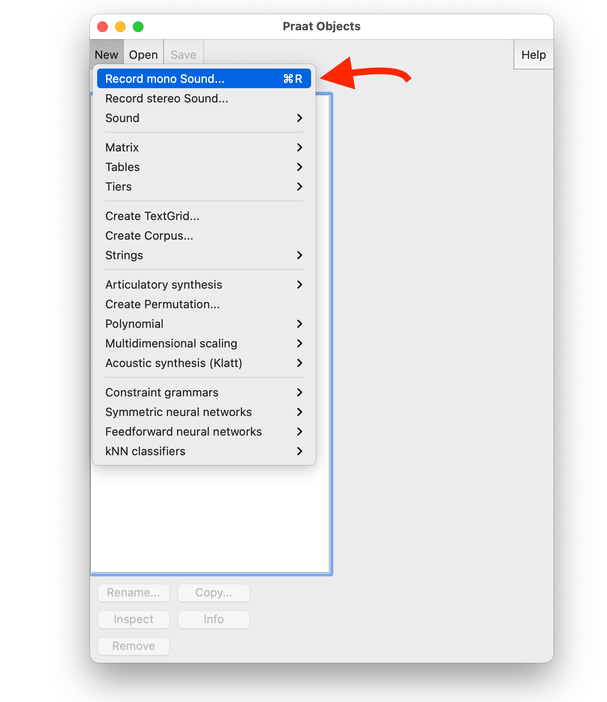 

* Make sure you "save to list" before closing the recorder!

## Stored sound

You should now have a Sound in your **objects** window

* Select the Sound object and a menu will appear to the right
* Click "Play" to hear your sound

## Saving your recording

We'll end this by saving our work as a .WAV file (the standard format for phonetics work)

* The file is not yet saved, only *stored* in Praat
* If you close Praat without saving the file, it will vanish

## Importing a sound file

<audio id="bush" src="./assets/media/bbk-hills-of-bushes.wav"></audio>

We might also **import** sounds which have already been recorded

* Download <a href="./assets/media/bbk-files.zip">this ZIP file</a> (673 KB), which contains all of the files we'll use
* Use the "Open" dialogue to open **bbk-hills-of-bushes.wav**
* That file contains one utterance of Babanki <button onclick="document.getElementById('bush').play()"> [tə̀tāŋ tə́ tə́ꜜtóʔ]</button> "hills of bushes" from Faytak & Akumbu (2021)

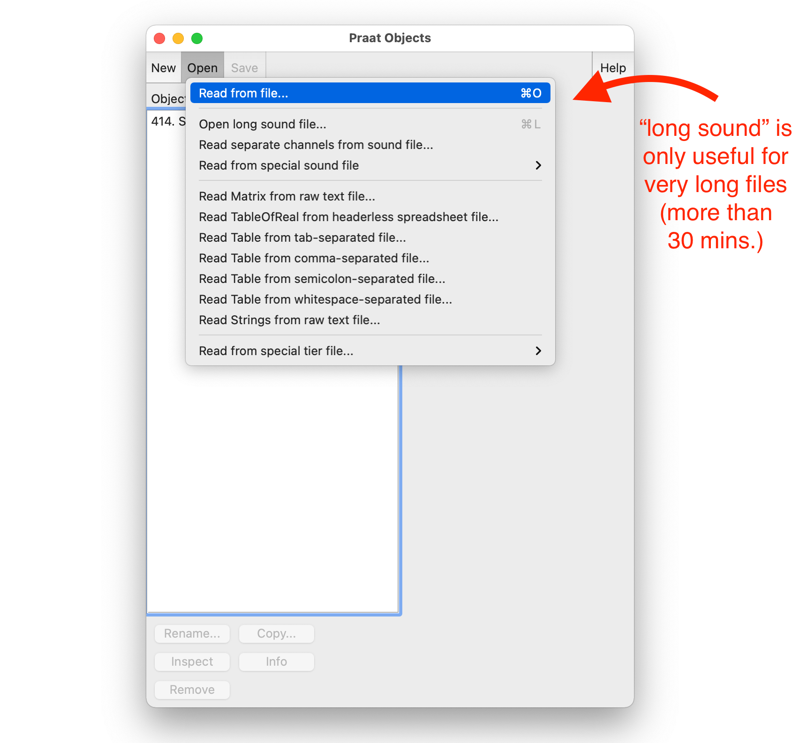

# Making and using TextGrids

## Viewing a sound file

We'll start by viewing Babanki <button onclick="document.getElementById('bush').play()"> [tə̀tāŋ tə́ tə́ꜜtóʔ]</button> "hills of bushes"

* Select the Sound and click "View and Edit" in the right menu

Viewer window has button and keyboard controls

* Select by clicking, SHIFT-clicking, or clicking and dragging in sound
* Press TAB to play selected sound, or click bar below window
* Control buttons (zoom in, zoom out, scroll) are at lower left
* Keyboard shortcuts: CTRL+ (PC) or Command+ (Mac)...
	* A: zoom out to all
	* N: zoom to selection
	* I: zoom in
	* O: zoom out

We may wish to know where the words and segments are, but we lack useful landmarks at this point

* Each "blob" is a syllable
* No indication of tones (yet)

## Making a TextGrid

**TextGrids** are one of the most useful features of Praat: annotate and organize your audio files

* Using the menu as shown below, we'll make a TextGrid for our Babanki sound object

 

## Interval tiers

Let's use the **interval tier** "sentence" and use it to transcribe the utterance

* Contains a list of ranges in time separated by boundaries
* Useful for marking off words, utterances, and some vowels and consonants
* Here, click before the beginning and after the end of the utterance, then type a transcription or translation in the middle

## Point tiers

Let's use the **point tier** "stop" to mark off where each [t] release happens

* Contains a list of points in time
* Useful for instantaneous events
* Note that *intervals are generally more useful* for most segments
* Can't click and highlight range like interval tier 

## Adding and removing tiers

We might be dissatisfied with how the tone marks are displaying; we could make a new tier for tones (autosegmental style)

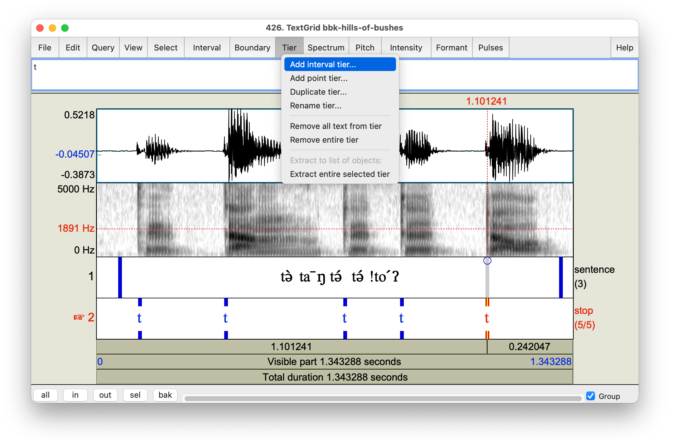 

Amending the TextGrid using the new tier:

## Saving TextGrids

Using CTRL+S or the menu shown below, you must *save* your TextGrid when you are done

* If you close Praat without saving your TextGrid, it will vanish
* Much like recorded audio files which are stored in the object list

# Reading our data

## Data displays

We may wish to provide further details in our TextGrids, but we encounter another problem here: how to interpret the data?

* Praat shows **waveforms** and **spectrograms**
* Note the simpler TextGrid (segments, tones); **bbk-hills-of-bushes.TextGrid** in downloaded files

## Waveforms

**Waveforms** show sound pressure (the pressure that sound waves make on the microphone) versus time

* We expect any **voiced** speech signal to *oscillate* because the vocal folds open and close in a repeating pattern
* Other **voiceless** sounds show no movement away from "zero line" and no clear oscillation

## Sonority

Sounds produced with a more open mouth are *louder* and  more sonorous Parker (2008) ; these are *thicker* on the waveform

## Spectrograms

We can also show the **spectrogram** for our recording

* Breaks down our waveform to give us information about the **sound spectrum** and where its energy is (high or low frequency)

Spectrograms are three-dimensional, and show time vs. **frequency** vs. sound pressure (color) 

* The darker the spectrogram (and the thicker the waveform), the more sound pressure there is

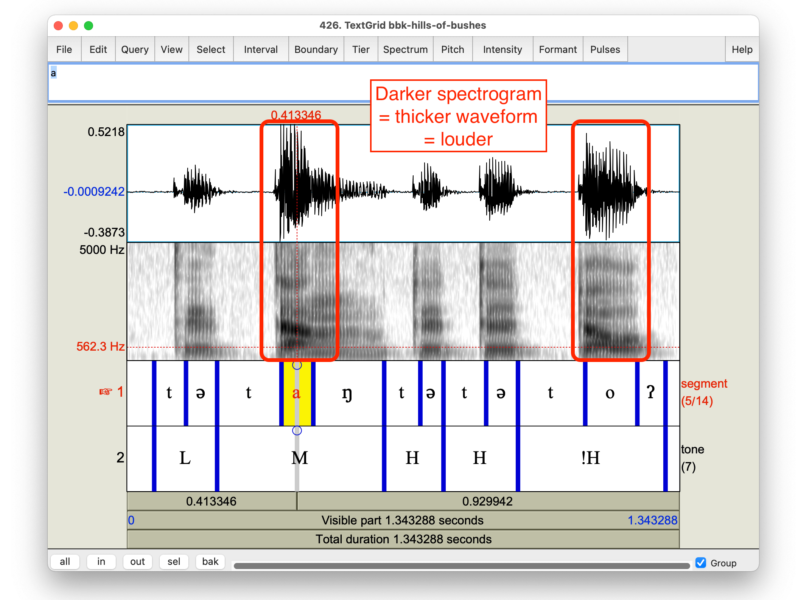

* Think of it as an elevation map (Mt. Cameroon pictured)

## Interpreting spectrograms

**Vowels**, **semivowels**, and **approximants** have characteristic striping, horizontally and vertically

* Voicing is visible as vertical stripes in vowels, and as a small "bar" at bottom
* **Formants** are clear horizontal bands above the voicing bar

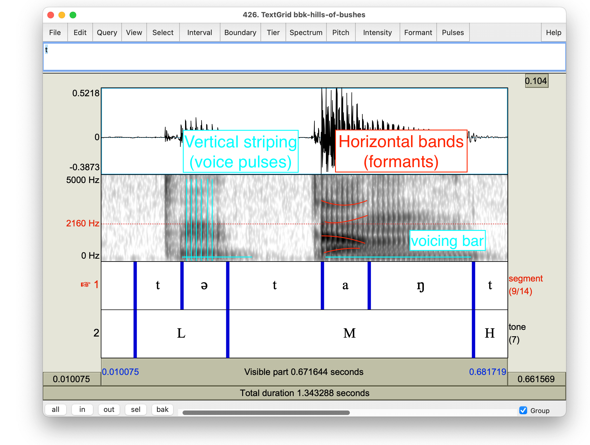

## Interpreting spectrograms

**Nasals** look somewhat like vowels, with "smudged" formants and less energy (darkness)

* Due to the opening of the velum: nasal cavity "muffles" the sound
* Much like soft objects in a room muffle echo

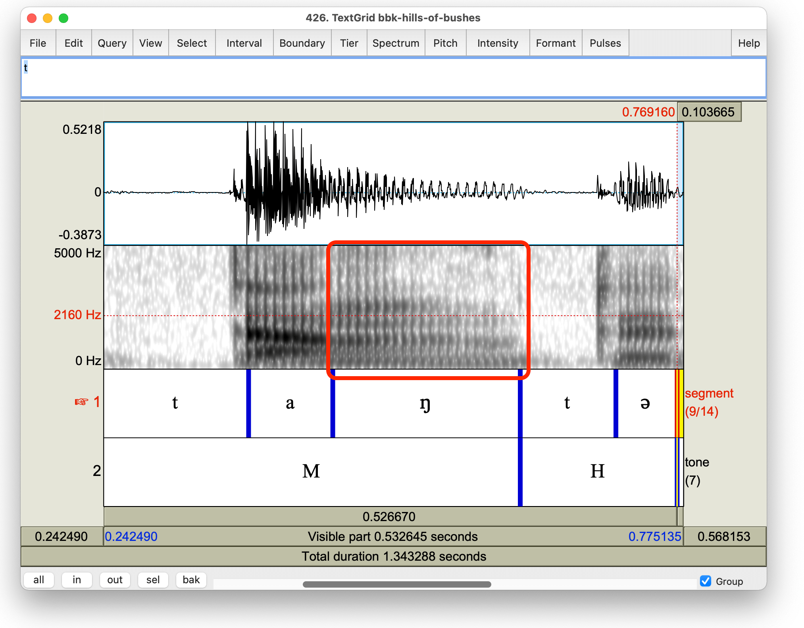

## Interpreting spectrograms

**Fricatives** have high-frequency or low-frequency noise

* Dark irregular smudges across entire areas of spectrogram
* The further back the fricative, the lower the average frequency
* Compare [s] and [ʒ]: [s] is further front, has higher frequency, sits higher on spectrogram

## Interpreting spectrograms

**Stops** show an absence of (most) energy followed by a **burst** across the whole spectrum

**Affricates** look similar, but as if they were followed by a fricative

* From Babanki [kə̀dʒóm] 'Babanki' Faytak & Akumbu (2021)

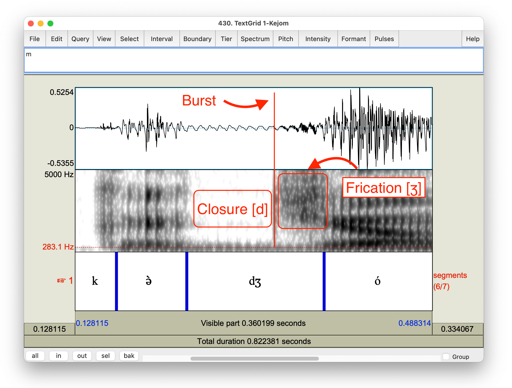

## Prenasalized segments

Prenasalized stops and affricates often have a *long nasal closure* followed by a *short oral closure* which we can see clearly in the spectrogram

* Note the "smudged" energy goes away when oral closure begins in [ⁿpfʲ] below
* From Babanki [kə̀ⁿpfʲɨ́ŋ] 'owl' Faytak & Akumbu (2021)

# Drawing figures

## Why make figures?

Figures are an easy way to present a small amount of phonetic data in scientific papers

* Give support to phonological judgments
* Support particular transcriptions
* Provide more detail for any especially unusual sounds or sound contrasts

This section: professional-looking and informative data displays

## Picture window

Waveforms and spectrograms can be "drawn" or "painted" (respectively) in the **picture window**

* This also opened when you open Praat; we'll stop ignoring it now
* The blue rectangle indicates the *plot area* where the figure will be drawn: change size by clicking and dragging as needed

## Drawing a waveform

"Draw" (in the object window) is for any line-based drawings, including waveforms

* Select a Sound to draw its waveform

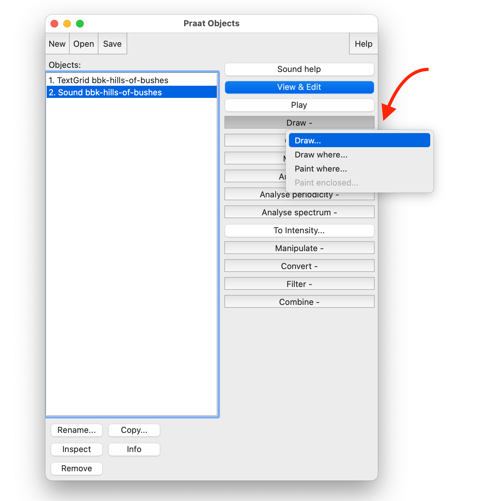
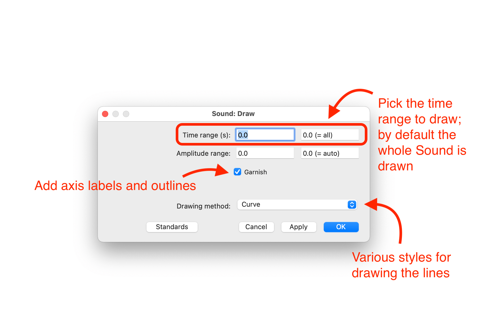

The result: a waveform drawn within the plot area

## Drawing a TextGrid

TextGrids can be drawn as well, using the same menu as Sounds

* By default, they appear with an empty space above them

## Combining TextGrids and waveforms

A Sound and TextGrid can be drawn together very easily: simply **select both** and choose the Draw menu as before

* Adds TextGrid annotation to the waveform drawing

## Extracting a spectrogram

"Paint" is for drawing spectrograms and other objects, but: we need the right **object** to do this

* Select Sound and click "View and Edit"
* Select from the Spectrum menu "Extract visible spectrogram"

## Painting a spectrogram

This sends a Spectrogram object to the object list; when we select this we get a "Paint" option under Draw

The result: as expected, but a bit too tall for its width (make plot area wider/shorter)

## Spectrograms and TextGrids

Drawing a spectrogram and a TextGrid at the same time is a bit more complicated

1. Paint the spectrogram, but **uncheck "Garnish"**
2. Add the Y axis marks using the "Margins" menu

 

3. Add a Y axis label, usually "Frequency (Hz)"
* I've also added a box around the plot here with "Margins" > "Draw Inner Box"

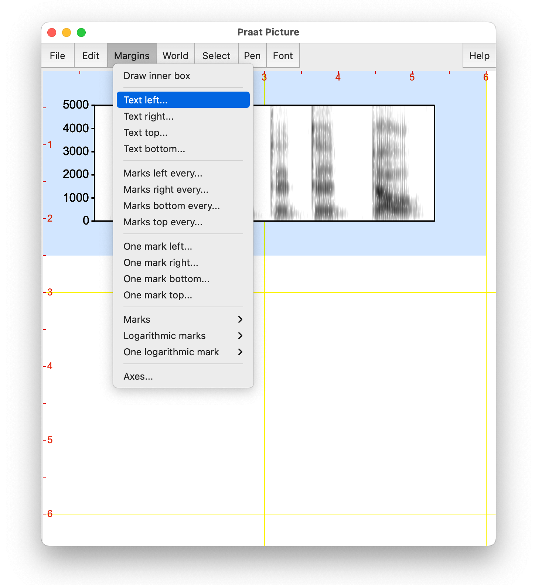 

## Spectrograms and TextGrids

3. **Resize** plot area to be  taller than spectrogram (pictured), and Draw the TextGrid

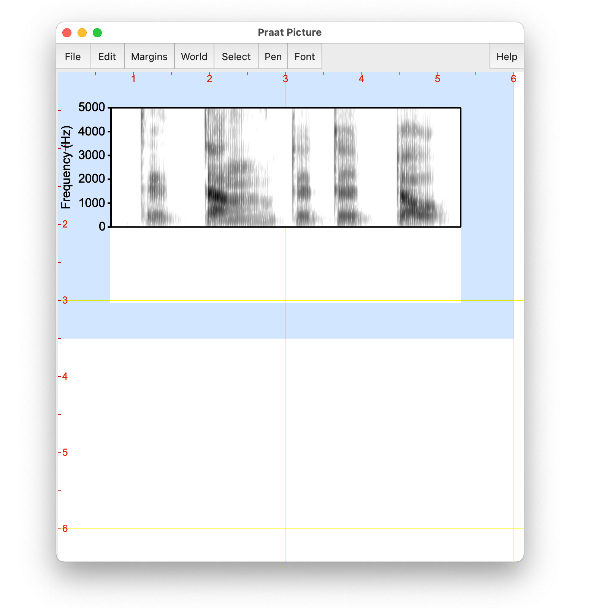

The result: TextGrid annotations on top of the spectrogram

## Saving

As with everything else in Praat, you must **save** before closing the picture window or you will lose your work

* If you don't keep the plot area in the same place (covering your figure or margins), you won't save the entire figure

# BREAK

# Measuring phonetic properties

## Why numerical measurements?

Now we'll turn to **taking numerical measurements** in Praat

* Actual calculation
* Displaying **figures** of these measurements
* Storing measurements as **tabular data** (at the end)

More than showing an entire sound file as a waveform or spectrogram, focusing on a specific phonetic property can be useful

* Make a figure for this specific property 
* Focus on topic of interest for your discussion
* Display with a TextGrid, a waveform, etc.

## Why numerical measurements?

Also lets us measure many utterances and **summarize**, which also allows us to handle **phonetic variation**

* Languages differ in their phonetic implementation of the "same" segments
* Speakers of the same language produce it differently depending on their history, social stance, etc
* Even phonologically identical words can differ slightly phonetically Gahl (2008)

Because of this it's best to collect **many observations** and **average** or **model** the data to remove noise and variation

* Multiple speakers
* Multiple repetitions
* Multiple words

## Duration

One of the simplest measures: **duration** of segments or words

* Simply ending time of the interval minus its starting time ($t_2 - t_1$), in seconds
* Two ways to acquire this in Praat: 
	* Displayed in viewing window when you select an interval
	* If you use the "Query" menu, a text box appears which you can copy-paste the value from

## Model use

An example from Babanki (**bbk-prenas.wav**): proportion of prenasalized consonants which is nasal Faytak & Akumbu (2021)

* Not uncommon for continuants to stop up when prenasalized, e.g. /ⁿz/ > [ndz]
* But /ⁿz/ and /ⁿdz/ (etc.) are contrastive in Babanki
* Babanki speakers produce *shorter, lighter prenasalization* before continuants
* This may help to avoid merger of continuants and non-continuants

## Model use

Other phenomena studied with duration (not exhaustive):

* Voice onset time McKinney (1990); Connell (1994, 2002); Monaka (2006)
* Compensatory lengthening Hamann, Miatto, & Downing (2019); Danis (2020)
* Any other timing relation you can think of (many, many possibilities)
	* Consonant gemination
	* Long vowels
	* Lengthening of segments or syllables due to stress assignment

## Pitch (fundamental frequency, f0)

Pitch (and all other measurements we'll talk about) have a dedicated **menu** 

* Turn on "show pitch" to use all other options
* **f0 track** appears over spectrogram (below) when "showing"

## Pitch settings

**Settings** for pitch are important

* If pitch range is not suited to the speaker, fake jumps in pitch can appear
* Below, the low-falling tone has a fake jump, well above H for this speaker!
* From our prior knowledge of the language we should **overrule** Praat

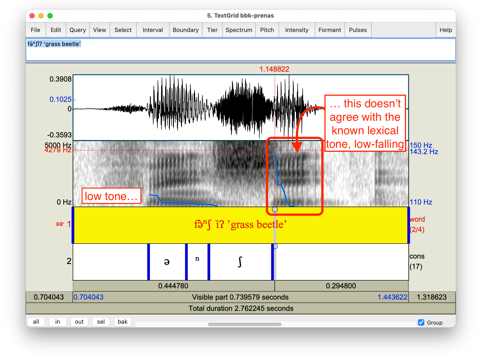

## Pitch settings

A quick change to pitch range fixes the jump issue 

* In "Settings..." under the Pitch menu
* The pitch range was too high for the speaker, so we lower the pitch floor

* This handles the low tones better

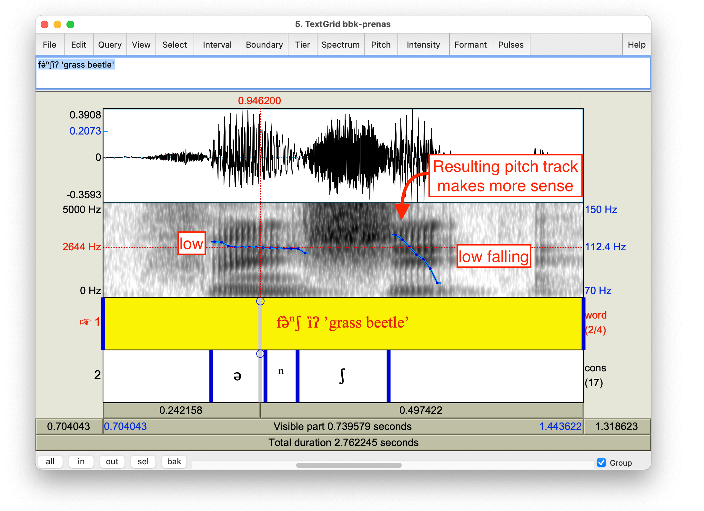

* If jumps don't go away, the "Advanced pitch settings..." window offers some options

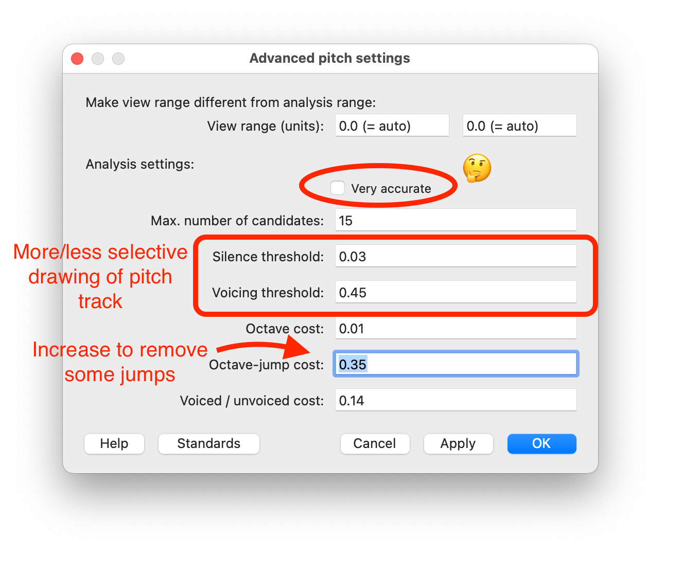

## Model use

<audio id="schwa" src="./assets/media/bbk-schwa.wav"></audio>

All tonal phenomena involve f0

* Lexical tone, downstep, downdrift, pitch reset, tone depression, lexical tone contrasts
* Intonation (question formation, etc)

Babanki example in <button onclick="document.getElementById('schwa').play()"> bbk-schwa.wav</button>: 

* Prefixal L ( və̀-lɨ́m "males") behave differently from stem L (bə̀lâŋ "plank") when between two Hs
	* Third word is bə́lə̀ŋ "groundnut"
* HL(prefix)H raises to mid: HM(prefix)H Akumbu (2019)

## Model use

<audio id="aboro" src="./assets/media/Part2_5_Rialland_Embosi_fig01.wav"></audio>

Sub-phonemic effects of intonation on tonemes can be examined figure from Rialland & Aborobongui (2016)

* Boundary tones (%) indicate sentence type
* Effect of L% on lexical H in <button onclick="document.getElementById('aboro').play()"> the example below</button>

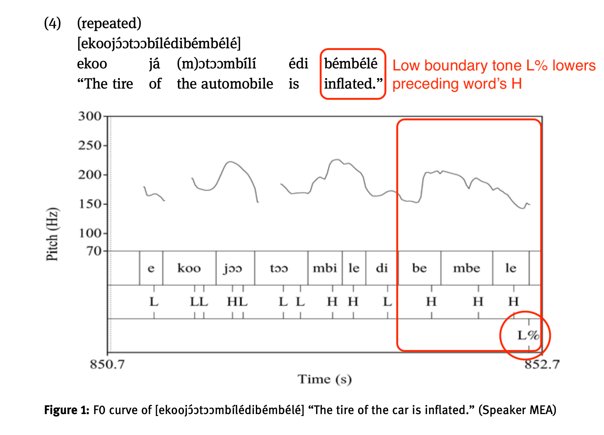

Other tone topics (not exhaustive): 

* Tone depressor consonants Traill, Khumalo, & Fridjhon (1987); Chen & Downing (2011); Mathes & Chebanne (2018); Lotven & Berkson (2019)
* Formal representation of tone Akumbu (2019); Gjersøe, Nformi, & Paschen (2019); Myers, Namyalo, & Kiriggwajjo (2019); McPherson (2020)
* Downdrift, downstep, and pitch reset Genzel & Kügler (2011); Hamlaoui & Makasso (2019); Oppong (2021)

## Intensity

A measure of **loudness**, measured in decibels (dB)

* Intensity menu and settings are exactly parallel to Pitch menu and settings

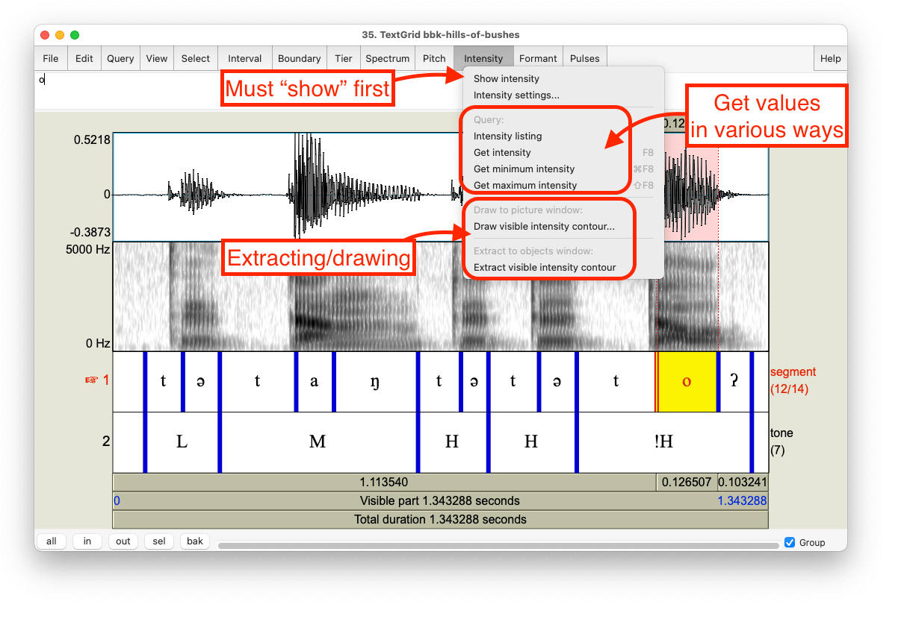

* The yellow intensity track can be hard to spot
* Higher parts of track match darker parts of spectrogram and thicker parts of waveform

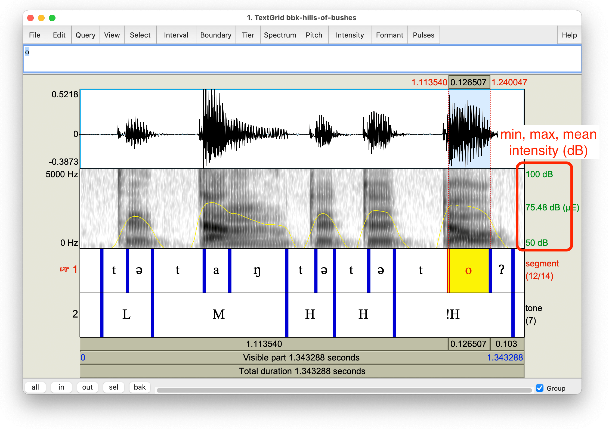

## Model use

Intensity is useful for measuring degree of constriction

* Degree of consonant constriction (or lenition)
* Prosodic factors such as stress (in many languages)

Babanki example: stressed (stems) and unstressed (prefixes) don't seem to be differentiated by intensity

* But stem H has a longer duration

## Model use

Implosive vs. non-implosive voiced stops have different intensity profiles figure from Nagano-Madsen & Thornell (2012)

* See also Naidoo (2012)

Numerous other uses in prosody

## f0 and intensity figures

f0 (pitch) and intensity tracks can easily be Drawn to figures as seen above

* In "Pitch" and "Intensity" menus, there is the option to Draw directly to the Picture window with or without a TextGrid
* Best to combine with a TextGrid whenever possible
* Below: pitch contour for Kejom <button onclick="document.getElementById('bush').play()"> [tə̀tāŋ tə́ tə́ꜜtóʔ]</button> "hills of bushes" from Faytak & Akumbu (2021) 

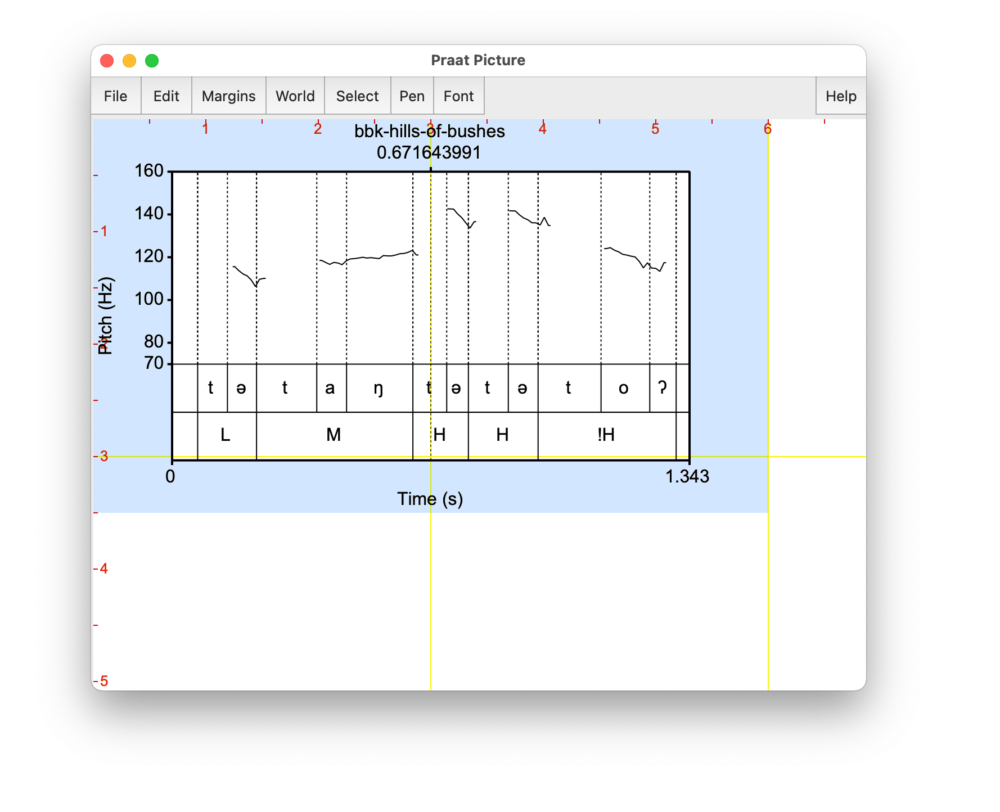

## Formant frequencies

Formant frequencies provide **vowel quality** and other contrasts

* Formant transitions show place of consonants 
* Lateral and nasal quality, etc.

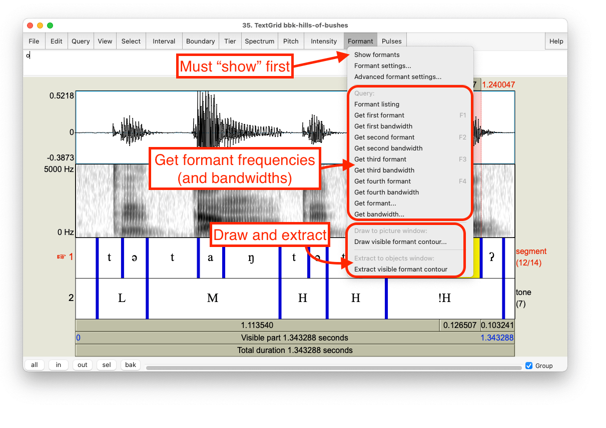

## Formant frequencies

Turn on "show formants", and formant tracks for the first three formants (F1, F2, F3) appear

* All have some inverse relationship with a property $x$: the higher the frequency, the less $x$
* F1 inversely relates to height (higher F1 = lower vowel)
* F2 inversely relates to backness (higher F2 = fronter vowel)
* F3 inversely relates to retroflexion (low F3 = more retroflexion) and other qualities

## Formant settings

Estimating formant frequencies requires calibration for every individual speaker: low pitched voices need different settings compared to high pitched voices

* Often simplified to "men" versus "women", but there is a lot of variation in pitch for each
* Children (with very high f0) can be especially difficult

The default settings work well for **higher-pitched voices**

* Lower-pitched voices need **fewer formants** and a **lower maximum frequency**

## Formant tracking

The default settings of 5 formants in 5500 Hz (for higher-pitched voices) don't work well for the very low-pitched voice of the Babanki speaker:

Better: changed to 4.5 formants, 4200 Hz; much lower frequency range

## Formant figures

Formant tracks work best in a plot of F1 against F2 (which is quite hard to make in Praat), but formant tracks can be drawn like any other measure

* Draw separately from TextGrid and "un-garnish"
* Much like we did for the spectrogram + TextGrid combination
* "Speckle" under "Draw" produces this from an extracted Formant object

## F1-F2 scatterplots

F1-F2 scatterplots have F2 on the $x$ axis, F1 on the $y$ axis, with both axes **reversed** 

* Praat does have a *limited* ability to make scatterplots
* Must manually specify plot size
* Can only use these four point types: x + o .
* Limited ability to label or make legends

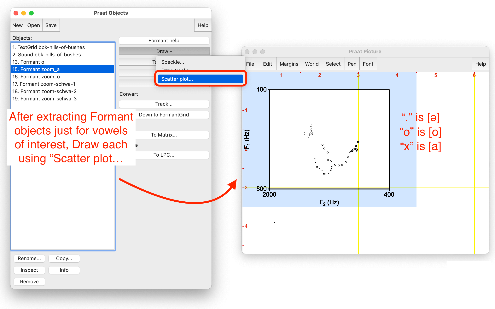

## Model use 

Better scatterplot figures can be made using tabular data (we'll discuss later) figure from Faytak & Akumbu (2021)

* Here, ellipses indicate where each cloud of points is centered

* With this plot it becomes clear why we reverse the axes: vowel space resembles the IPA vowel trapezoid

## Model use 

Formant data is useful in figuring out **harmony systems**; ATR or otherwise

* Dagbani right-to-left ATR harmony also affects the low vowel /a/, counter to previous descriptions figure from Hudu (2016) 

* Moro's height harmony system may condition 'high' and 'low' /ə/, previously thought to be transparent to harmony Ritchart & Rose (2015)
* Note presentation of data in a **table** in addition to a scatterplot

 

Other uses for formant measures (non-exhaustive):

* General description of vowel inventory Koffi (2018), McPherson (2020)
* Characterizing harmony systems Starwalt (2008); McCollum & Essegbey (2020)

## Voicing ("Pulses")

Praat also detects measures relating to **voicing**: these are grouped under the unintuitive name "Pulses"

* So called because voicing produces repeating, pulsing sounds
* Detecting voicing = detecting regular pulses in the sound signal

The Pulses menu contains the same "showing", measure-getting, and drawing functions as other menus

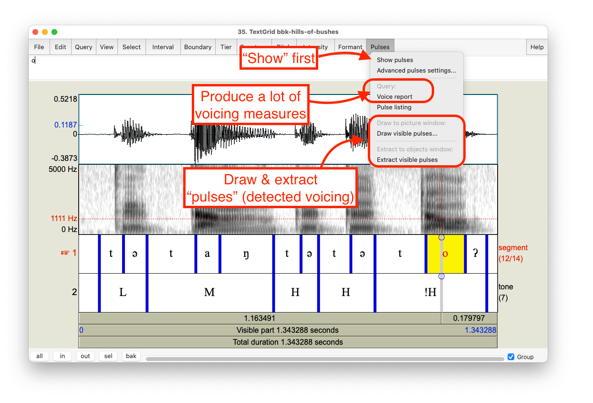

The result: each detected "voice pulse", shown over waveform

## Display pulses

The pulses themselves can be plotted with a TextGrid like any other similar object

* Shaded areas indicate area where voice pulses occur repeatedly
* Functions like a "voicing detector"

## Voicing report

If voicing has a predictable timing but varies in extent, the **voicing report** may be useful (access in the Pulses menu)

* Specifically the number after "Fraction of locally unvoiced frames"

## Model use

Voicing in unexpected places is common for labial-velars; this can be confirmed by looking for pulses figure from Connell (1994)

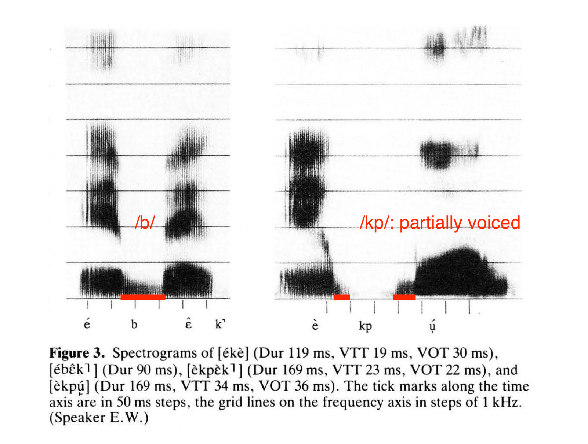

Other voicing-related topics:

* Mixed-voicing consonant clusters in Taa ("Khoi-san") Nakagawa (2008); Naumann (2016)
* Lenition or devoicing of consonants Solé, Hyman, & Monaka (2010); Boyer & Zsiga (2013); Bendjaballah & Le Gac (2021) 

# Text output and tabular data

## Getting out of Praat

Praat is useful, but it has important **limitations**

* Hard to produce all types of figures
* Can't do statistical analysis (which is standard for phonetics)

Because of this, we often need to **export** data from Praat into other programs

## Tabular data

The most effective way to export numerical measurements: **tabular data**, that is, **spreadsheets**

* One observation (time point, segment, etc) per row
* One measure per column
* Name columns using the first row
* Other columns give non-numerical information (speaker ID, segment, word, etc.)

Google Drive or Excel both work well (.xls, .txt, or .csv format)

* I will be using Google Drive for examples, but all of this can be done with Excel too

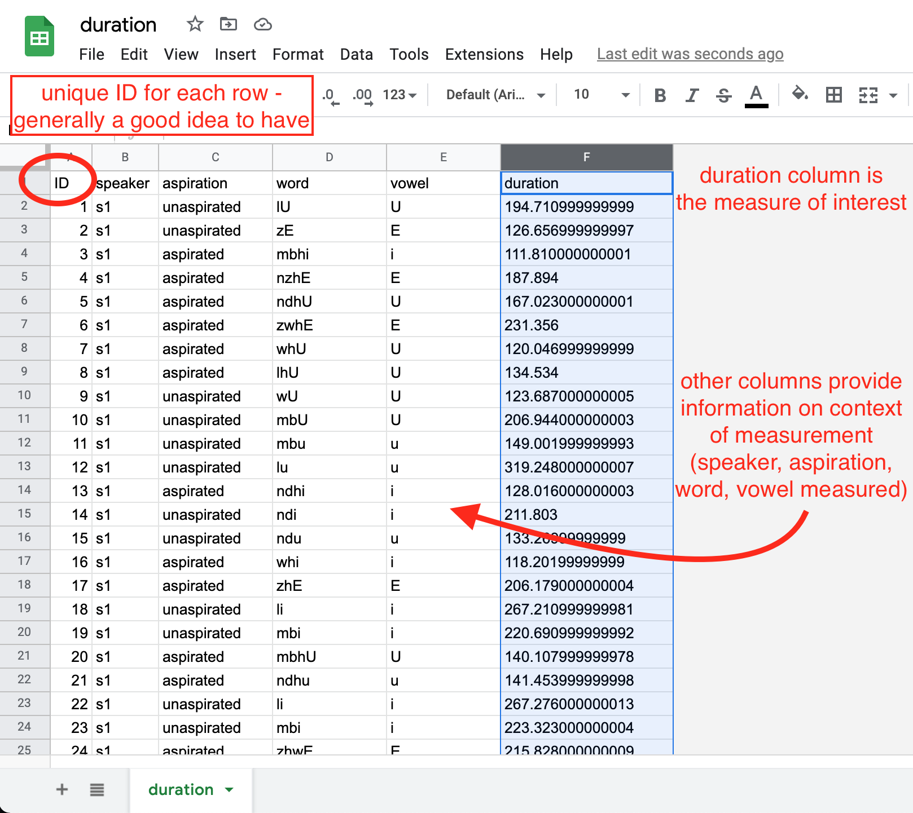

## Data construction: duration

We'll use **duration** to demonstrate the most basic spreadsheet construction 

1. Select an interval
2. Generate text output in Praat ("Query" menu)
3. Copy-paste output into spreadsheet
4. Add metadata

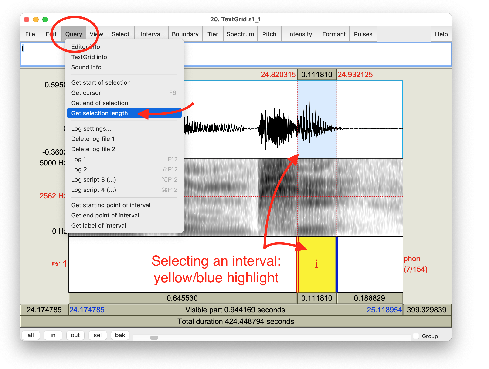 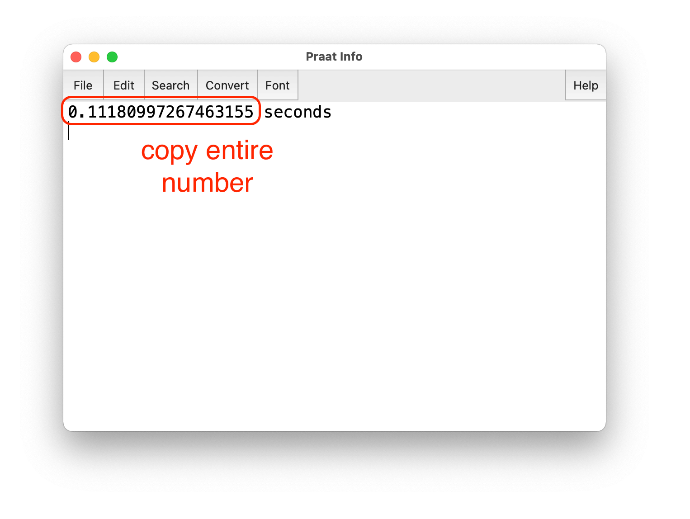 

Repeat this process for each of your observations, starting a **new row** each time

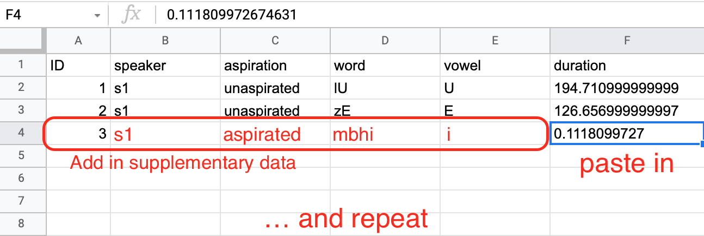

## Praat text output

Text output is generated using the **menus** above the data display

* Duration: under "Query" after selecting an interval
* Pitch, intensity, formants, voicing ("Pulses") are all under their expected menus

For any measure other than duration, menus behave slightly differently depending on whether your cursor has selected an **interval** or not

* If you have selected an interval, you will get a **list** or an **average** (mean) of measurements
* If you have not selected an interval, you will get a **point** measurement

A shortcut exists to get the **midpoint** of any interval

## "Get..." versus "Listing..."

"Get..." provides a single measurement, or a single **mean** measurement across an interval 

* "Get pitch"
* "Get intensity" 
* "Get $n$th formant" (F1, F2, etc)

"Listing..." provides *every single* measure within an interval

* "Pitch listing"
* "Intensity listing"
* "Formant listing"
* ("Pulse listing": timing of pulses)

Exceptions:

* Minimum and Maximum Pitch can also be calculated for an interval
* "Voice report" for an interval generates a large number of different measures

## Data construction: single pitch

Mean, max, and min f0 measures (from "Get...") can be copy-pasted into their own cell just like our duration example

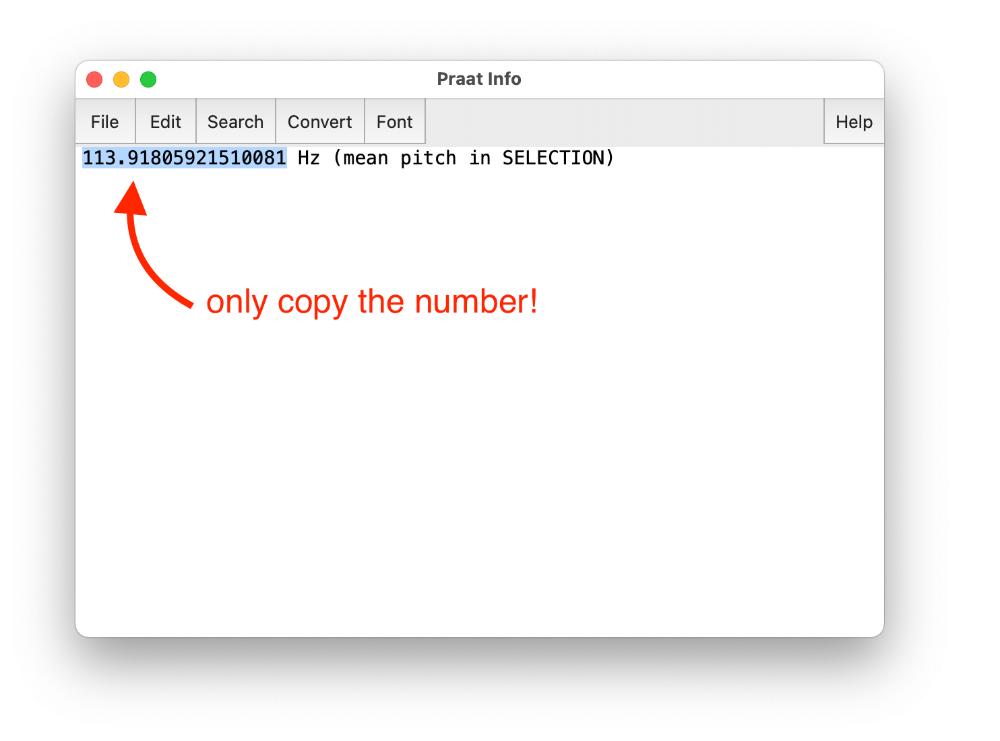

Listings (f0 over time) are trickier to paste:

* Multiple columns (time points need to be included)
* Number of time points varies
* May have unsuccessful measurements ("--undefined--")

## Data construction: pitch listing

We'll take pitch as an example, but these instructions will work for *any listing*

1. Select interval
2. Generate text output ("Pitch listing") and copy entire contents of text box
	* If you've already got the header line, you don't need the first line

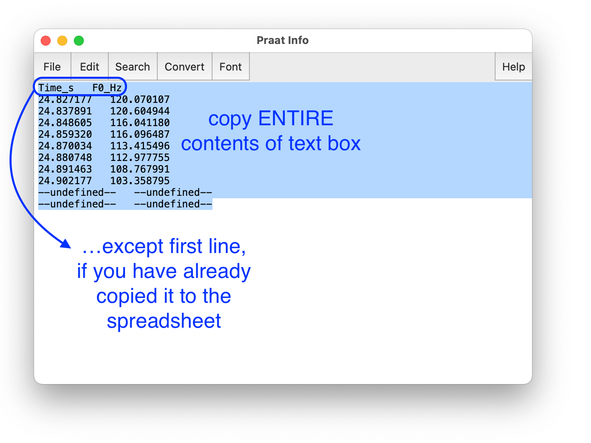

## Data construction: pitch listing

Continued:

3. Paste into spreadsheet
4. In paste menu, split columns using "Custom"; use *two* spaces (  )

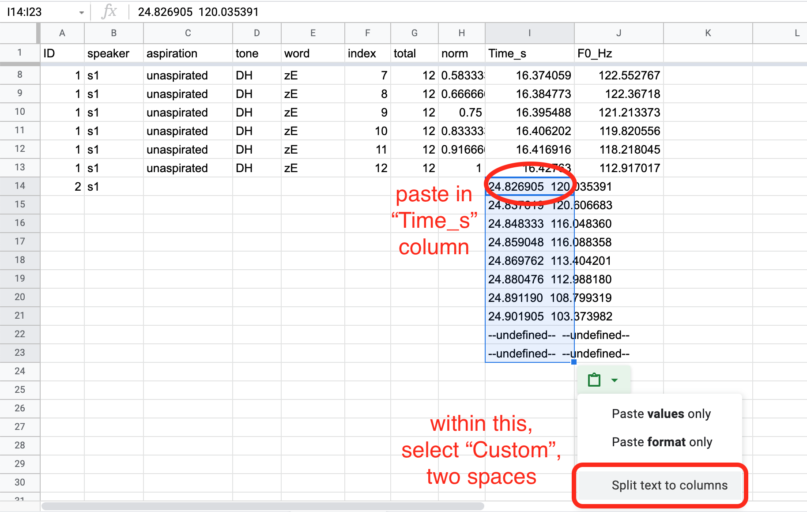

5. Fill in metadata

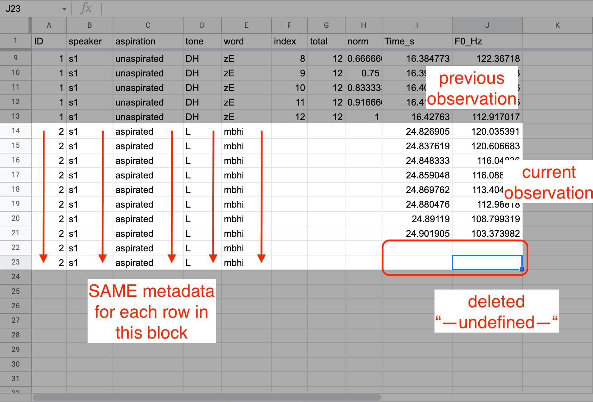

## Times for listings

Unlike before, we need to contextualize the **time** values and **normalize** them 

* Compare across speakers, who might have different speeds
* Compare across repetitions, because speakers vary their speed

The best way to do this:

1. Count rows in your series and add the $total$ number of samples into each row in a $total$ column
2. Add an $index$ value in a column indicating which number sample we are on (1, 2, 3 ... $total$)
3. Calculate *percent of total duration* by dividing $index$ / $total$ and adding this to a third column $norm$
4. Be sure to include --undefined-- values as empty cells

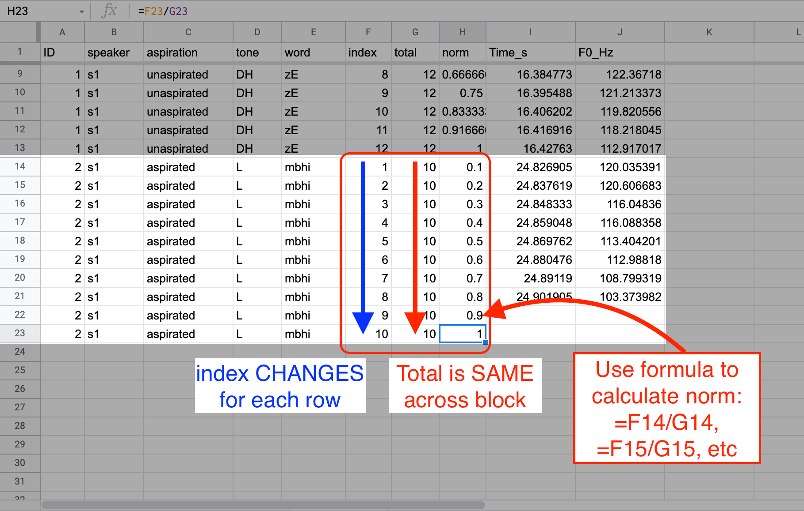

## Data construction: formant listing

Same as pitch listing, but note there are four columns for F1-F4, plus one for times

Much as above, but with more measurement columns:

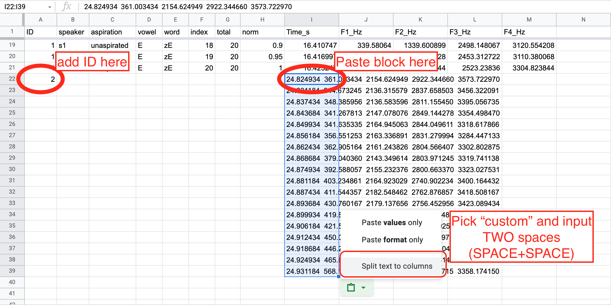

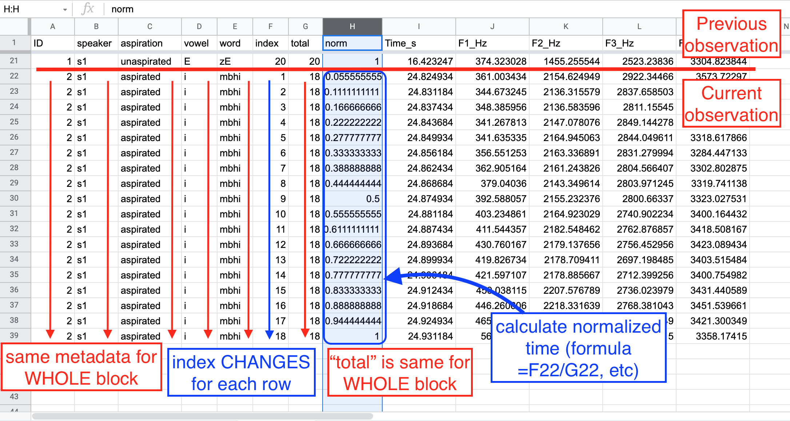

## Value of listings

Working with listings is more difficult than working with mean measures, but having **time series** of measurements is valuable

* Limbum question prosody involves boundary tones such as L%
* These exert lowering effects and create phonetic contour tones figure from Gjersøe, Nformi, & Paschen (2019)
* Plots contain **average** pitch tracks for 300-400 sentence readings, 3 speakers

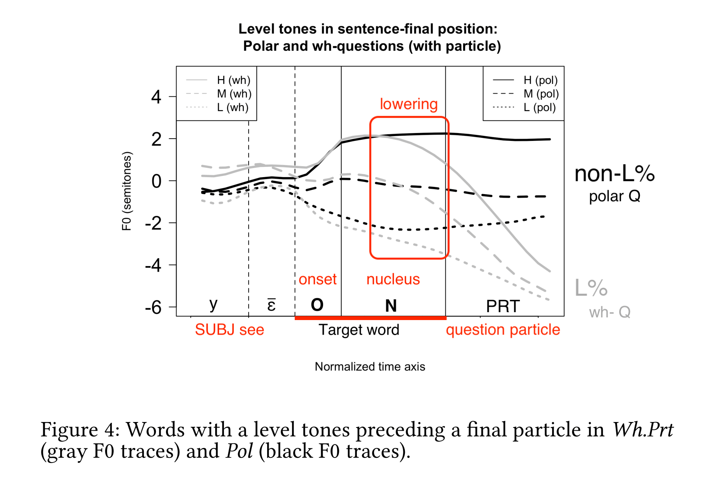

## Coding

Beyond the scope of this tutorial, but more efficient in a number of areas: basic **coding**

* **Praat scripting** can more quickly produce tabular data (ask us how!)
* Plots can be made using R (or Excel!)
* Mostly *free* software

While there is a steeper learning curve, the improvement to the process may pay off in the long run

# BREAK

# Articulatory data

## Acoustics vs. articulation

Acoustics gives us an **indirect idea** of the movements of the articulators

Sometimes, though, we need to look *directly at* the articulators

* If there are multiple explanations for acoustics
* If the examined sounds are totally unfamiliar or especially unusual
	* In the Bantoid area, this is not uncommon!

## Articulation measurement

We point out here that characterizing and measuring some articulations is **much easier** than usually expected

* Lip articulation
* Palatography
* Basically **photography**
	* With whichever resources are on hand
	* All of my personal examples shown here are shot on a phone camera

## Lip articulation

Lips are easily seen moving since they are on the exterior of the face

* Mirror at 45 degree angle provides an additional side view of the lips

Example: Babanki lip articulation during vowels Faytak & Akumbu (2021)

* Rounded [u] (right) can be contrasted with labiodental [ʉv] (left) and bilabial compressed [ʉβ] (center)

## Model use

Lip activity during Medumba [ʉ]: *compressed* in the direction of a bilabial stop Olson & Meynadier (2015)

* Relaxed lower lip often leads to bilabial trill [ʙ] during vowel figure from Olson & Meynadier (2015)
* Compression vs. rounding totally unexplored for most Bantoid languages with an /ʉ/

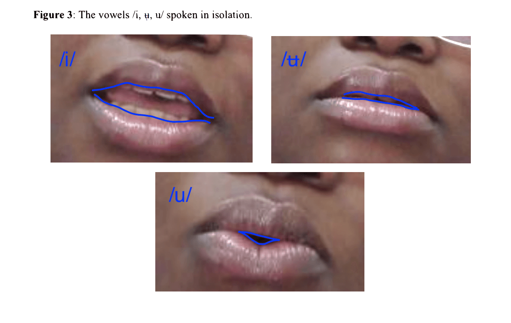

Subtle lip posture differences also known to occur on various fricatives and approximants

* Differences in posture *enhance* the contrast between labiodental /f, v/ and bilabial fricatives /ɸ, β/ in Ewe, Kwangali, ruGciriku, etc. Ladefoged (1968, 1990); Utman & Blumstein (1994)
* 

## Model use

For faster articulations, short videos can also be useful

* Video of a Mono speaker producing a labial flap Olson & Hajek (2004)
* Word is [àⱱétòɾò] "stick used in animal trap" (video repeats)

<iframe width="1264" height="552" src="https://www.youtube.com/embed/3j1i1dVDqgs?rel=0&Version=3&loop=1&playlist=3j1i1dVDqgs" frameborder="0" allow="autoplay; encrypted-media" allowfullscreen></iframe>

## Palatographs

A "tongue-print" on the roof of the mouth which shows where articulatory activity takes place Anderson (2008)

* Stop and fricative place
* Certain aspects of vowel articulation

The method is more involved than simple photography:

1. Paint tongue with mixture of oil and dark edible powder (chocolate or charcoal)
2. Speaker produces a single token of a word with *one* lingual consonant
3. Open mouth, insert mirror, photograph

## Model use

<audio id="goat" src="./assets/media/kom-goat.wav"></audio>

<audio id="kola" src="./assets/media/kom-kola.wav"></audio>

Kom exhibits a contrast between [i] and fronted, fricativized [i̟] (which I will discuss further in my regular talk)

* <button onclick="document.getElementById('kola').play()">[ībi᷇] 'kola nut'</button>
* <button onclick="document.getElementById('goat').play()">[ə̄bí̟] 'goat'</button>

Palatography reveals the lingual articulation of these two vowels

* Contrasts like these are probably quite frequent in the Bantoid area
* Compare the [z͡i] vowels observed in Len Mambila and Limbum Fransen (1995); Nforgwei (2004); Connell (2007); Lewis & Shittu (2014)

## Model use

More canonically used for clear evidence of lingual place contrasts

* Dental vs. (post)alveolar stop contrast in Lusoga Nabirye, de Schryver, & Verhoeven (2016)

## Equipment

Everything that we've talked about in this section involves **minimal equipment**

* Smartphone camera or point-and-shoot camera
* **Dental mirror**: or hand-held metal mirror, about 6cm wide and 12cm long
  * Held outside for lip angles
  * Inserted against upper molars for palatography
* Edible pigment (chocolate powder, edible charcoal) for palatography
* A brush for painting the tongue (I prefer a narrow paintbrush or a makeup brush)

Optional:

* Phone tripod or camera tripod
* Photography lighting

## Figures vs. tabular data

The value of photographic evidence as a figure should be obvious: simply include the image

If you have larger numbers of images, you might convert these to **tabular data** for further analysis

* Measure the size of some physical attribute and enter that into your spreadsheet
* For example, measure *ratio* of lip opening width to lip width in pixels
* This normalizes for speaker size and for position (head tilt, here) figure from Olson & Meynadier (2015)

## Other articulations

It should be mentioned that certain articulations produced further back are not discussed here

* Dorsal or pharyngeal consonants
* Complex tongue shapes, as in clicks
* Advanced/retracted tongue root

However, **ultrasound** technology is gradually making it easier to image these articulations Miller, Gick et al. (2006); Namaseb & Iskarous (2007); Allen, Pulleyblank, & Ajíbóyè (2013); Hudu (2014)

* Entirely portable and non-invasive
* But some significant technical barriers remain

# Practical considerations

## File naming and metadata

Name your recording files according to the same logical pattern

* Date, language, topic
* Avoid duplicating names
* Avoid vague names

To identify further details, speak them during *the recording itself*

* Identify and name yourself
* Identify speaker(s) and their roles if this is not sensitive information
* Identify anyone else who may be heard in the recording (assistants, translators, etc.)
* Give time, date, and location of recording

## File backups

Back up *every recording* in multiple locations if possible, to avoid technological problems or theft destroying your work

* SD cards or thumb drives
* Multiple computers (share key files with a trusted colleague)
* Email small files to yourself (download as attachments later)
* Long-term cloud storage (Google Drive, OneDrive, Box, Dropbox, etc) is ideal but uploading may be expensive

## Processing tabular data 

Tabular data, of whatever sort, needs to be averaged, summarized (mean/standard deviation), or submitted to a statistical model

* Averaging and some basic statistical models can be done using Excel's Data Analysis Tools (need to install)
* While Excel and Google Drive (below) *work* for basic things, learning a dedicated statistical program is better in the long run
* Collaborators may be willing to help

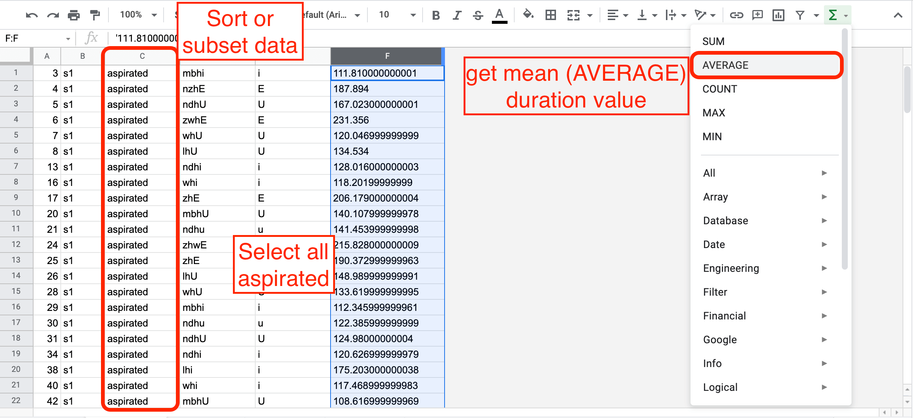

## Statistics

Simple statistical analysis and modeling are standard in phonetics for analysis of numerical data (t-testing, linear models, curve fitting, etc)

* We acknowledge this is not practical for all attendees, but collaborators can help guide this work
* Having *nicely formatted tabular data* is crucial to this handoff

If you want to try stats yourself, it's best to find software for handling tabular data:

* <a href="https://www.r-project.org/">R</a> is free software which is useful for statistical analysis
* Excel can also be used 
* Simple plots can also be made in Excel and R

## Statistical power

If you plan to model the data, it's important to have enough **statistical power**

* Need to ensure you have collected numerous **repetitions** of the phenomenon you're after
* Need to ensure that enough **speakers** are recorded (the more the better)
  * To get at the community average, instead of the idiosyncrasies of one speaker
* We've necessarily used very small data sets for this demo: in reality larger numbers are needed

For the average phonetics study, good power is obtained at 15-20 speakers (rule of thumb)

# Conclusions

## Summary

We've covered:

* Basics of instrumental phonetics
* Praat (annotations, figures, measurements)
* Text and tabular data
* Photography for articulation data
* Practical tips

What remains to be seen:

* Long-term prospects for the methods
* Unanticipated stumbling blocks
* Incorporating further methodological advances

## An audit

In compiling these slides and the references they contain, I reflected upon:

* The current state of the phonetics literature for African languages
* Who writes that literature
* Who is cited here 

It is clear that African linguists are under-represented at every level, regardless of how you define "African linguist"

figure showing count of first/any authors of African extraction/birth

figure showing count of first/any authors of African *affiliation*

## Open discussion

Some potential topics for discussion:

* How can we build capacity for this work in Africa's universities?
* Can existing high-quality documentary work be used as a starting point?
* How can we advise this work when (not "if") students decide to pursue it?
* What should be the role of linguists off the continent in developing this area? 

## References {.bib}

Akumbu, P. (2019). A featural analysis of mid and downstepped high tone in Babanki. In Clem, E., Jenks, P., & Sande, H., eds., *Theory and description in African linguistics: Selected papers from the 47th Annual Conference on African Linguistics*, 3–20. <a href="https://langsci-press.org/catalog/view/192/1150/1590-1">PDF</a>

Allen, B., Pulleyblank, D., & Ajíbóyè, Ọ. (2013). Articulatory mapping of Yoruba vowels: an ultrasound study. *Phonology*, 30(2), 183-210. <a href="https://ir.unilag.edu.ng/handle/123456789/2016">PDF</a>

Anderson, V. (2008). Static palatography for language fieldwork. *Language Documentation & Conservation*, 2(1), 1-27. <a href="https://scholarspace.manoa.hawaii.edu/handle/10125/1808">Article</a>

Bendjaballah, S. & Le Gac, D. (2021). The acoustics of word-initial and word-internal voiced stops in Somali. *Journal of the International Phonetic Association*, first view. <a href="https://doi.org/10.1017/S0025100321000281">Abstract</a>

Boyer, O., & Zsiga, E. (2013). Phonological devoicing and phonetic voicing in Setswana. In Ọla Orie, Ọ. and Sanders, K., eds., *Selected Proceedings of the Annual Conference on African Linguistics*, 43, 82-89. <a href="https://citeseerx.ist.psu.edu/viewdoc/download?doi=10.1.1.657.5153&rep=rep1&type=pdf">PDF</a>

Connell, B. (2007). Mambila fricative vowels and Bantu spirantisation. *Africana Linguistica*, 13(1), 7-31. <a href="https://www.persee.fr/doc/aflin_2033-8732_2007_num_13_1_969">Article</a>

Connell, B. (1994). The structure of labial-velar stops. *Journal of Phonetics*, 22(4), 441-476. <a href="https://doi.org/10.1016/S0095-4470(19)30295-5">Abstract</a>

Danis, N. (2020). Yorùbá vowel deletion involves compensatory lengthening: Evidence from phonetics. *Stellenbosch Papers in Linguistics Plus*, 60(1), 1-12.
<a href="https://hdl.handle.net/10520/ejc-spilplus-v60-n1-a1">Abstract & PDF</a>

Faytak, M., & Akumbu, P. W. (2021). Kejom (Babanki). *Journal of the International Phonetic Association*, 51(2), 333-354. <a href="https://doi.org/10.1017/S0025100319000264">Article</a>

Fransen, M. (1995). A Grammar of Limbum: A Grassfields Bantu Language Spoken in the North-West Province of Cameroon. PhD dissertation, Vrije Universitet Amsterdam.

Gahl, S. (2008). *Time* and *Thyme* Are not Homophones: The Effect of Lemma Frequency on Word Durations in Spontaneous Speech. *Language* 84(3), 474-496. <a href="https://doi.org/10.1353/lan.0.0035">Article</a>

Ge, C., Xiong, Y., & Mok, P. (2021). How reliable are phonetic data collected remotely? Comparison of recording devices and environments on acoustic measurements. In *Proc Interspeech 2021*, 1683-1687. <a href="http://ling.cuhk.edu.hk/people/peggy/GeXiongMok_Interspeech2021.pdf">PDF</a>

Genzel, S. & Kügler, F. (2011). Phonetic realization of automatic (downdrift) and non-automatic downstep in Akan. *Proceedings of ICPhS 17*, Hong Kong. <a href="http://icphs2011.hk.lt.cityu.edu.hk/resources/OnlineProceedings/RegularSession/Genzel/Genzel.pdf">PDF</a>

Gick, B., Pulleyblank, D., Campbell, F., & Mutaka, N. (2006). Low vowels and transparency in Kinande vowel harmony. *Phonology*, 23(1), 1-20. <a href="https://www.researchgate.net/profile/Douglas-Pulleyblank/publication/231788585_Low_vowels_and_transparency_in_Kinande_vowel_harmony/links/0deec536d70d2b816c000000/Low-vowels-and-transparency-in-Kinande-vowel-harmony.pdf">PDF</a>

Gjersøe, S., Nformi, J., & Paschen, L. (2019). Hybrid falling tones in Limbum. In Clem, E., Jenks, P. & Sande, H., eds., *Theory and Description in African Linguistics: Selected Papers from the 47th Annual Conference on African Linguistics*, 95-118. <a href="https://langsci-press.org/catalog/view/192/1484/1595-1">PDF</a>

Hamlaoui, F. & Makasso, E. (2019). Downstep and recursive phonological phrases in Bàsàá (Bantu A43). In Clem, E., Jenks, P. & Sande, H., eds., *Theory and Description in African Linguistics: Selected Papers from the 47th Annual Conference on African Linguistics*, 155-175. <a href="https://langsci-press.org/catalog/view/192/1487/1598-1">PDF</a>.

Hudu, F. (2014). [ATR] feature involves a distinct tongue root articulation: Evidence from ultrasound imaging. *Lingua*, 143, 36-51. <a href="https://doi.org/10.1016/j.lingua.2013.12.009">Abstract</a>

Hudu, F. (2016). A phonetic inquiry into Dagbani vowel neutralisations. *Journal of African Languages and Linguistics*, (37)1, 59-89. <a href="https://doi.org/10.1515/jall-2016-0002">Abstract</a>

Hyman, L. (2014). How to study a tone language. *Language Documentation & Conservation*, 8, 525-562. <a href="https://scholarspace.manoa.hawaii.edu/handle/10125/24624">Article</a>

Koffi, E. (2018). The acoustic vowel space of Anyi in light of the cardinal vowel system and
the Dispersion Focalization Theory. In Kandybowicz, J., Major, T., Torrence, H., & Duncan, P., eds., *African linguistics on the prairie: Selected papers from the 45th Annual Conference on African Linguistics*. <a href="https://langsci-press.org/catalog/view/120/1321/1099-2">PDF</a>

Ladefoged, P. (1990). What do we symbolize? Thoughts prompted by bilabial and labiodental fricatives. *Journal of the International Phonetic Association*, 20(2), 32-36. <a href="https://doi.org/10.1017/S0025100300004254">Abstract</a> <a href="https://escholarship.org/content/qt8j00q68c/qt8j00q68c.pdf#page=11">Preprint PDF</a>

Ladefoged, P. (1968). *A phonetic study of West African languages: An auditory-instrumental survey.* Cambridge University Press. 

Lewis, D., & Shittu, S. (2014). Phonemic Status of Len Fricative-Vowels. *Ibadan Journal of Humanities Studies*, 24, 27-45. <a href="https://d1wqtxts1xzle7.cloudfront.net/58083355/Lewis-Shittu_Fricative-Vowels-with-cover-page-v2.pdf?Expires=1647723825&Signature=Na3aiC4CnjsqrlzOpWavRK62Me6X0qua9u5-rENtVXcw9Kc-dYEeTPz9QdgVH-M7ItxnzH024r4yndu8wHw~p1wY4CrAKFzDx566C~h8N8prQozt8mtuY6nnF4Q7VLO9-bLyRyS-NyELxQpNdqHXIaS2-EZc3GPGTdTgC9NXew~Sy9nx6JZ~EyWZLLRJ0-6Vs-M53Jw35TTD1tJEK7aXx8oQXFcYdes6AvQ5dSBMJ-auwVKYagml3V9IHt1cwHm5aw6G-bb5vfpEgl1o1SoVKxoaOKJjzKU~cv3NU~hP1yFlaY8hrMXIg-pRf~pVLNNlMsQXguo5eSmuzDnonz-KzQ__&Key-Pair-Id=APKAJLOHF5GGSLRBV4ZA">PDF</a>

Lotven, S. & Berkson, K. (2019). The phonetics and phonology of depressor consonants in Gengbe. In Clem, E., Jenks, P. & Sande, H., eds., *Theory and Description in African Linguistics: Selected Papers from the 47th Annual Conference on African Linguistics*, 249-268. <a href="https://langsci-press.org/catalog/view/192/1492/1603-1">PDF</a>

Maddieson, I. & Sands, B. (2019). The sounds of the Bantu languages. In Van de Velde, M., Bostoen, K., Nurse, D., & Philippson, G., eds., *The Bantu Languages: Second Edition*, 79-127. Routledge. <a href="https://www.researchgate.net/profile/Bonny-Sands/publication/323369007_The_sounds_of_the_Bantu_languages/links/5a906c28aca2721405622bfb/The-sounds-of-the-Bantu-languages.pdf">Preprint</a>

Mathes, T. & Chebanne, A. (2018). High tone lowering and raising in Tsua. *Stellenbosch Papers in Linguistics Plus*, 54, 1-16. <a href="https://www.ajol.info/index.php/splp/article/view/184478">Abstract & PDF</a>

McCollum, A. & Essegbey, J. (2020). Initial prominence and progressive vowel harmony in Tutrugbu *Phonological Data and Analysis* 2(3), 1-37. <a href="https://doi.org/10.3765/pda.v2art3.14">Abstract & PDF</a>

McKinney, N. (1990). Temporal characteristics of fortis stops and affricates in Tyap and Jju. *Journal of Phonetics*, <a href="https://doi.org/10.1016/S0095-4470(19)30392-4">Abstract</a>

McPherson, L. (2020). Seenku. *Journal of the International Phonetic Association*, 50(2), 220-239. <a href="https://doi.org/10.1017/S0025100318000312">Abstract</a>

Miller, A., Namaseb, L., & Iskarous, K. (2007). Tongue body constriction differences in click types. *Laboratory Phonology*, 9, 643-656. <a href="http://citeseerx.ist.psu.edu/viewdoc/download?doi=10.1.1.135.2851&rep=rep1&type=pdf">PDF</a> 

Monaka, K. (2005). Shekgalagari stops and theories of phonological representation. *Lwati: A Journal of Contemporary Research*, 2, 24-42. <a href="https://doi.org/10.4314/lwati.v2i1.36780">Abstract & PDF</a>

Myers, S., Namyalo, S., & Kiriggwajjo, A. (2019). F0 timing and tone contrasts in Luganda. Phonetica, 76(1), 55-81. <a href="https://doi.org/10.1159/000491073">Abstract</a>

Nabirye, M., de Schryver, G., & Verhoeven, J. (2016). Lusoga (Lutenga). *Journal of the International Phonetic Association*, 46(2), 219-228. <a href="https://doi.org/10.1017/S0025100315000249">Abstract & PDF</a>

Nagano-Madsen, Y. & Thornell, C. (2012). Acoustic properties of implosives in Bantu Mpiemo. In Eriksson, A. & Abelin, Å., eds., *Proceedings of FONETIK 2012*, Gothenburg, 73-76. <a href="
http://citeseerx.ist.psu.edu/viewdoc/download?doi=10.1.1.397.802&rep=rep1&type=pdf#page=81">PDF</a>

Naidoo, S. (2012). A re-evaluation of the Zulu implosive [ɓ]. *South African Journal of African Languages*, 30(1), 1-10. <a href="https://doi.org/10.1080/02572117.2010.10587331">Abstract</a>

Nakagawa, H. (2008). Aspects of the phonetic and phonological structure of the G\|ui language (Doctoral dissertation). <a href="https://core.ac.uk/download/pdf/39664836.pdf">Synopsis</a>

Naumann, C. (2016). The phoneme inventory of Taa (West !Xoon dialect). In Vossen, R. & Haacke, W., eds., *Lone Tree: Scholarship in Service of the Koon. Essays in memory of Anthony Traill*. Köln: Rüdiger Köppe Velag. <a href="https://d1wqtxts1xzle7.cloudfront.net/54707358/Naumann2009PhonemeInventoryTaaMS-with-cover-page-v2.pdf?Expires=1647648067&Signature=Q8aXSTuE9W419Bls~PVVILRHSZ~Ownk82e~1DvLJlVD2Zzp40MBMBjVUJk3Z9Hv00yAAoopFy8LIC0hG~mn2ChPBeJ2EQKtpjK90wvNwyl7AzU2uK1oYhJgNO0BQsH~ZpsW-eibvYlODvm7ADrIRJf~Q9iUopqkmPMFSTV2Ri4DBhxJ9qoSB3LGMkrS3dGRP42biILfDxSqU2H71Yy4Q~~rICVWZaNyKWFBnCc0gEWIbPT3SdY9PqbzB0iCWa8fO-00BGjlw7k0hekGi7Q7swUbYpw0F9USh-DmNkKFRE5Bfz~7Uuw73tFacKra1DR~BsSGJbNgFzXCiktPvJUCa-Q__&Key-Pair-Id=APKAJLOHF5GGSLRBV4ZA">PDF</a>

Nforgwei, S. (2004). A study of the phonological and syntactic processes in the standardisation of Limbum. PhD dissertation, Université de Yaoundé. <a href="https://pure.mpg.de/rest/items/item_403491/component/file_403490/content">PDF</a>

Olson, K. & Meynadier, Y. (2015) On Medumba bilabial trills and vowels. *Proceedings of ICPhS 18*, Glasgow. <a href="https://hal.archives-ouvertes.fr/hal-01211220/file/2015_ICPhS_Olson.pdf">PDF</a>

Oppong, O. (2021). Pitch reset in Asante Twi, a dialect of Akan. MA Thesis, University of Helsinki. <a href="http://hdl.handle.net/10138/331097">Abstract & PDF</a>

Parker, S. (2008). Sound level protrusions as physical correlates of sonority. *Journal of Phonetics*, 36(1), 55-90. <a href="https://doi.org/10.1016/j.wocn.2007.09.003">Abstract</a>

Rialland, A. & Aborobongui, M. (2016). How intonations interact with tones in Embosi (Bantu C25), a two-tone language without downdrift. In Downing, L. & Rialland, A., eds., *Intonation in African tone languages* 195-xxx. Berlin: Mouton de Gruyter. <a href="https://doi.org/10.1515/9783110503524-007">DOI</a>
<a href="
https://direct.mit.edu/coli/article/46/4/713/97329/Sparse-Transcription">PDF</a>

Ritchart, A. & Rose, S. (2015). Schwas in Moro Vowel Harmony. In Kramer, R., Zsiga, E., & Tlale Boyer, O., eds., *Selected Proceedings of the 44th Annual Conference on African Linguistics*, 231-242. <a href="https://pages.ucsd.edu/~aritchart/Ritchart_Rose_2015_ACAL44.pdf">PDF</a>

Sanker, C., Babinski, S., Burns, R., Evans, M., Johns, J., Kim, J., Smith, S., Weber, N., & Bowern, C. (2021). (Don't) try this at home! The effects of recording devices and software on phonetic analysis. *Language*, 97(4), e360-e382. <a href="https://muse.jhu.edu/article/840967/pdf">PDF</a>

Solé, M. J., Hyman, L. M., & Monaka, K. C. (2010). More on post-nasal devoicing: The case of Shekgalagari. *Journal of Phonetics*, 38(4), 604-615. <a href="https://doi.org/10.1016/j.wocn.2010.09.002">Abstract</a> <a href="http://www.linguistics.berkeley.edu/PhonLab/documents/2009/Shekgalagari_USletter_PLAR.pdf">Preprint</a>

Starwalt, C. (2008). The acoustic correlates of ATR harmony in seven-and nine-vowel African languages: A phonetic inquiry into phonological structure. PhD dissertation, The University of Texas at Arlington. <a href="https://www.proquest.com/docview/304842357?pq-origsite=gscholar&fromopenview=true">PDF</a>

Traill, A., Khumalo, J., & Fridjhon, P. (1987). Depressing facts about Zulu. *African Studies* 46(2), 255-274. <a href="https://doi.org/10.1080/00020188708707678">Abstract & PDF</a>

Utman, J., & Blumstein, S. (1994). The influence of language on the acoustic properties of phonetic features: A study of the feature [strident] in Ewe and English. *Phonetica*, 51(4), 221-238. <a href="https://doi.org/10.1159/000261978">Abstract</a>

Whalen, D. H., DiCanio, C., & Dockum, R. (2020). Phonetic documentation in three collections: Topics and evolution. *Journal of the International Phonetic Association*, ##, 1-27. <a href="https://doi.org/10.1017/S0025100320000079">Abstract</a>

Zee, E. (1981). Effect of vowel quality on perception of post–vocalic nasal consonants in noise. *Journal of Phonetics*, 9(1), 35-48. <a href="https://doi.org/10.1016/S0095-4470(19)30925-8">Abstract</a>
