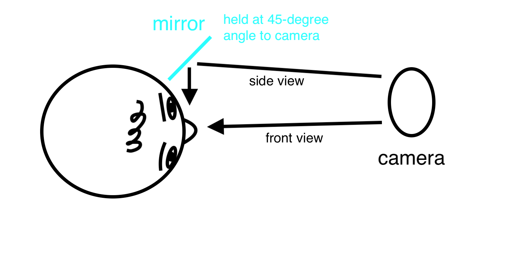
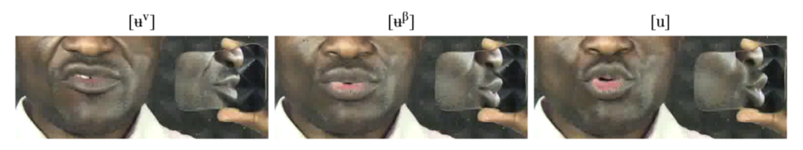
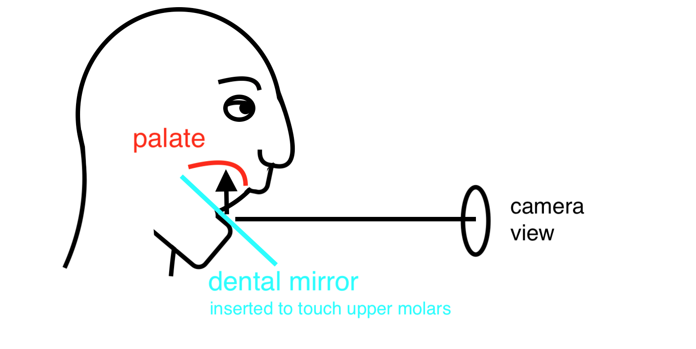
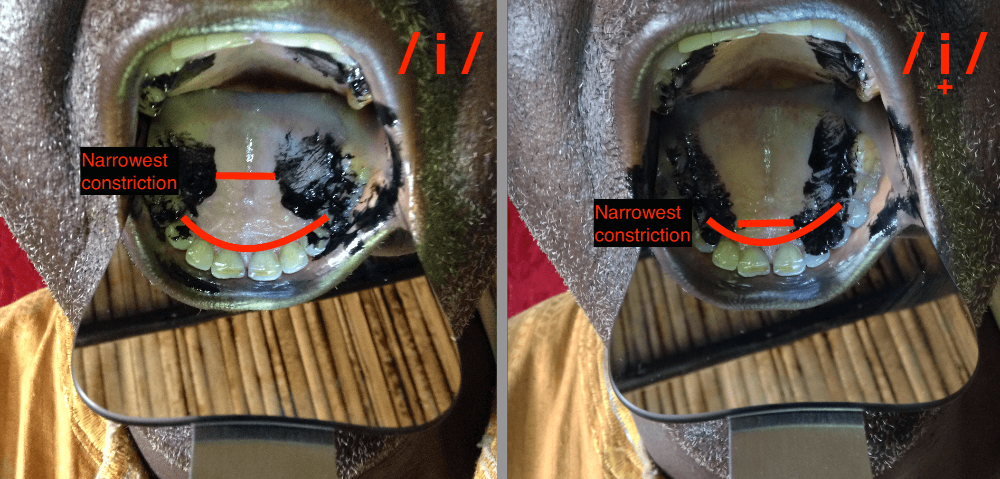

% [verb]ing phonetics: workshop 2
% Banto1d, 23 March 2022
% Universität Hamburg 
  Matthew Faytak 
  Katie Franich

## Overview

In this session:

* Beyond Praat: articulatory data
* Data management
* Using the data
* Open discussion period

# Articulatory data

## Acoustics vs. articulation

Acoustics gives us an **indirect idea** of the movements of the articulators

Sometimes, though, we need to look directly at the articulators

* If there are multiple explanations for acoustics
* If the examined sounds are totally unfamiliar or especially unusual
* In our context, this is fairly common

## Lip articulation

Movement of tongue and lips: lips are easily seen moving

* Mirror at 45 degree angle provides a side view

## Examples

Pius vowel photos

* example (Pius again)

## Palatographs

More complex, but provide information on tongue-palate contact Anderson (2008)

* stop and fricative place
* certain aspects of vowel articulation

Method

* paint tongue
* one token involving one lingual consonant
* open mouth, insert mirror, photograph

Electropalatography? Thomas-Vilakati (2010)

## Examples

Kom high vowels (which I will be talking about in my regular talk)

* Kom iz vs. i
* Audio examples

## Required equipment

Smartphone camera or handheld camera

Hand-held mirror (for lips)
dental mirror (for palatography)

edible pigment (chocolate powder, edible charcoal) for palatography

## Optional equipment

Phone tripod or camera tripod, to stabilize image

Photography light for better image quality

## Good practice

Take more photographs than you think you'll need 

* Not all will be well-lit or at the right angle
* ???

## Beyond our reach (for now)

Things which are a bit tricky to measure; stick with acoustics 

* Tongue root advancement or retraction Allen, Pulleyblank, & Ajíbóyè (2013) 

## Move to refs below

Allen, B., Pulleyblank, D., & Ajíbóyè, Ọ. (2013). Articulatory mapping of Yoruba vowels: an ultrasound study. *Phonology*, 30(2), 183-210. <a href="https://ir.unilag.edu.ng/handle/123456789/2016">PDF</a>

Gick, B., Pulleyblank, D., Campbell, F., & Mutaka, N. (2006). Low vowels and transparency in Kinande vowel harmony. *Phonology*, 23(1), 1-20. <a href="https://www.researchgate.net/profile/Douglas-Pulleyblank/publication/231788585_Low_vowels_and_transparency_in_Kinande_vowel_harmony/links/0deec536d70d2b816c000000/Low-vowels-and-transparency-in-Kinande-vowel-harmony.pdf">PDF</a>

Hudu, F. (2014). [ATR] feature involves a distinct tongue root articulation: Evidence from ultrasound imaging. *Lingua*, 143, 36-51. <a href="https://doi.org/10.1016/j.lingua.2013.12.009">Abstract</a>

Hudu, F. (2016). A phonetic inquiry into Dagbani vowel neutralisations. *Journal of African Languages and Linguistics*, 37(1), 59-89. <a href="https://doi.org/10.1515/jall-2016-0002">Abstract</a>

## Put in previous slides

Ajíbóyè, Ọ., Déchaine, R., Gick, B., & Pulleyblank, D. (2011). Disambiguating Yorùbá tones: At the interface between syntax, morphology, phonology and phonetics. *Lingua*, 121(10), 1631-1648. <a href="https://ir.unilag.edu.ng/bitstream/handle/123456789/8793/Disambiguating_Yoruba_tones_At_the_inter.pdf?sequence=1">PDF</a> tone

Billington, R. (2017). The phonetics and phonology of the Lopit language. PhD dissertation, University of Melbourne. <a href="http://hdl.handle.net/11343/192353">Abstract & PDF</a> tone, ATR, geminates

Casali, R. F. (2008). ATR harmony in African languages. Language and linguistics compass, 2(3), 496-549. <a href="https://doi.org/10.1111/j.1749-818X.2008.00064.x">Abstract</a> ATR (theory)

Connell, B. (2002). Aspects of the phonetics of Cambap. *Studies in African Linguistics*, 31(1/2), 179-210. <a href="https://journals.flvc.org/sal/article/view/107350">Abstract & PDF</a>

Downing & Gick (2001), V'less tone depressors in Nambya and Botswana Kalang'a 

Franich (var.) on Medumba
2014 diss.
2021 JPhon article
Danis et al. (2012) Medumba?

Faytak (????) on Kom/Limbum?

Hubbard, K. (1995). ‘Prenasalised consonants’ and syllable timing: Evidence from Runyambo and Luganda. *Phonology* 12, 235–256. <a href="https://doi.org/10.1017/S0952675700002487">Abstract</a>

Hudu, F. (2016). A phonetic inquiry into Dagbani vowel neutralisations. *Journal of African Languages and Linguistics*, 37(1), 59-89. <a href="https://doi.org/10.1515/jall-2016-0002">Abstract</a> ATR, neutralization/prosody

Jouannet 1983 - Kinyarwanda fortition/secondary articulation

Lee-Kim et al (2014) - Tsonga whistled fricatives

Shosted (2006) - Tshwa (?) whistled frictives?
Shosted (2011) - Changana (S53/S511)

Mathangwane, J. (1996). Phonetics and phonology of Ikalanga: A diachronic and synchronic study. PhD dissertation, University of California, Berkeley. <a href="https://www.proquest.com/docview/304307079?accountid=14169">PDF</a> check link

Mathangwane (1999) - iKalanga \*kw as [pk], more fortition

Mathes, T. & Chebanne, A. (2018). An SS ANOVA (Smoothing Spline Analysis of Variance) study of high tone lowering in Tsua. *South African Journal of African Languages*, 38(2), 137-148. <a href="https://doi.org/10.1080/02572117.2018.1463701">Abstract</a> maybe too complicated.

Mathes, T. & Chebanne, A. (2018). High tone lowering and raising in Tsua. *Stellenbosch Papers in Linguistics Plus*, 54, 1-16. <a href="https://www.ajol.info/index.php/splp/article/view/184478">Abstract & PDF</a> particularly good as a model.

Miller, A., Namaseb, L., & Iskarous, K. (2007). Tongue body constriction differences in click types. *Laboratory Phonology*, 9, 643-656. <a href="http://citeseerx.ist.psu.edu/viewdoc/download?doi=10.1.1.135.2851&rep=rep1&type=pdf">PDF</a> 

Naidoo 2010 - Zulu implosive
Nagano-Madsen & THornell (2012) - Mpiemo implosives

Ladefoged 1990 - " Differences in lip posture appear to enhance the contrast between labiodental /f, v/ and
labial fricatives /ɸ, β/ in Kwangali (K.33) and in Gciriku (K.332) "; also Blumstein & ??? in the one Ewe paper; Maddieson on Ewe

Liu, X., & Kula, N. (2018). A comparative study of depression in Bantu, Khoisan and Chinese Wu – laryngeal settings and feature specifications. *Stellenbosch Papers in Linguistics Plus*, 54, 17-34. <a href="https://www.ajol.info/index.php/splp/article/view/184479">Abstract & PDF</a> (good overview, but only kind of phoneticky)

Maddieson, I. & Sands, B. (2019). The sounds of the Bantu languages. In ... 

Nabirye et al., 2016 - LuSoga palatography (apical/laminal distinction)

Olson, K. & Meynadier, Y. (2015) bilabial trills in Medumba

Olson & Hajek (1999) - labial flap

Traill et al (1987) - depressing facts about Zulu

Tlale, The phonetics and phonology of Sengwato, a dialect of Setswana (2005, Georgetown diss)

more depressors: Lee 2015, Cibelli 2015, Chen & Downing 2011

Nakagawa on clicks (and lots of other Khoesan stuff)

Miller on clicks
Fulop et al (2003) - Yeyi clicks
Thomas-Vilakati (2010) - EPG
Gunnink on clicks

Post-nasal stops are
devoiced in Kgalagari (Solé et al. 2010), and in Tswana only for some speakers (Coetzee and Pretorius 2010). 

Myers, S., Namyalo, S., & Kiriggwajjo, A. (2019). F0 timing and tone contrasts in Luganda. Phonetica, 76(1), 55-81.https://doi.org/10.1159/000491073

Embosi (C.25) which does not have downdrift,
still has final lowering due to a L% boundary tone (Rialland and Aborobongui 2016).
Basaá downstep - Makasso et al. 2016
Oppong (2021) - pitch reset in Akan (look again for cites?)
Rialland (2007) - survey of question marking prosody

## General overviews for later reading

Ladefoged, P. (1968). *A phonetic study of West African languages: An auditory-instrumental survey*. Cambridge University Press.

Ladefoged & Maddieson (1996). *Sounds of the World's Languages.* Cambridge University Press.

Anyanwu, R.

IPA illustrations: 
Temne
Ega
Seenku
Dagaare
Kabiye
Igbo?, Ika Igbo
Hausa?
Kalabari Ijo
Ibibio
Basaá
Cicipu
Goemai
Tera
Mambay
Kera
Mono
Luanyjang Dinka
Shilluk
Amharic
Nara
Kunama
Tashlhiyt Berber (Shilha)
Zuwarah Berber
Lusoga (Lutenga)
Sandawe
Bemba (Hamann & Kula 2015)
Setswana
Central Malagasy

# Data management

## Now what?

Suppose you have made a set of recordings onto your device. Now you should ensure that you don't lose them

* You can skip this part for some amount of time, but you risk losing the data altogether
* Remembering the recordings is not a substitute for the recordings themselves

## File backups

Back up *every file* in multiple locations if possible

* SD cards are an efficient way to do this
* Thumb drives and external drives are acceptable as well (though they wear out with time)
* Multiple computers work (i.e. share with a colleague)

Cloud storage is a good option, though uploading may be expensive

* Emailing small files to yourself works in a pinch
* Long-term cloud storage is ideal (Google Drive, OneDrive, Box, Dropbox, etc)

## File naming

Name your files according to the same logical pattern

* Date, language, topic
* Avoid duplicating names

To identify further details you should speak them during *the recording itself*

* Identify yourself
* Identify speaker if this is not sensitive information
* Give time, date, and location of recording
* Identify anyone else who may be heard in the recording (assistants, translators, etc.)

# Using the data

## Figure/photo production

Your current work will benefit from inclusion of figures, photographic data, etc.

* include as supplementary information or examples in mémoire/thèse MA/PhD model
* Same for papers

## Figure/photo analysis

In exceptional cases, you may measure some physical attribute of articulatory pictures/images and convert that to tabular data

i.e. ratio of lip opening to lip width (or height-height) in pixels

lip example/schematic

## Tabular data analysis

Tabular data consisting of many acoustic measures is more complicated: it needs to be **averaged**, summarized (mean/standard deviation), or submitted to a statistical model

Averaging and basic statistical models can be done on this data, using Excel's Data Analysis Tools (need to install)

* While Excel *works*, learning a dedicated statistical program is better in the long run
* We'll discuss after break

picture example?

## Statistics

Simple statistical analysis and modeling (t-testing, linear models, curve fitting, etc)

* We acknowledge this is not practical for all attendees, but it is standard in phonetics
* Collaborators who happen to know statistics may contribute this work (division of labor)
  * Multi-authored papers *are the norm* in phonetics!
* Having nicely formatted tabular data is crucial to this handoff

## Statistical power

Because of the need to model the data, it's important to have enough **statistical power**

* Need to ensure you have collected numerous repetitions of the phenomenon you're after
* Need to ensure that enough **speakers** are recorded (the more the better)
  * To get at the community average, instead of the idiosyncrasies of one speaker

## Trying stats yourself

R is free software which is useful for statistical analysis

* Excel can also be used (though it's not always so useful)

Simple plots can also be made in Excel and R

# Conclusions

## Summary

Summary asdf

## Open discussion

Some potential topics for discussion:

* How can we build capacity for this work in the continent's universities?
* Can existing high-quality documentary work be used as a starting point?
* How can we valorize this work when students decide to pursue it?
* What should be the role of linguists off the continent in developing this work? 

## References {.bib}

Anderson, V. (2008). Static palatography for language fieldwork. *Language Documentation & Conservation*, 2(1), 1-27. <a href="https://scholarspace.manoa.hawaii.edu/handle/10125/1808">Article</a>
