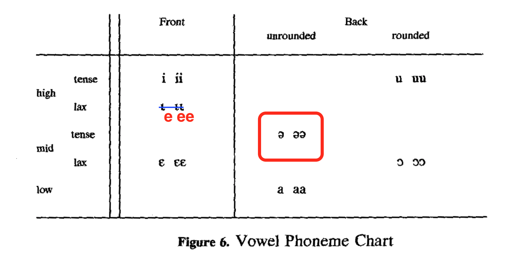
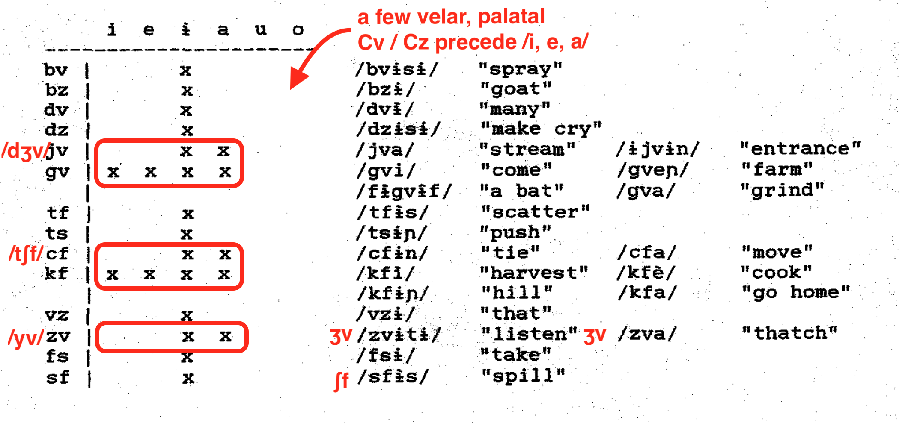
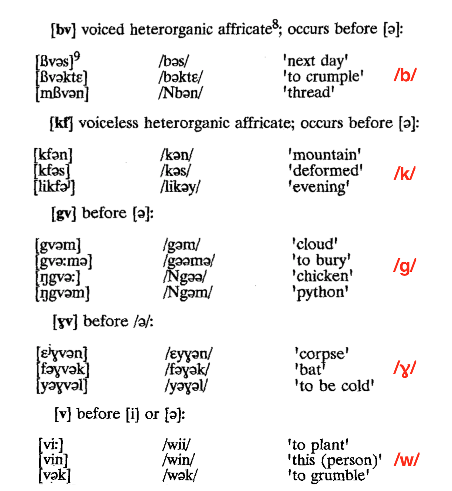
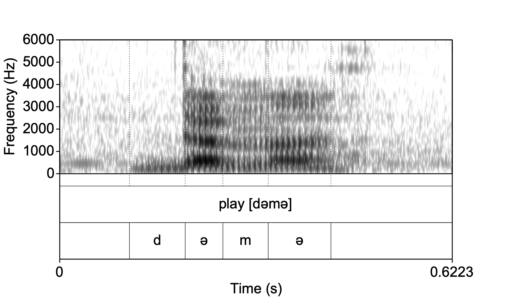
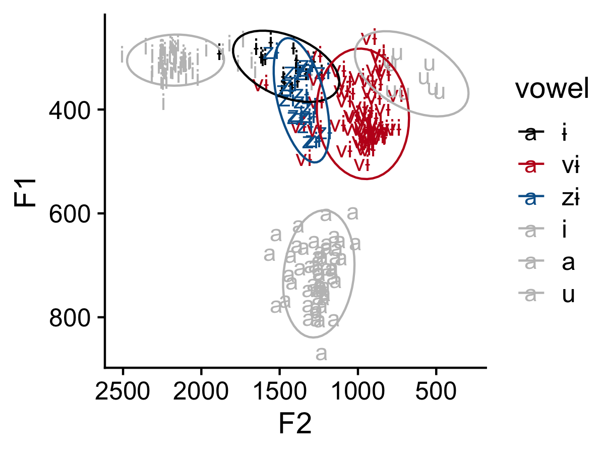
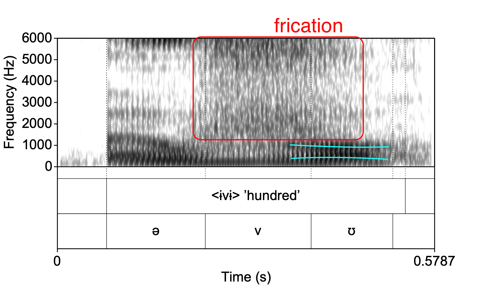
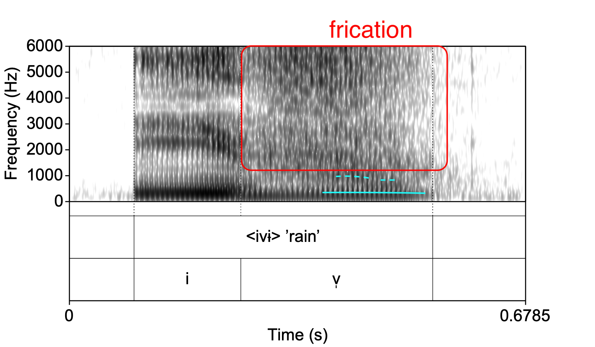
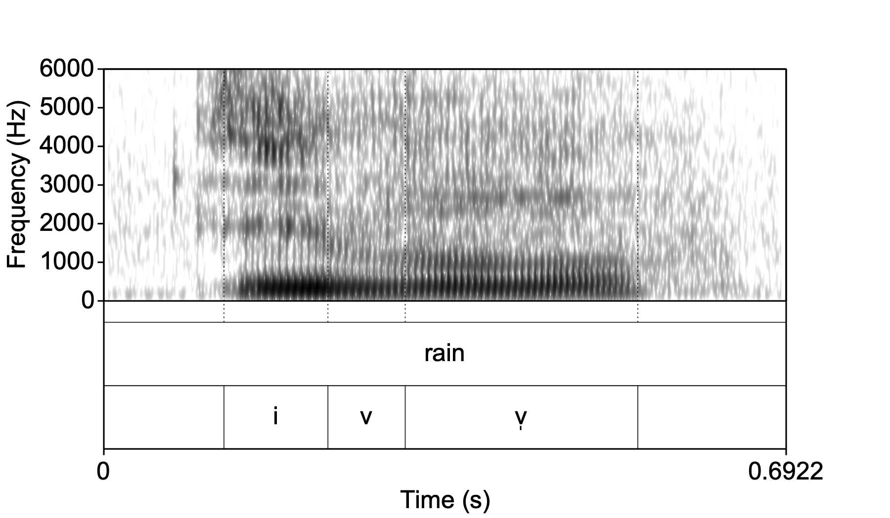

% Phonetic detail and phonological analysis in Kom and Oku
% Banto1d Universität Hamburg, 25 March 2022
% Matthew Faytak (Univ. at Buffalo) faytak@buffalo.edu

## Overview

Prior phonemic analysis of Central Ring languages (Kom, Oku)

* Vowels: too few?
* Consonant clusters: too many?

Phonetic study

* Methods, analysis
* Preliminary results

Discussion

* Phonetic methods as an input to phonological analysis
* Ring (and proto-Ring) vowel and consonant inventories

# Introduction

## Central Ring languages

An under-explored cluster of languages noted for their complex tonal and segmental phonology Hyman (1980); Paulin (1995)

* Focus here: **Kom** and **Oku** (circled)

 

map from Paulin (1995)

## Previous analyses: vowels

Prior analysis of Kom and Oku: unremarkable inventories for the Grassfields

* Peripheral vowels with one central non-low vowel, 2-3 degrees of height
* Previous analysis of Kom has /i e a o u/ plus central /ɨ/ Shultz (1993)

* Previous analysis of Oku: Davis (1992), Davis & Blood (1999)

## Previous analyses: Kom consonants

Both Kom and Oku have also been analyzed with unusual consonant phonotactics for the area (and Grassfields generally)

* $C_1C_2$- in Kom, disregarding prenasalization: nearly all clusters precede a vowel written **\<ɨ\>** Shultz (1993)
* $C_1$ and $C_2$ always match for [$\pm$voice]

## Previous analyses: Oku consonants

In Oku, we see hints of what may actually be happening here: bilabials, velars, and /w/ labiodentalize before **\<ə\>** Davis (1992)

* Yields b &rarr; [bv], k &rarr; [kf], g &rarr; [gv], ɣ &rarr; [ɣv], w &rarr; [v]
* Davis attributes this to a *labiodentalizing effect* of /ə/

## An alternative: fricative vowels

To sum up the analytical status quo for Kom and Oku: 

* Onset clusters in the set \<Cs Cz Cf Cv\> which only occur before the central vowels (\<ɨ\> or \<ə\>)
* Central vowels occur elsewhere

An analysis which may work better: Oku and Kom have **fricative vowels** mistaken for /Cə/ or /Cɨ/ sequences Connell (2007)

* Fricative vowels have a centralized quality
* Frication occurs over most of vowel's duration
* Frication is an intrinsic part of the production of the vowel

One way to check: **overlap** of /v/-like (and /z/-like) constrictions with following vowel which is analyzed as \<ɨ\> or \<ə\>

* If mostly over vowel, fricative timing and vowel quality will be affected
* If mostly over consonant, vowel quality will *not* be affected

# Exploratory phonetic study

## Research questions

What is the relationship between frication and Kom \<Cɨ\> / Oku \<Cə\>?

* Does presence of frication "color" the vowel-like part of the sequence?
* How is the frication timed in each language?

Small study, mixed instrumental and impressionistic methods:

1. Calculate typical **vowel quality** for vowel-like parts of \<(C)ɨ\> in Kom and \<(C)ə\> in Oku
2. Visually inspect for differences in **timing** of frication

## Materials

Previously collected wordlist recordings (3 male speakers, out of roughly 30 total)

* Recorded in Bamenda (NE, NV) and Kom village of Njinkuyn (ME)
* AudioTechnica AT820-series lapel mic and Marantz PMD 660 recorder (44.1 kHz sampling rate)

Isolated word list reading of words containing \<vV\>, \<zV\>, and \<V\> (677 tokens total)

* Kom: 46 \<ɨ\>, 109 \<vɨ\>, 111 \<zɨ\>, 104 /i/, 113 /a/, 22 /u/ tokens
* Oku: 50 \<ə\>, 81 \<və\>, 15 /i/, 18 /u/, 8 /a/ tokens
* /i u a/ collected purely for comparison
* Not well-balanced; follow-up study will ideally have more tokens of \<ɨ\>

## Analysis

Formant frequency extraction with Praat via the Parselmouth Python package Jadoul, Thompson, & de Boer (2018); Boersma & Weenink (2021)

* Extracted from vowel-like portions only
* F1 and F2 measures were manually corrected for the Kom speakers (7 tokens of /u/ and 11 of \<vɨ\>)
* Back rounded vowels are prone to formant estimation errors due to close F1 and F2: looks like a single formant

* Different formant estimation settings (5.5 instead of 4.5 formants) for /u/ were used for Kom speaker NV2
* Any vowel which did not have trackable formants was excluded from analysis

# Results: Oku

## Formants, Oku speaker NE

Speaker NE's schwa variants all overlap in their formant frequencies

* Ellipses contain 95% of a group's data

## Oku C labiodentalization

<audio id="oku-lab-m" src="./assets/media/oku-labiodental-m.wav"></audio>

<audio id="oku-drink" src="./assets/media/oku-drink.wav"></audio>

Some labiodentalized consonants not accounted for in Davis (1992) were observed: /t d/

* /t/, /d/ are also be realized as [tf], [dv] before some (but not all) /ə/
* All with brief frication on release

<audio id="oku-lab-d" src="./assets/media/oku-labiodental-d.wav"></audio>

<audio id="oku-schwa" src="./assets/media/oku-regular-schwa.wav"></audio>

* <button onclick="document.getElementById('oku-lab-d').play()"> With [v] frication</button>

* <button onclick="document.getElementById('oku-schwa').play()">Some schwas</button> don't seem to condition labiodentalization, however

## Oku C labiodentalization

Nasals seem to have *overlapping* labiodental approximation, which was completely missed in Davis (1992)

* /m/ labiodentalizes to [ɱv] or [ɱʋ] before /ə/, sometimes just [ɱ]: <button onclick="document.getElementById('oku-lab-m').play()"> [səɱək] 'INF-eat powder'</button>

* /n/ before /ə/ has a distinctive quality, perhaps [n͡ʋ] <button onclick="document.getElementById('oku-drink').play()"> [n͡ʋə] 'drink'</button>
* Realization of /nə/ is rather variable compared to other consonants

## Oku: summary

F1 and F2 of all \<ə\> vowels overlaps, and frication does not obviously extend into the vowel

* Vowels always have a fricative-free portion
* Labiodentalization is brief, light, and seems to overlap the onset consonant's closure 
* Quality of vowel itself does not change along with accompanying frication

Confirms that Davis' treatment as an [ə] accompanied with modification of onset consonants is *basically correct*

* Quite typologically unusual

# Results: Kom

## Formants, Kom speaker NV

Younger speaker (born c. 1990) has moderately well separated formant frequencies for \<ɨ\>, \<vɨ\>, \<zɨ\>

## Frication timing, NV

<audio id="kom-eat" src="./assets/media/kom-eat-vowel.wav"></audio>

<audio id="kom-more" src="./assets/media/kom-more-vowel.wav"></audio>

Kom frication completely obscures the vowel formants in many cases

* Quite unlike Oku, where a vowel with clear formants is always visible
* Formants <button onclick="document.getElementById('kom-more').play()"> half-visible</button>

* No clear <button onclick="document.getElementById('kom-eat').play()"> upper formants</button> visible

 

## Kom, ME

Older speaker (born c. 1950) has well-separated formant frequencies for \<ɨ\>, \<vɨ\>, \<zɨ\>

## Frication timing, ME

<audio id="kom-rain" src="./assets/media/kom-em-rain.wav"></audio>

Noticeably lighter frication, but it consistently extends <button onclick="document.getElementById('kom-rain').play()"> all across</button> visible the vowel

## Kom: summary

Strong evidence that the analysis in Shultz (1993) is incorrect: \<vɨ\> and \<zɨ\> are not sequences, but unit phonemes

* \<ɨ\> vowel's formant frequencies differ according to whether it is preceded by a \<v\> or \<z\>
* Stem \<ɨ\> is higher and somewhat more front when occurring on its own
* Along with the timing of frication, indicates a [z] or [v]-like constriction which persists from frication through vowel portion

## Kom palatography

Static palatography Anderson (2008) gives converging evidence for this constriction

<audio id="goat" src="./assets/media/kom-goat.wav"></audio>

<audio id="em-kola" src="./assets/media/kom-kola.wav"></audio>

* Left: [i], as in <button onclick="document.getElementById('kola').play()"> [ībi᷇] 'kola nut'</button>
* Right: \<zɨ\>, as in <button onclick="document.getElementById('goat').play()"> [ə̄bź] 'goat'</button>

# Discussion

## Reanalysis

Kom and Oku have vowels with associated frication, but "associated" in two different ways

* Kom **/v/**, **/z/**: frication realized on vowel; constriction affects vowel quality
	* Lightly "laid over" the entire vowel (older Kom speakers) 
	* Or stronger on first half to two-thirds of vowel (younger Kom speakers)
* Oku "labiodentalizing" **/ᵛə/**: frication (or approximation, or modified closure) realized primarily on adjacent consonant; quality is basically unmodified [ə] as Davis (1992) suggests

Tempting to see this as snapshots of diachronic development: 

* Frication develops, then "splits" into a CV sequence as in Oku, then vowel is absorbed into [ə]-like category
* Younger Kom speakers like NV may be moving towards a "split", though vowel quality remains quite different

## Resulting inventories

Kom has contrastive fricative vowels which are arguably specified for [$\pm$ back]

| | Front | | Back |
| ------ | ------ | ------- | ------ |
| Fricative | **z** | | **v** |
| High | i y | **ɨ** | u |
| High-mid | e | | o |
| Low-mid | ɛ œ | | | 
| Low | | a | |

Oku has two phonetically identical, but maybe contrastive, schwas, only *one of which* labiodentalizes

| | Front | | Back |
| ------ | ------ | ------- | ------ |
| High | i |  | u |
| High-mid | e |  | o |
| Low-mid | ɛ | **ə ᵛə** | | 
| Low | | a | |

## Phonetic methods and the field

Special role for phonetics in the Bantoid area: as a **corrective**

* Avoid detail being "filled in" using assumptions from an assumed areal profile
* Lots of Grassfields languages have phones transcribed with \<ʉ\>, \<ɨ\>, or \<ə\>

Grassfields and surrounding areas have many fricative vowels "hiding behind" symbols like \<ʉ\> or \<ɨ\>:

* [z] and [v]-like vowels observed in Len Mambila and Limbum Fransen (1995); Nforgwei (2004); Connell (2007); Lewis & Shittu (2014)
* [v]-like vowels occur throughout Beboid and Yemne-Kimbi (Noone, Ncane, Fang) Hyman (1981); Boutwell (2020); Good & Tschonghongei, p.c.
* Lip-compressed vowels prone to trilling and frication are known elsewhere Olson & Meynadier (2015); Faytak & Akumbu (2021)

Understanding the distribution and historical development of segmental phenomena such as these are important for reconstructing the area's proto-languages

## Historical connections

The fricative-vowel explanation connects Oku schwas and Kom "central vowels" to Proto-Ring (PR) **high vowels**

* Correspondence sets containing Oku "labiodentalizing" /ᵛə/, Kom /v/, and (conservative) Bum /u/ are quite clear

| lexeme | Kom | Oku | Babanki | Bum | PR (Piron) | PR (revised) | PB | 
| ----------- | ----------- | ----------- | ----------- | ----------- | ----------- | ----------- | ----------- | ----------- |
| fowl      | ŋgv̀       | mbvə̀       | mbvʉ̀       | ŋgù       | \*kúɛ̀, \*búɛ̀       | \*ngúb\`       | \*\*kúbà       |
| foot   | -v᷇        | -və́        | -wʉ́       | -wú        | \*gúdɔ̀        | \*ɣúl\`        | \*\*pàdí        |
| knee   | -lv᷇        | -lə́y        | -lwí        | --       | \*dútì        | \*lúɪ̀        | \*\*dúɪ̀        |
| drink   | nv́        | nʋə́        | ɲʉ́        | ɲú       | \*nú\`        | \*nú\`        | \*\*ɲú        |

* The situation with Kom /z/ is more complex but clearly involves PR \*i

| lexeme | Kom | Oku | Babanki | Bum | PR (Piron) | PR (revised) | PB | 
| ----------- | ----------- | ----------- | ----------- | ----------- | ----------- | ----------- | ----------- | ----------- |
| swallow   | mz̀        | mì́       | mì        | mì       | \*mìɛ́        | \*mì        | \*\*mìd        |
| give birth   | bź        | bî        | bwí        | bɨ̂       | \*búítɛ̀, \*dí        | \*bí\`       | \*\*bíad        |
| goat   | bź        | bvə́y        | byí        | bú       | \*búmì        | \*bʊ́ì        | \*\*bʊ́dì        |
| forge   | tź        | tvə́y        | tyí        | --       | --        | \*tʊ́ì        | \*\*tʊ́d(ì)        |

* More comparative work needed for Oku "plain" /ə/

## References {.bib}

Anderson, V. (2008). Static palatography for language fieldwork. *Language Documentation & Conservation*, 2(1), 1-27. <a href="https://scholarspace.manoa.hawaii.edu/handle/10125/1808">PDF</a>

Boersma, P. & Weenink, D. (2021). Praat (software suite). <a href="https://praat.org">https://praat.org</a> 

Boutwell, R. (2020). *A grammar of Nchane: A Bantoid (Beboid) language of Cameroon.* Netherlands Graduate School of Linguistics. <a href="https://www.lotpublications.nl/Documents/572_fulltext.pdf">PDF</a>

Connell, B. (2007). Mambila fricative vowels and Bantu spirantisation. *Africana Linguistica*, 13(1), 7-31. <a href="https://www.persee.fr/doc/aflin_2033-8732_2007_num_13_1_969">Article</a>

Davis, L. (1992). A segmental phonology of the Oku language. Master's thesis, University of Texas at Arlington. <a href="https://www.silcam.org/resources/archives/9762">PDF</a>

Davis, L. & Blood, C. (1999). *Oku-English provisional lexicon.* Yaoundé: SIL Cameroon. <a href="https://www.silcam.org/resources/archives/47878">PDF</a>

Faytak, M., & Akumbu, P. W. (2021). Kejom (Babanki). *Journal of the International Phonetic Association*, 51(2), 333-354. <a href="https://doi.org/10.1017/S0025100319000264">Article</a>

Fransen, M. (1995). A Grammar of Limbum: A Grassfields Bantu Language Spoken in the North-West Province of Cameroon. PhD dissertation, Vrije Universitet Amsterdam.

Hyman, L. (1980). Babanki and the Ring group. In Voorhoeve, J. & Bouquiaux, L., eds., *L'expansion bantoue: Actes du Colloque International du CNRS, Viviers (France), 4-16 avr. 1977*, 225-258. Paris: SELAF. 

Hyman, L. (2014). How to study a tone language. *Language Documentation & Conservation*, 8, 525-562. <a href="https://scholarspace.manoa.hawaii.edu/handle/10125/24624">PDF</a>

Hyman, L. (1981). *Noni Grammatical Structure: With special reference to verb morphology.* Southern California Occasional Papers in Linguistics 9, Dept. of Linguistics, University of Southern California. <a href="https://dornsife.usc.edu/assets/sites/56/docs/SCOPIL9-Noni_grammatical_structure.pdf">PDF</a> 

Jadoul, Y., Thompson, B., & de Boer, B. (2018). Introducing Parselmouth: A Python interface to Praat. *Journal of Phonetics*, 71, 1-15. <a href="https://doi.org/10.1016/j.wocn.2018.07.001">Abstract</a> &nbsp;&nbsp;&nbsp; <a href="https://parselmouth.readthedocs.io/en/stable/">User Guide</a>

Lewis, D., & Shittu, S. (2014). Phonemic Status of Len Fricative-Vowels. *Ibadan Journal of Humanities Studies*, 24, 27-45. <a href="https://d1wqtxts1xzle7.cloudfront.net/58083355/Lewis-Shittu_Fricative-Vowels-with-cover-page-v2.pdf?Expires=1647723825&Signature=Na3aiC4CnjsqrlzOpWavRK62Me6X0qua9u5-rENtVXcw9Kc-dYEeTPz9QdgVH-M7ItxnzH024r4yndu8wHw~p1wY4CrAKFzDx566C~h8N8prQozt8mtuY6nnF4Q7VLO9-bLyRyS-NyELxQpNdqHXIaS2-EZc3GPGTdTgC9NXew~Sy9nx6JZ~EyWZLLRJ0-6Vs-M53Jw35TTD1tJEK7aXx8oQXFcYdes6AvQ5dSBMJ-auwVKYagml3V9IHt1cwHm5aw6G-bb5vfpEgl1o1SoVKxoaOKJjzKU~cv3NU~hP1yFlaY8hrMXIg-pRf~pVLNNlMsQXguo5eSmuzDnonz-KzQ__&Key-Pair-Id=APKAJLOHF5GGSLRBV4ZA">PDF</a>

Nforgwei, S. (2004). A study of the phonological and syntactic processes in the standardisation of Limbum. PhD dissertation, Université de Yaoundé. <a href="https://pure.mpg.de/rest/items/item_403491/component/file_403490/content">PDF</a>

Olson, K. & Meynadier, Y. (2015) On Medumba bilabial trills and vowels. *Proceedings of ICPhS 18*, Glasgow. <a href="https://hal.archives-ouvertes.fr/hal-01211220/file/2015_ICPhS_Olson.pdf">PDF</a>

Paulin, P. (1995). *Étude comparative des langues du groupe ring.* Mémoire de DEA en sciences de langage, Université Lumière Lyon 2.

Schultz, G. (1993). *Notes on the phonology of the Kom language.* Yaoundé: SIL Cameroon. <a href="https://www.silcam.org/resources/archives/47560">PDF</a>

