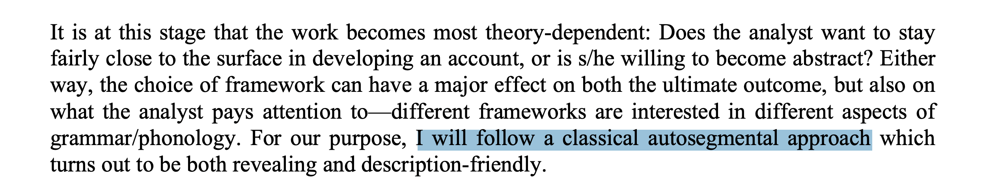
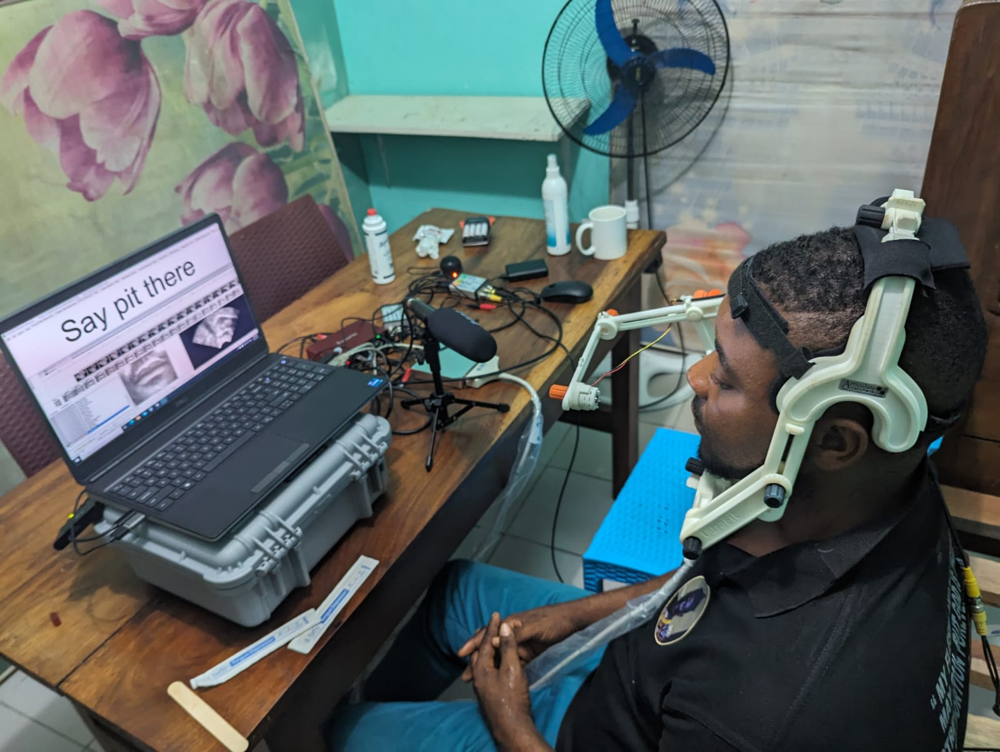

% Phonetic methods and fieldwork: the view from Cameroon 
% CNYHCSS, 26 Oct 2024  University of Rochester
% Matthew Faytak (Univ. at Buffalo)

## Overview

The workshop these slides are drawn from was an introduction to **practical field** phonetics aimed at linguists trained in Cameroon

* Universität Hamburg, 2022
* University of Buea\* (Cameroon), 2022

* Some background, and the phonetics-fieldwork connection
* Acoustic recording best practices
* Basic articulatory data (yes, really)

# Background

## Background

Africa has long been regarded as central to phonetic description Ladefoged (1968), Maddieson & Sands (2019)

* Complex tone systems
* Advanced/retracted tongue root (and harmony)
* Labial-velars
* Clicks, implosives, and other non-pulmonic consonants

But there is little phonetics research on African languages Whalen, DiCanio, & Dockum (2019)

. . . 

*Many other field areas* are like this: sorely under-studied from a phonetic perspective. **Your data can change this!**

## Why take (really good) recordings?

Documentation funders (surprisingly) often don't have clear guidelines for recording quality or equipment - why bother?

Several practical advantages to investing time in good recordings, even if you do not plan to analyze the data yourself

* **Broader use** and **reanalysis** of the created data
* **Precision** and reliability in characterizing sounds, detecting contrasts
* **Neutrality**\* in the face of analytical and perceptual bias

Always as a **complement** to impressionistic methods (I always *also* transcribe my data)

## Neutrality: analysis

In impressionistic phonological description, all presentation of data is effectively filtered through the worker's theoretical analysis 

* For example: autosegmental representations often make transcriptions more abstract Hyman (2014):545

* Very easy for analysts to allow the representational method to shape the representations themselves

## Neutrality: perception

Even a trained phonetic ear is prone to making occasional mistakes based on **perceptual bias**

* For example: nasal consonant codas are more often misidentified after non-low vowels Zee (1981)
* Transcription mistakes permanently enter the record!

# Recording acoustic data

## Desired qualities

We always want acoustic speech data to be:

* Low in background **noise**
* Sufficiently **loud** against background noise, but not too loud
* Free of **echo**

Certain details of format are also important: 

* Record using a high **sampling rate**, at least 22.1 kHz
* Save in **non-compressed** format (such as **.WAV**; avoid .MP3)
* Often controlled by the hardware you are using

## Good recording

<audio id="good" src="./assets/media/best-quality.wav"></audio>

<button onclick="document.getElementById('good').play()">"La plume de ma tante"</button>

* Speaker's voice is much louder than background, but is not *too* loud
* Background is free of avoidable noise
* Practically no echo

The following slides contain recordings which fail on one of the points above

## Too noisy

Recordings should not contain excessive background noise 

<audio id="noise2" src="./assets/media/noisy2.wav"></audio>
<audio id="scuff" src="./assets/media/scuffing.wav"></audio>

* <button onclick="document.getElementById('noise2').play()">Continuous noise</button> from a fan
* <button onclick="document.getElementById('scuff').play()">Intermittent noise</button> from touching the microphone

Make test recordings! Any noise, however quiet to your ears in the moment, will be *much louder* in the recording later

* Rain on the roof (especially metal roofs)
* Appliances (refrigerators, any motors or fans)
* Busy roads (trucks, taxis)
* Chickens, goats, children, etc.
* Phones ringing or vibrating
* Speaker striking self, table, microphone, etc. 

## Too much echo

<audio id="echo1" src="./assets/media/echo1.wav"></audio>
<audio id="echo2" src="./assets/media/echo2.wav"></audio>

If echo is strong, audio ends up overlapping itself; problem for listening and analysis later

* <button onclick="document.getElementById('echo1').play()">Slight echo</button> (in tiled hallway)
* <button onclick="document.getElementById('echo2').play()">More echo</button>(in concrete stairwell)

How to improve: listen for echo and choose surroundings which have less

* "Soft" rooms reduce echo (couches, carpets, pillows, hanging clothes); tile, stone, and cement produce echo
* Record in the back seat of a car (motor off) if available
* Record outside if no suitable room exists

## Too loud ("clipped")

<audio id="clip" src="./assets/media/clipping.wav"></audio>
<audio id="pop" src="./assets/media/popping.wav"></audio>

If the speaker is too loud and/or too close to the microphone, the device cannot respond enough; **clipping** results

* <button onclick="document.getElementById('clip').play()">Clipping of whole utterance</button>
* This can also happen for <button onclick="document.getElementById('pop').play()"> stops and fricatives only</button>, where the releases "pop" in the microphone

How to improve: make test recordings, reposition microphones as needed

* If there is general clipping, microphone needs to be further away or speaker needs to be quieter
* If stops "pop", position microphone to the **side** of the mouth
* **Gain** can often be adjusted if you are using a recorder

## Core equipment for field settings

Most problems can be fixed by using the right **external microphone**;  catch less background echo/noise

* Look for **cardioid** or **unidirectional** in the description if you are recording single speakers
* **Headset** microphones may be especially useful since they literally point at the mouth
* Recording public events may require an **omnidirectional** microphone
* Position of microphone(s) is also very important: avoid clipping, pops, etc

Checking your recording quality with **headphones**: can detect unanticipated issues

## More variable equipment

**Acoustic baffles** to reduce echo or wind noises

* Soft, fluffy objects: blankets, sofas, etc.
* A **car** with padded seats can function as a soundbooth in a pinch (motor off, windows closed)
* "Dead cats" and "marshmallows": covers for mics which reduce wind/airflow noise
* I've used **mattresses** as acoustic treatment in reverberant rooms

## One outcome

<audio id="nsunsu" src="./assets/media/nsunsu.wav"></audio>

It is possible to get high-quality data in a relatively uncontrolled field setting! 

The setup for <button onclick="document.getElementById('nsunsu').play()">this text recording</button>

* Zoom H4 audio recorder (WAV, mono, 22.1 khZ sampling)
* Shure SM10A hypercardioid headset microphone
* A couple of mattresses against the wall facing the speaker
* Separate room with closed door

## A different outcome

<audio id="fang" src="./assets/media/fang.wav"></audio>

This <button onclick="document.getElementById('fang').play()">elicitation recording</button> of a nearby language was made to a somewhat less careful standard 

* Zoom H1 recorder (WAV, stereo, 48 kHz sampling)
	* I converted to mono
* No external microphone (H1's internal omnidirectional mics used)
* No sound treatment - echo, rather extensive background noise
	* While it's not always *this* bad, this level of noise applies to a surprising portion of the materials
* Recording possibly made in a common area or shared room

Data of this quality is basically archivable at ELAR!

* ELDP standards for recordings and recording equipment are *not publicly defined* and seem excessively flexible

# Simple articulatory data

## Articulatory data? Really?

Characterizing articulation is **much easier** than many expect; can be useful for difficult or unusual sounds/contrasts

Basically **photography** with whichever resources are on hand; all of *my* examples shown here were shot on my phone camera

* Lip articulation
* Palatography

## Lip articulation

Lips are easily seen moving since they are on the exterior of the face

* Mirror at 45 degree angle provides an additional side view of the lips
* Short videos, which images are clipped from later, are the easiest

## Lip articulation: examples

Babanki lip articulation during vowels Faytak & Akumbu (2021)

* Rounded [u] (right) can be contrasted with labiodental [ʉv] (left) and bilabial compressed [ʉβ] (center)

For faster articulations, the videos themselves can also be useful

* Video of a Mono speaker producing a labial flap Olson & Hajek (2004)
* **[àⱱétòɾò]** "stick used in animal trap"

<iframe width="800" height="400" src="https://www.youtube.com/embed/3j1i1dVDqgs?rel=0&Version=3&loop=1&playlist=3j1i1dVDqgs" frameborder="0" allow="autoplay; encrypted-media" allowfullscreen></iframe>

## Palatography

A "tongue-print" on the roof of the mouth which shows where articulatory activity takes place Anderson (2008)

More involved than simple photography:

1. Paint tongue with mixture of oil and dark edible powder (chocolate or charcoal)
2. Speaker produces a single token of a word with *one* lingual consonant
3. Open mouth, insert mirror, photograph

## Palatography: examples

<audio id="goat" src="./assets/media/kom-goat.wav"></audio>
<audio id="kola" src="./assets/media/kom-kola.wav"></audio>

Kom (and other languages in the area such as Limbum) exhibit unusual vowel contrasts Fransen (1995); Nforgwei (2004); Connell (2007); Lewis & Shittu (2014)

* Regular [i], as in <button onclick="document.getElementById('kola').play()"> [ībi᷇] 'kola nut'</button>
* Fronted, fricativized [i̟], as in <button onclick="document.getElementById('goat').play()"> [ə̄bí̟] 'goat'</button>

Palatography reveals aspects of the lingual articulation of these two vowels

More canonically used for evidence of lingual place contrasts

* Dental vs. (post)alveolar stop contrast in Lusoga Nabirye, de Schryver, & Verhoeven (2016)

## Equipment

Everything that we've talked about in this section involves **minimal equipment**, some of which you may have anyway

* Smartphone camera or point-and-shoot camera
* **Dental mirror**: or hand-held metal mirror, about 6cm wide and 12cm long (mouth-sized)
  * Held outside for lip angles
  * Inserted against upper molars for palatography
* Edible pigment (chocolate powder, edible charcoal) for palatography
* A brush for painting the tongue (I prefer a narrow paintbrush or a makeup brush, but Q-tips work too)

Optional: tripod, lighting, etc

## Other articulations

It should be mentioned that certain articulations produced further back are not discussed here: dorsals, tongue root, pharyngeals, etc 

**Ultrasound** technology is making it easier to image these articulations: portable, non-invasive Miller et al. (2007), Gick et al. (2006); Allen et al. (2013); Hudu (2014)

## Ultrasound example

<audio id="mimbo" src="./assets/media/i_mimbo.wav"></audio>
<audio id="press" src="./assets/media/iq_press_ipfv.wav"></audio>

Mundabli pharyngealized vowels (**Vˤ**): very low constriction, double bunching, epilarynx involvement is source of additional noise 

* <button onclick="document.getElementById('mimbo').play()"> [ⁿbí] 'beverage'</button>
* <button onclick="document.getElementById('press').play()"> [ⁿfìˤ] 'press-IPFV'</button>

# Conclusions

## Conclusions

We've covered:

* Basics of audio recording
* Photography for basic articulatory data
* Why you (as non-phoneticians) should care

What remains to be seen:

* Uptake across different groups, among different training backgrounds
* Deeper community benefits (linguists aren't the only ones who can use the recorded data)

## References {.bib}

Allen, B., Pulleyblank, D., & Ajíbóyè, Ọ. (2013). Articulatory mapping of Yoruba vowels: an ultrasound study. *Phonology*, 30(2), 183-210. <a href="https://ir.unilag.edu.ng/handle/123456789/2016">Abstract & PDF</a>

Anderson, V. (2008). Static palatography for language fieldwork. *Language Documentation & Conservation*, 2(1), 1-27. <a href="https://scholarspace.manoa.hawaii.edu/handle/10125/1808">PDF</a>

Connell, B. (2007). Mambila fricative vowels and Bantu spirantisation. *Africana Linguistica*, 13(1), 7-31. <a href="https://www.persee.fr/doc/aflin_2033-8732_2007_num_13_1_969">Article</a>

Faytak, M., & Akumbu, P. W. (2021). Kejom (Babanki). *Journal of the International Phonetic Association*, 51(2), 333-354. <a href="https://doi.org/10.1017/S0025100319000264">Article</a>

Faytak, M., Quintana Godoy, M., & Yang, T. (2024). Lingual and epilaryngeal articulation of vowels in Mundabli. *Proceedings of ISSP 2024*, Autrans, France: 169-172. <a href="https://doi.org/10.21437/issp.2024-43">Abstract and PDF</a>

Fransen, M. (1995). A Grammar of Limbum: A Grassfields Bantu Language Spoken in the North-West Province of Cameroon. PhD dissertation, Vrije Universitet Amsterdam.

Gick, B., Pulleyblank, D., Campbell, F., & Mutaka, N. (2006). Low vowels and transparency in Kinande vowel harmony. *Phonology*, 23(1), 1-20. <a href="https://www.researchgate.net/profile/Douglas-Pulleyblank/publication/231788585_Low_vowels_and_transparency_in_Kinande_vowel_harmony/links/0deec536d70d2b816c000000/Low-vowels-and-transparency-in-Kinande-vowel-harmony.pdf">PDF</a>

Hudu, F. (2014). [ATR] feature involves a distinct tongue root articulation: Evidence from ultrasound imaging. *Lingua*, 143, 36-51. <a href="https://doi.org/10.1016/j.lingua.2013.12.009">Abstract</a>

Hyman, L. (2014). How to study a tone language. *Language Documentation & Conservation*, 8, 525-562. <a href="https://scholarspace.manoa.hawaii.edu/handle/10125/24624">PDF</a>

Ladefoged, P. (1968). *A phonetic study of West African languages: An auditory-instrumental survey.* Cambridge University Press. 

Lewis, D., & Shittu, S. (2014). Phonemic Status of Len Fricative-Vowels. *Ibadan Journal of Humanities Studies*, 24, 27-45. <a href="https://d1wqtxts1xzle7.cloudfront.net/58083355/Lewis-Shittu_Fricative-Vowels-with-cover-page-v2.pdf?Expires=1647723825&Signature=Na3aiC4CnjsqrlzOpWavRK62Me6X0qua9u5-rENtVXcw9Kc-dYEeTPz9QdgVH-M7ItxnzH024r4yndu8wHw~p1wY4CrAKFzDx566C~h8N8prQozt8mtuY6nnF4Q7VLO9-bLyRyS-NyELxQpNdqHXIaS2-EZc3GPGTdTgC9NXew~Sy9nx6JZ~EyWZLLRJ0-6Vs-M53Jw35TTD1tJEK7aXx8oQXFcYdes6AvQ5dSBMJ-auwVKYagml3V9IHt1cwHm5aw6G-bb5vfpEgl1o1SoVKxoaOKJjzKU~cv3NU~hP1yFlaY8hrMXIg-pRf~pVLNNlMsQXguo5eSmuzDnonz-KzQ__&Key-Pair-Id=APKAJLOHF5GGSLRBV4ZA">PDF</a>

Maddieson, I. & Sands, B. (2019). The sounds of the Bantu languages. In Van de Velde, M., Bostoen, K., Nurse, D., & Philippson, G., eds., *The Bantu Languages: Second Edition*, 79-127. Routledge. <a href="https://www.researchgate.net/profile/Bonny-Sands/publication/323369007_The_sounds_of_the_Bantu_languages/links/5a906c28aca2721405622bfb/The-sounds-of-the-Bantu-languages.pdf">Preprint PDF</a>

Miller, A., Namaseb, L., & Iskarous, K. (2007). Tongue body constriction differences in click types. *Laboratory Phonology*, 9, 643-656. <a href="http://citeseerx.ist.psu.edu/viewdoc/download?doi=10.1.1.135.2851&rep=rep1&type=pdf">PDF</a> 

Nabirye, M., de Schryver, G., & Verhoeven, J. (2016). Lusoga (Lutenga). *Journal of the International Phonetic Association*, 46(2), 219-228. <a href="https://doi.org/10.1017/S0025100315000249">Abstract & PDF</a>

Nforgwei, S. (2004). A study of the phonological and syntactic processes in the standardisation of Limbum. PhD dissertation, Université de Yaoundé. <a href="https://pure.mpg.de/rest/items/item_403491/component/file_403490/content">PDF</a>

Olson, Kenneth S. & John Hajek. 2004. A crosslinguistic lexicon of the labial flap. *Linguistic Discovery* 2(2), pp. 21–57. <a href="https://journals.dartmouth.edu/cgi-bin/WebObjects/Journals.woa/xmlpage/1/document/540">PDF</a>

Whalen, D. H., DiCanio, C., & Dockum, R. (2020). Phonetic documentation in three collections: Topics and evolution. *Journal of the International Phonetic Association*, 52(1), 1-27. <a href="https://doi.org/10.1017/S0025100320000079">Abstract</a>

Zee, E. (1981). Effect of vowel quality on perception of post–vocalic nasal consonants in noise. *Journal of Phonetics*, 9(1), 35-48. <a href="https://doi.org/10.1016/S0095-4470(19)30925-8">Abstract</a>

## Different training backgrounds

Why the original workshop, with focus on linguists trained in Africa?

In an informal sample of phonetics papers about African languages, it is clear that African linguists are underrepresented, regardless of how "African linguist" is defined

* Big differences in opportunities to get trained in instrumental methods
* Lower institutional support and fewer interested advisors

## Broader community use

Recordings are required for instrumental phonetic work, but there are many incidental benefits

* Speaker community may access the data
	* Literacy development (teaching tools)
	* Technical development (speech resources)
* Community of scientific researchers may access the data
	* New analyses *beyond* phonetics because data are directly available
	* Comparative work is easier: no need to "translate"
