% Practical field phonetics I
% Matthew Faytak, LLACAN
% 4-5 June 2025

## Overview, day 1

Day 1 of the workshop is broadly focused on recording and collection of acoustic data, within instrumental phonetics 

* Overview - why phonetics?
* Optimizing recording conditions
* Equipment 
* Better audio corpora from elicitation
* Designing (somewhat) controlled production studies

The "practical" element in this discussion: taking part in phonetic work is not entirely about analysis; **design** and **planning** are also crucial, and cost us nothing

## About the slides

These slides are a **web page**; this slideshow's URL is <a href="https://mfaytak.github.io/afriphon/fieldphon-1.html">mfaytak.github.io/afriphon/fieldphon-1.html</a>

* Use right, left arrow keys to navigate (or click to advance)
* Press "A" to see all slides at once, and "A" again to go back to slide view
* Links are formatted like <a href="https://www.youtube.com/watch?v=eVaUDAqrpKk">this</a>
* References look like This (1985)
* All references have links provided in the bibliography

The slides are hosted <a href="https://github.com/mfaytak/afriphon">here</a> on GitHub

References mentioned during the workshop are **linked** at the end of the slides

# Context of the workshop

## The situation

Africa has long been regarded as central to phonetic description Ladefoged (1968), Maddieson & Sands (2019)

* Complex tone systems of various types abound
* Clicks and tongue root harmony are found virtually nowhere else in the world
* Most African languages remain phonetically undocumented Whalen, DiCanio, & Dockum (2019)

Relatively little of this scholarship involves African scholars, an issue we'll revisit later

## Long-term goals

Let's assume that we are all committed to:

* Improving empirical **coverage** of African languages' sound structures
* Building data **resources** for African languages
	* Some data is better than no data
	* Crucial to advancing scientific research and technical development
* Developing **capacity** for an African phonetics practice, 
	* Which is aapted to the needs and demands of fieldwork
	* Which can be adopted, in whole or in part, by researchers based on the continent
	* Which is sensitive to the funding environment

## Why instrumental phonetics?

Several practical advantages over impressionistic approaches

* **Neutrality** in the face of perceptual bias
* **Precision** and reliability in detecting contrasts
* **Community use** of the created data

## Neutrality

Even a trained phonetic ear is prone to making occasional mistakes based on **perceptual bias**: to assume you don't make these mistakes is to assume your ears are somehow different from everyone else's

* For example: nasal consonant codas are more often misidentified after non-low vowels Zee (1981)
* Transcription mistakes permanently enter the record

## Precision

Not all contrasts can be easily described by the analyst's ear, and especially transcribed quickly in the moment 

* Fine vowel contrasts (especially central vowels)
* Diphthongs versus consonant secondary articulation
* Prenasalization versus N+C clusters
* Subtle differences in tone level and contour
* Multiple downsteps/upsteps

Recordings allow for careful re-listening later

## Community use

Recordings are required for instrumental phonetic work, but there are many benefits beyond this

* Speaker community may access the data if archived properly
	* Literacy development (teaching tools)
	* Technical development (speech resources)
* Community of scientific researchers may access the data
	* New analyses
	* Comparative work
* Analysis may be replicated later by other researchers (or the same researchers)

## Complementary methods

The aim is not to *displace* impression-based methods, but to *complement* them

* Transcription will always be needed at some level
* Our point is that it should not be *exclusively* relied on as the analytical object
* When possible, transcriptions ought to be supplemented with recordings, visualizations of recordings, or instrumental measures as evidence
* Instrumental measures as "second opinion" for analysis

# Audio data: recording conditions

## Desired qualities

We always want acoustic speech data to be, to the extent possible:

* Low in background **noise**
* Sufficiently **loud** against background noise, but not too loud
* Free of **echo**

Certain details of format are also important: 

* Record using a high **sampling rate**, at least 22.1 kHz
* Save in **non-compressed** format (such as **.WAV**; avoid .MP3)

## Good recording

<audio id="good" src="./assets/media/best-quality.wav"></audio>

<button onclick="document.getElementById('good').play()">"La plume de ma tante"</button>

* Speaker's voice is much louder than background, but is not *too* loud
* Background is free of avoidable noise
* Practically no echo

The following slides contain recordings which fail on one of the points above

## Too noisy

Recordings should not contain excessive background noise 

<audio id="noise2" src="./assets/media/noisy2.wav"></audio>
<audio id="scuff" src="./assets/media/scuffing.wav"></audio>

* <button onclick="document.getElementById('noise2').play()">Continuous noise</button> from a fan
* <button onclick="document.getElementById('scuff').play()">Intermittent noise</button> from touching the microphone

Make test recordings! Any noise, however quiet to your ears in the moment, will be *much louder* in the recording later

* Rain on the roof (especially metal roofs)
* Appliances (refrigerators, any motors or fans)
* Busy roads (trucks, taxis)
* Chickens, goats, children, etc.
* Phones ringing or vibrating
* Speaker striking self, table, microphone, etc. 

## Too much echo

<audio id="echo1" src="./assets/media/echo1.wav"></audio>
<audio id="echo2" src="./assets/media/echo2.wav"></audio>

If echo is strong, audio ends up overlapping itself; small problem for listening but major problem for analysis later

* <button onclick="document.getElementById('echo1').play()">Slight echo</button> (in tiled hallway)
* <button onclick="document.getElementById('echo2').play()">More echo</button>(in concrete stairwell)

How to improve: listen for echo and choose surroundings which have less

* "Soft" rooms reduce echo (couches, carpets, pillows, hanging clothes); tile, stone, and cement produce echo
* Record in the back seat of a car (motor off) if available
* Record outside if no suitable room exists

## Too loud ("clipped")

<audio id="clip" src="./assets/media/clipping.wav"></audio>
<audio id="pop" src="./assets/media/popping.wav"></audio>

If the speaker is too loud and/or too close to the microphone, the device cannot respond enough; **clipping** results

* <button onclick="document.getElementById('clip').play()">Clipping of whole utterance</button>
* This can also happen for <button onclick="document.getElementById('pop').play()"> stops and fricatives only</button>, where the releases "pop" in the microphone

How to improve: make test recordings, reposition microphones as needed

* If there is general clipping, microphone needs to be further away or speaker needs to be quieter
* If stops "pop", position microphone to the **side** of the mouth
* **Gain** can often be adjusted if you are using a recorder

## Recommendations: site design

Many of these characteristics are due to **site design**; critical not just for data quality but **comparing** your data to other data Faytak et al. under review

Design your site accordingly, and hold some things constant. To the extent that you *can't* hold any of these things constant, your equipment may be able to compensate

* Keep space quiet and free of avoidable background noise
* Limit access to the recording space to participants
* Use a *consistent* recording space at "home base" if at all possible
	* Reverberation and noise for a speaker seated in the space may affect production Bottalico et al., 2020; Hay et al., 2017
	* Moving them to a *different location* in the space may affect these characteristics

## Recommendations: check before you record

Once you have a setup you and your consultants are happy with, check for problems *before* you record

* Make **test recordings** and **check with headphones** to check for echo, gain problems, etc. 

Other fixes relate to the positioning of your equipment in the space, regardless of what the equipment is: position microphones appropriately

## Recommendations: site contents

Mind what, and who, is *in* the space when recording:

* Researchers present may *also* affect production due to "audience design" Bell, 1984; Hay et al., 2009; Labov, 1991; Ameka, 2018
* Social cues from local culture may be present in the data collection space itself, and may affect language production as a function of the participant’s social history Hay and Drager, 2010; Hurring et al., 2022

So-called "Kangaroo/Kiwi priming" from Hay and Drager (2010): 

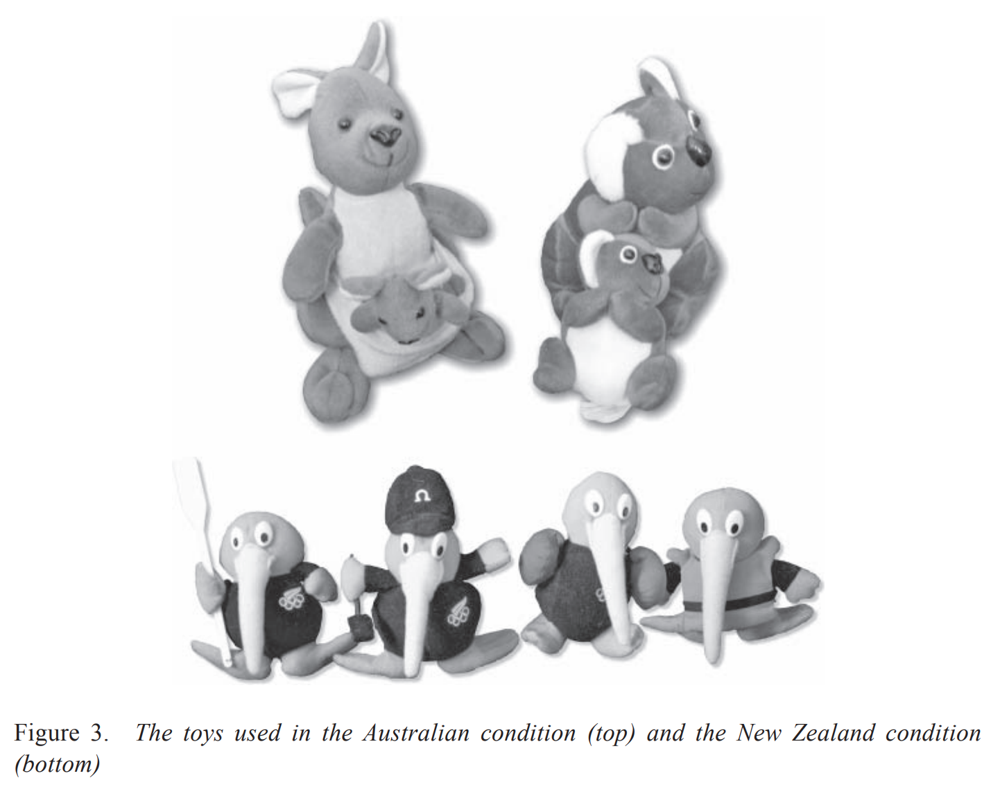

# Equipment

## The short version

Use **external microphones**!

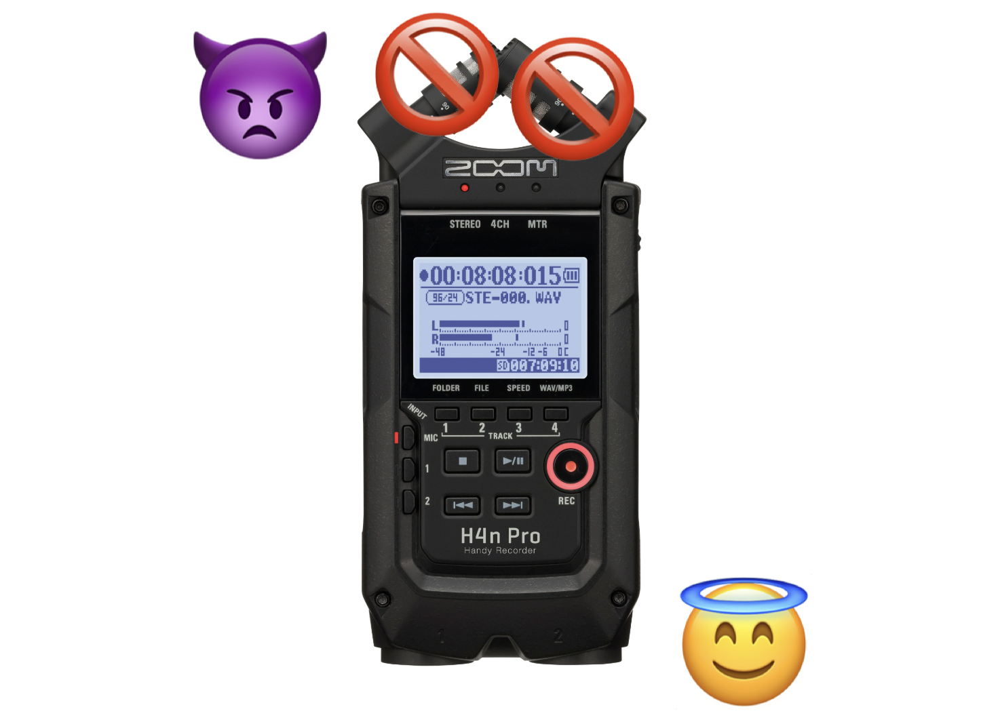

## Key equipment

Most problems can be fixed by using the right **external microphone**; catch less background echo/noise

* Look for **cardioid**, **hypercardioid**, or **unidirectional** microphones for recording single speakers
* **Dynamic** microphones are slightly more expensive, but are less likely to clip than **condenser** microphones
* **Headset** microphones are especially useful since they point at the mouth and block out noise coming from other directions
	* If not suitable, **shotgun** microphones are a second choice since they are usually cardioid in response
* Recording public events may require an **omnidirectional** microphone
* Position and distance of microphone(s) is also very important: avoid clipping, pops, etc

Checking your recording quality with **headphones** can detect unanticipated issues

## Optional, but great, equipment

**Acoustic baffles** to reduce echo or wind noises

* Soft, fluffy objects around the room: blankets, sofas, etc.
	* Avoid hard, smooth surfaces 
	* Cement, tile, plaster, etc are unfortunately extremely common in our field environments
* A **car** with padded seats can function as a soundbooth in a pinch (motor off, windows closed)
* "Dead cats" and "marshmallows": covers for mics which reduce wind/airflow noise

In many cases, **quiet furniture** can be gotten - single-piece plastic chairs that will not creak or squeak

## Sound treatment

Proper **sound treatment** is often possible in the field with some improvisation. At my field site near Douala: 

* Speakers sit facing a wall with added sound treatment
* Locally convenient material is foam mattresses
* Wooden frame constructed to stand one away from a wall
* Chairs are "quiet" one-piece plastic chairs

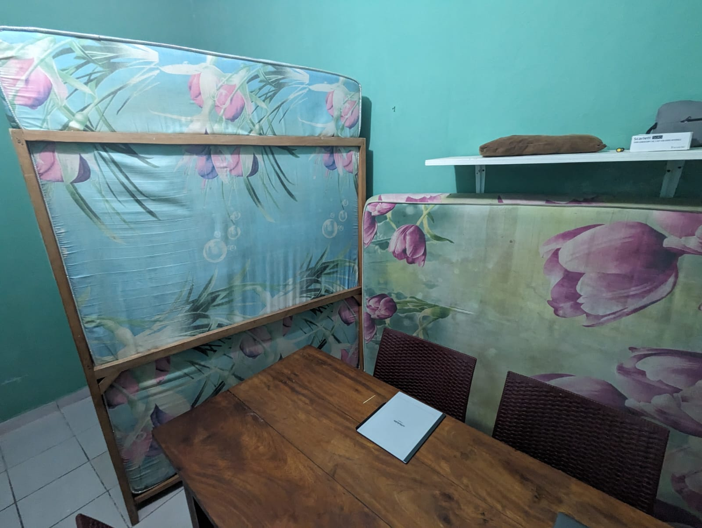

## Recommendations: 

Use the **same equipment in all sessions** if at all possible

* Different microphones and even different recorders are known to affect fine details of recording Vogel et al., 2014; Sanker et al., 2021; Zhang et al., 2021
* This has downstream effects on measures that might be taken Freeman and De Decker, 2021; Penney et al., 2021
	* Basic acoustic measures are only slightly affected
	* But anything involving calculation of derived measures suffers more

Equipment failures happen (in my experience, especially microphones); try to replace with a comparable piece of equipment

# Better audio from elicitation

## Building phonetics corpora

We can build data sets suitable for phonetic analysis from *recordings we already need to make*, if they are recorded properly

* Attention to site design
* Attention to recording equipment and settings
* Some minor structural changes

These do not require major changes to the work we already need to do

## Basic improvements to recording conditions

<audio id="nsunsu" src="./assets/media/nsunsu.wav"></audio>

It is possible to get high-quality data in a  field setting, with relatively few adjustments to elicitation procedures! From my field site, which we saw a few slides ago, 

<button onclick="document.getElementById('nsunsu').play()">this text recording</button>

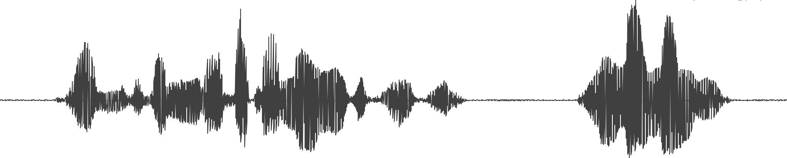

* Zoom H4 audio recorder (WAV, mono, 22.1 khZ sampling)
* Shure SM10A hypercardioid headset microphone worn by speaker
* Mattresses against the wall facing the speaker
* Separate room with closed door (but open window)

## No improvements to conditions

<audio id="fang" src="./assets/media/fang.wav"></audio>

Nearly the same location but with setup with less careful choice of equipment and fewer controls on nearby activities

<button onclick="document.getElementById('fang').play()">This elicitation recording</button>

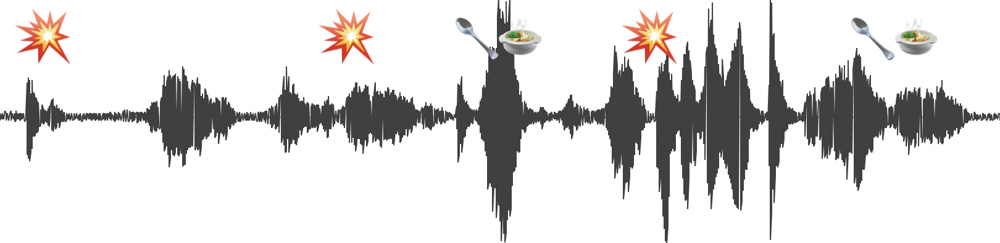

* Zoom H1 recorder (WAV, stereo, 48 kHz sampling)
* No external microphone (H1's internal omnidirectional mics used)
* No sound treatment - echo, rather extensive background noise
	* While it's not always *this* bad, this level of noise applies to a surprising portion of the materials
	* Recording possibly made in a common area or shared room rather than a closed-off room
* Poor signal to noise ratio (note background "fuzz")

Data of this quality is archivable at ELAR, and frequently is archived there!

* ELDP standards for recordings and recording equipment are *not publicly defined* and seem excessively flexible
* To my knowledge they also prioritize capturing a "scene" over ensuring some minimum quality

## The myth of "lab quality"

"Phonetics requires lab data recorded in a sound booth, so why should I even try?"

This is based on an unexamined **myth**: "the laboratory" as an invariant gold standard Latour, 1983; Banaji and Crowder, 1989; Speed et al., 2018; Whalen and McDonough, 2015; Xu, 2010

* Labs *also* have different sources of unmanageable variation in recording quality (background noise, etc)
	* Location near ducts, bathrooms
	* Low-frequency noise from the roof (in the case of my own laboratory)
* Labs are constructed for different purposes/recording quality standards, and according to different financial constraints

Also, phonetics is not always as stringent as people imagine

* The field has somewhat loosened its recording quality standards for interesting field data
* Acknowledging that having more breadth means incorporating field data

# Designing more controlled studies

## Elicitation vs. controlled study

Elicitation:

* Speaker provides materials in a range of contexts
* No special preparation required
* Relatively spontaneous, uncontrolled speech
* Plenty of confounds introduced

Controlled **production study**:

* Speaker provides materials in a specific, pre-agreed context, a **frame sentence**
* Preparation of a **stimulus** set and the frame is required
* Speakers have to be coached
* Very few confounds

## Reasons for controlled production

If you are interested in some very fine phonetic detail, you cannot reasonably expect to be able to observe that detail in uncontrolled, spontaneous speech data: rather difficult to measure

* Phonation differences (modal vs. laryngealized vowels, voiced stops vs. implosives, etc)
* Timecourse differences (partially nasalized segments, etc)
* Some durational differences (especially due to presence of other segments, prosody, etc.)
* Some vowel quality differences (ATR/RTR)

The above is a non-exhaustive list; generally, **anything unclear or unfamiliar**, or which you aren't sure how to characterize, should also be assumed to be like this

You may also not ever get **enough** "naturally occurring" observations of some phenomena to make a clear judgment Xu, 2010

## "Controlled elicitation"

With some slight adjustments to procedure, elicitation recordings can compare favorably to a controlled study, and retain some of elicitation's advantages

* Saves time on designing a study, which might not be possible while on a single field trip
* Speakers are already familiar with elicitation and might not have the same familiarity with controlled studies

## A basic template

The usual steps in elicitation: 

1. Introduce the concept in the language of communication
2. Negotiate how many translations the concept has, and transcribe each of them

Add one more step:

3. **Controlled repetition** phase for each agreed-upon variant
	* Get *multiple repetitions* of each item, 3-5 minimally
	* Pauses between each repetition
	* Optionally, use a **frame sentence** to constrain the surrounding prosodic details and keep the target items surrounded by speech 

## Mundabli (ɲɔ᷆ ⁿdʒāˤn)

A few recent studies of mine have been based on "controlled elicitation" from 1000-item wordlist elicited from four Mundabli speakers

* Thanks to Dwo Evette, Dwo Clifort, Ntambong Irene, Ntemfang Ignatius, who requested acknowledgement
* List developed in part by Nelson C. Tschonghongei (U. Yaoundé) specifically for investigating northern Grassfields Bantu and Beboid languages

Mundabli is Yemne-Kimbi (Bantoid) language spoken in Lower Fungom, Cameroon by ~800 people, now roughly half in diaspora in towns to the west of Douala 

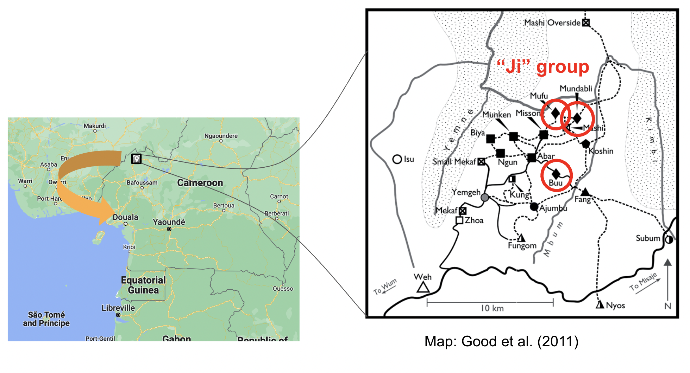

## Research question 1: high vowels

How does Mundabli (Yemne-Kimbi, Cameroon) distinguish its two sets of high vowels? Faytak et al. 2023

* Quite similar to the ear except for noisiness in higher vowels
* Noisier **[i]**, **[u]** versus "lower", less noisy **[ɪ]**, **[ʊ]**

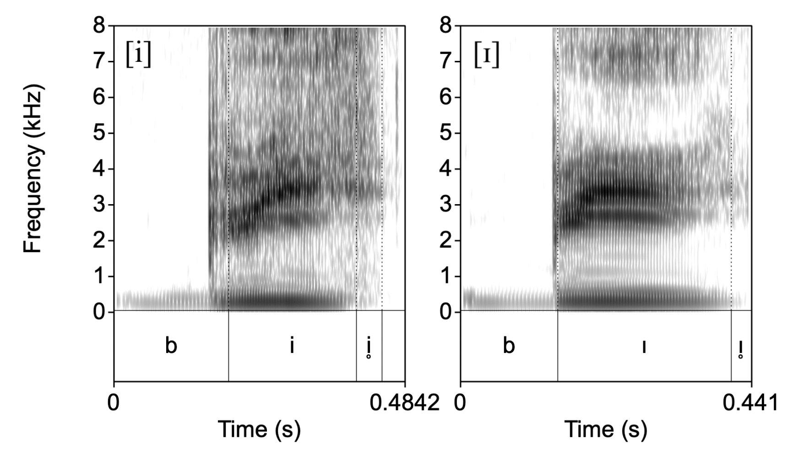
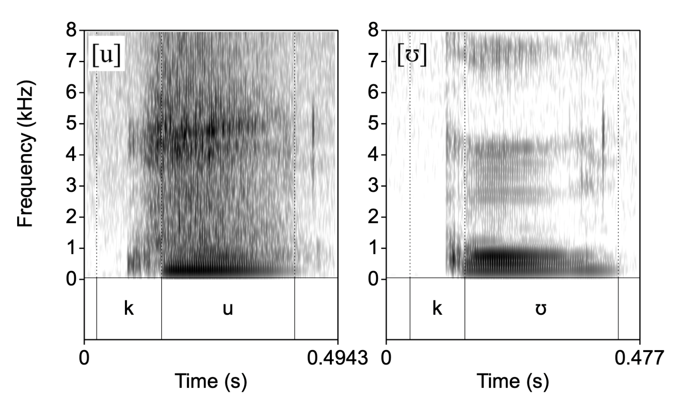

## Research question 1: high vowels

As it turns out: Mundabli seems to use frication as part of the contrast; formants are not reliable to separate the vowels for 1/4 speakers and border on being unreliable for others

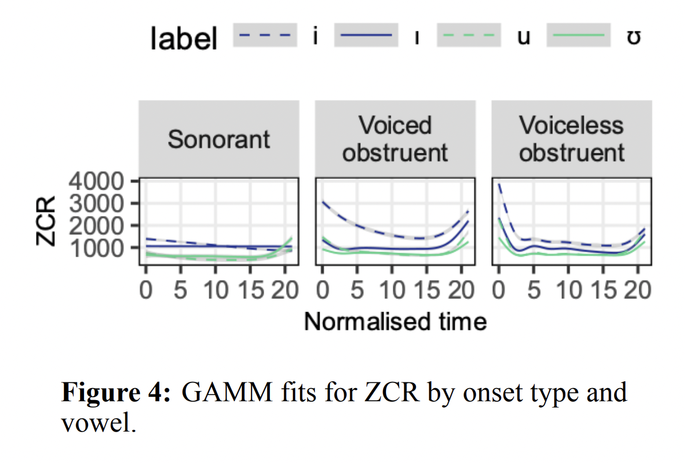
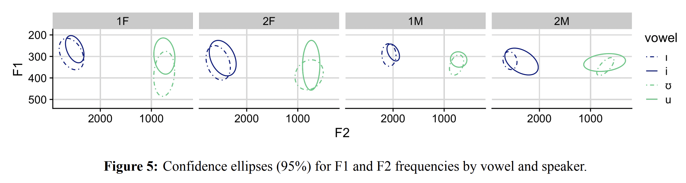

## Research question 2: tone and onset consonants

Is the pitch of Mundabli vowels affected by onset voicing, even with the many tones in the language? Yang & Faytak 2025

* For theoretical reasons, we expect a language with a lot of tones (high functional load) might *limit* the phonetic influence
* Speakers have "phonetic knowledge" of language and plan accordingly Kingston & Diehl 1994; Whalen 1990

Mundabli contrasts numerous surface tones; some tone sandhi processes and grammatical tone as well Voll 2017

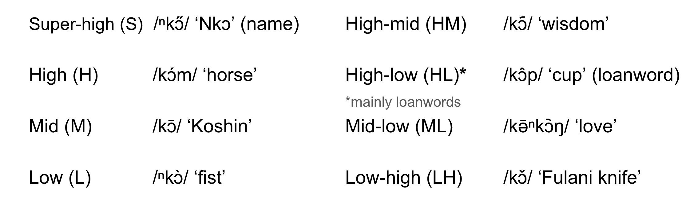

## Research question 2: tone and onset consonants

As it turns out: no, Mundabli **does not** limit the amount of pitch deviation that occurs when the syllable onset is a voiceless obstruent

* Sample results shown for contour tones

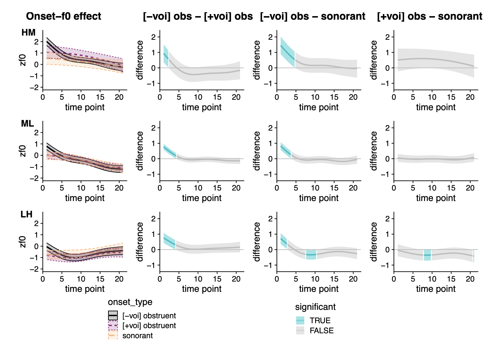

## Designing a controlled production study

For a more precisely controlled study, the question is mainly of **planning**

1. Define your research question(s)
2. Determine how many experimental **conditions** you need to answer the question(s)
	* Ensure you have a suitable **control**
3. Select stimuli around your conditions
	* Remove as many **confounds** as possible
	* Maximize word **types** and repetitions of **tokens** within each condition
4. **Test** with multiple naïve speakers to check for unsuitable stimuli or unexpected variability
5. Finally carry out the study (in the style of elicitation)

## Some typical research questions

Field linguistics is most often concerned with confirming basic characteristics of the language at issue; phonetics is no exception

* Does sound **[A]** have some specific acoustic or articulatory characteristics?
* What is the difference between **[A]** and **[B]**?
* *Are* **[A]** and **[B]** different?
* How do speakers vary in producing **[A]** or **[B]**?

## Confirmatory vs. exploratory research

Basic distinction in the nature of research questions Roettger et al. 2019; Fife & Rodgers 2022

* **Confirmatory** research has specific hypotheses and predictions formulated ahead of any observation
* **Exploratory** research does not (and often cannot) make advance predictions

Linguistics frequently suffers from trying to fit its work into a confirmatory mold when this is not appropriate

* Often takes the form of **HARKing**: Hypothesizing After Results are Known
* Common problem in behavioral science due to perceived prestige of confirmatory work

It's OK to be exploratory! Tukey 1980

* Both are necessary parts of the scientific ecosystem, though they are necessarily distributed differently around
* Exploratory work can form a basis for later confirmatory work
* Results on their own are useful without a hypothesis-shaped justification invented after the fact

## Setting up conditions

**Condition**: category grouping some types, or the context they are produced in, which forms the basis for comparison in analysis

In production experiments, conditions are often simply types of segmental or prosodic **context**, including features that are **simultaneously produced**, which we would expect to induce coarticulation or coproduction

* Some segment (or class) adjacent to some segment (or class)
* Tone or prosodic contrast produced simultaneously with some segment (or class)
* Some feature produced simultaneously with some collection of features
	* e.g. nasalization or other secondary articulation on vowels versus none
	* e.g. RTR vs. plain vowels
	* e.g. implosives vs. plain voiced stops (different laryngeal features)

**Minimize** number of conditions; fight the natural urge to pose lots of small questions in one session by using lots of conditions

## "Canon" of structures

You can also do full "documentation" of some phenomenon as it intersects a variety of structures: very useful for exploratory work when a language has an obviously interesting property which you don't fully understand yet

* All vowels, crossed with different coarticulating consonants
* All tones crossed with onset consonant types
* "Canon" of syllable types differing in some property 
	* e.g. nasality on vowels resulting from NV(C), (C)VN, NVN, oral controls ... 
* etc. 

Especially useful for more exploratory work in the field

* You may not even know what the interesting strcutures to zoom in on are 
* So, recording all of them is a solution

## "Canon" example: Gbagyi

Gbagyi (Nupoid, Nigeria) has interesting syllable structure with respect to nasality: good case study for collecting an entire "canon" of items for later exploratory investigation

* Specific interest is in the realization of the **second** syllable in each item
* Design is broadly syllable nasality shape, crossed with vowel quality, crossed with the consonant's identity
	* Tone is largely uncontrolled
* Presentation of items below reflects Hyman & Magaji (1970) transcription, with **[Cⁿ]** indicating a nasal release

|		| CV	| CṼ	| NV 	|
| ---	| --- 	| --- 	| --- 	|
| /i/ 	| sātī 'Saturday'| * | 	|
| 		| lāàdì 'Sunday' | * | (āɲí 'song') | 
| /a/ 	| pūta᷆ 'leg'		| ótⁿá 'next year'		| 	|
| 		| òdā 'father' 	| ōdⁿā 'stream' | ōná 'fire' | 
| /u/ 	| ɲātú 'poison'	| otⁿú 'wood ash'		| 		|
| 		| ōdú 'heart' 	| òdⁿù 'antelope' | kwánū 'plate' | 

## Control conditions

Analysis of phonetic data essentially always involves **comparisons**; what we compare the condition of interest to is quite important

Experimental comparisons between conditions must involve one or more control conditions: the "absence of conditions"

* Most conditions can be thought of as “the presence of an effect”
* Control can be thought of as the absence of effects present in other conditions

Must compare control to at least one other non-control condition

## Selecting a control

Often requires some area knowledge to select properly: 

* Onset consonants can perturb the pitch of vowels following (even in tonal languages); "rise-fall dichotomy" Hombert 1977, 1978; Gao & Kirby 2024
* Nasals are "neutral" compared to voiceless and voiced obstruents: sonorants do not create any obstacles to the maintenance of voicing and so don't create pitch perturbations Hanson 2009; Kirby & Ladd 2015
* This was crucial to realizing that the size of the raising effect is actually much larger, a finding that has now been replicated several times Hanson 2009; Kirby & Ladd 2015; Yang & Faytak 2025

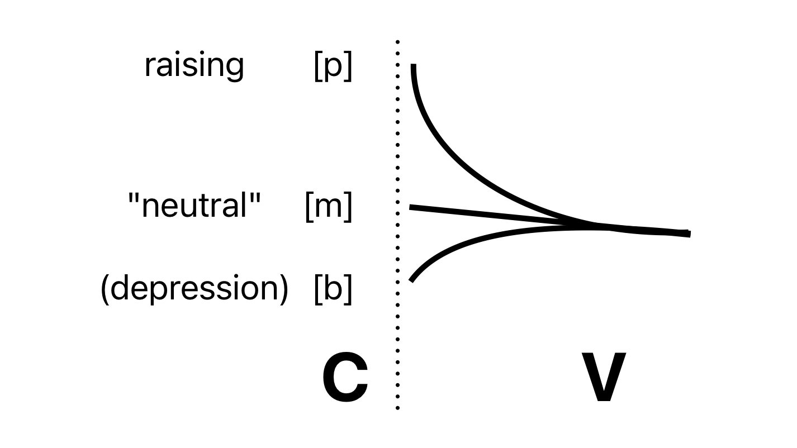

## Choose stimuli based on conditions

Select lexical or phrase data to provide examples of each condition 

* I usually first do exploratory elicitation and transcribe
* Then work from transcribed elicitation materials to design a more controlled study if needed

We have to distinguish **types** (the words used as stimuli) from **tokens** (the actual instances of tokens that are uttered): in general each type should have multiple tokens in a study

* Maximize tokens per condition; also have more than one type per condition (at least 2-3) due to needing to factor out word-specific phonetics in modeling later on, which can include subtle effects of part of speech Gahl 2008, Lohmann 2018 
	* The outcome for some category shouldn't be driven by one (potentially unusual) word, especially since in fieldwork it's not always possible to anticipate a word being unusual
* Get a few dozen tokens (or more) per condition if possible

## Remove confounds 

Variation in context should generally be restricted in materials to prevent **confounds** of the sort of variation or difference being studied

Essentially, keep your items as close to minimal pairs as possible (the motivations are basically the same)

* Segmental factors: surrounding consonants, vowels
* Suprasegmental/prosodic factors: surface or underlying tone, prominence
* Word boundaries and other similar morphological boundaries

Sometimes, it’s not entirely possible to perfectly control for various confounds; in these cases you might **balance** for variables that might influence your results, so that you can see them "colored" by each value across the board

* i.e. if you cannot find lexical items which are tightly controlled for consonant place, then vary the consonant so that each condition has consonants of several places, *evenly distributed*
* Often assumed you will model the effect later and "factor it out"

## Presentation and execution

Designed production studies can be carried out in the same way as elicitation: 

* Set up recording using the methods mentioned earlier
* Prompt speaker to produce a type
* Request multiple tokens after confirming the translation of the type

Keep the list the same across speakers to the extent possible, but randomize the order

* The study's questions, conditions, etc. should not be obvious to speakers
* Normal in field situations, especially for small languages, for speakers to reject a few words
* But don't go too far: if every speaker produces completely different words, it poses some problems for statistical modeling later on

## Controlled study: Mundabli pharyngealized vowels

More precisely designed study: how are Mundabli's pharyngealized vowels produced? Faytak et al. 2024

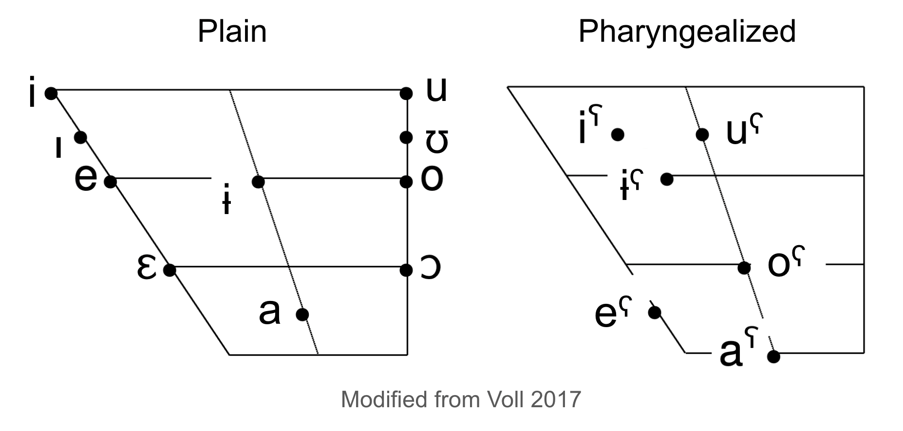

Two lexical items selected (based on elicited corpus) for each vowel category, controlling onset consonant place

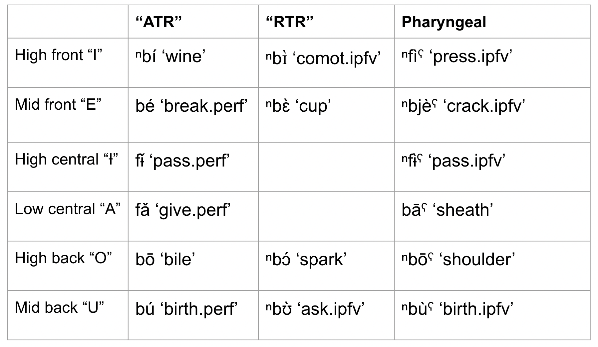

## Controlled study: Mundabli pharyngealized vowels

Some early findings from ongoing work:

* Centralizing effect on formants consistent with pharyngealization
* Not some other articulations like uvularization Evans et al. 2016 

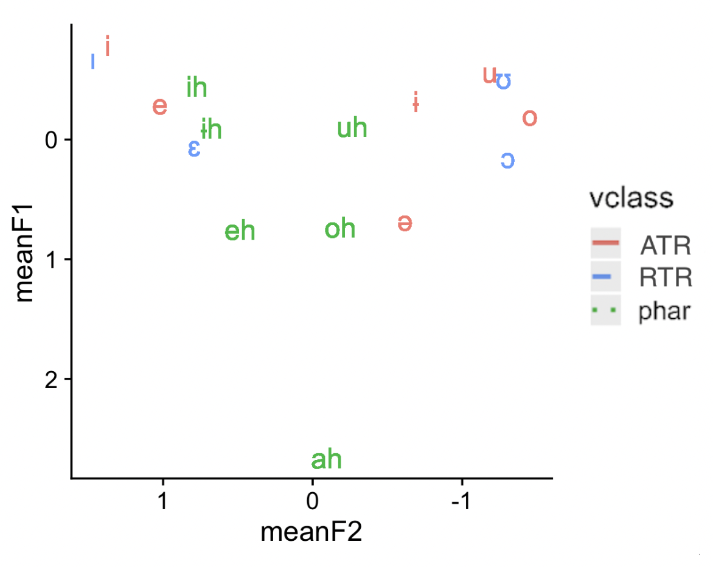

* Voice quality differences are also observed: tenser or creakier voice, which suggests lower vocal tract articulation is truly involved Edmondson et al 2007; Moisik et al. 2021

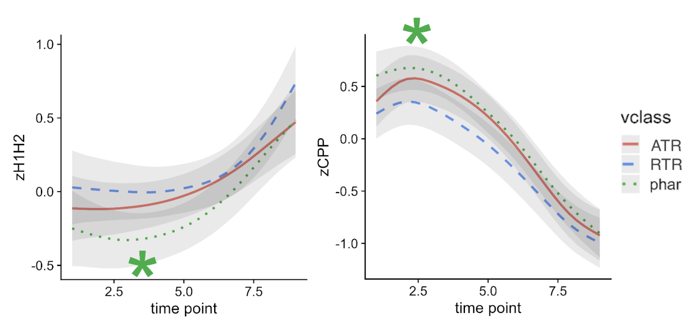

This leaves aside the articulatory component, which has been worked out with ultrasound

## Brainstorm: Build your own

Let's brainstorm a problem from a language of interest and consier:

* What would your research question(s) be?
* How would you design conditions and controls?
* What confounds can be avoided, and which are unavoidable?
* How would the typical presentation of the study work at your field site?

## References

Ameka, F. (2018). From comparative descriptive linguistic fieldwork to documentary linguistic fieldwork in Ghana. University of Hawai’i Press. http://hdl.handle.net/10125/24824

Banaji, M. R., and Crowder, R. G. (1989). The bankruptcy of everyday memory. *American Psychologist*, 44(9), 1185–1193. https://doi.org/10.1037/0003-066X.44.9.1185

Bell, A. (1984). Language Style as Audience Design. *Language in Society*, 13(2), 145–204.

Bottalico, P., Codino, J., Cantor-Cutiva, L. C., Marks, K., Nudelman, C. J., Skeffington, J., Shrivastav, R., Jackson-Menaldi, M. C., Hunter, E. J., and Rubin, A. D. (2020). Reproducibility of Voice Parameters: The Effect of Room Acoustics and Microphones. *Journal of Voice*, 34(3), 320–334. https://doi.org/10.1016/j.jvoice.2018.10.016

Edmondson, J. A., Padayodi, C. M., Hassan, Z. M., & Esling, J. H. (2007). The laryngeal articulator: Source and resonator. In J. Trouvain & W. J. Barry (Eds.), *Proc of the 16th International Congress of Phonetic Sciences* (2065–2068). Saarbrücken, Germany.

Evans, J., Sun, J., Chiu, C., and Liou, M. (2016). Uvular approximation as an articulatory vowel feature. *Journal of the International Phonetic Association* 46(1), pp. 1–31.

Faytak, M., Shao, B., Douanla Taffre, A. and Tschonghongei, N. (2023). Frication and formant frequencies in the Mundabli high vowels. In *Proceedings of ICPhS 20*, Prague.

Faytak, M., Quintana Godoy, M., and Yang, T. (2024). Lingual and epilaryngeal articulation of vowels in Mundabli. In *Proceedings of ISSP 13*.

Faytak, M., Kadavá, Š., Xu, C., Özsoy, O., Akumbu, P., Cardoso, A., Amengual, M., Arvaniti, A., Belz, M., Bevivino, D., Casillas, J., Caudrelier, T., Ćwiek, A., Dokovova, M., Dutta, I., Egurtzegi, A., Forst, H., Foulkes, P., Garcia, R., Grice, M., Hanulíková, A., Hellmuth, S., Kaźmierski, K., Li, X., Lorentzen, J., Mori, M., Nycz, J., Punnoose, R., Quesada Vázquez, L., Rebernik, T., Sawicka-Stępińska, B., Sehyr, Z., Setter, J., Spaniol, M., Urrestarazu-Porta, I., Vella, A., Zhang, C., Zygis, M., Buchanan, E., and Roettger, T. (under review). Big Team Science for language science: opportunities and challenges. *Linguistics*.

Fife, D. A., & Rodgers, J. L. (2022). Understanding the exploratory/confirmatory data analysis continuum: Moving beyond the “replication crisis”. *American Psychologist*, 77(3), 453.

Freeman, V., and De Decker, P. (2021). Remote sociophonetic data collection: Vowels and nasalization from self‐recordings on personal devices. *Language and Linguistics Compass*, 15(7), e12435. https://doi.org/10.1111/lnc3.12435

Gahl, S. (2008). Time and thyme are not homophones: The effect of lemma frequency on word durations in spontaneous speech. *Language*, 84(3), 474-496.

Gao, J. and Kirby, J. (2024). Laryngeal contrast and sound change: The production and perception of plosive
voicing and co-intrinsic pitch. *Language*, 100(1): 124–158.

Good, J., Lovegren, J., Mve, J. P., Nganguep Tchiemouo, C., Voll, R., & Di Carlo, P. (2011). The languages of the Lower Fungom region of Cameroon: Grammatical overview. *Africana Linguistica*, 17, 101-164.

Hanson, H. (2009). Effects of obstruent consonants on fundamental frequency at vowel onset in English. *The Journal of the Acoustical Society of America*, 125(1):425–441.

Hay, J., and Drager, K. (2010). Stuffed toys and speech perception. *Linguistics*, 48(4). https://doi.org/10.1515/ling.2010.027

Hay, J., Drager, K., and Warren, P. (2009). Careful Who You Talk to: An Effect of Experimenter Identity on the Production of the NEAR/SQUARE Merger in New Zealand English. *Australian Journal of Linguistics*, 29(2), 269–285. https://doi.org/10.1080/07268600902823128

Hay, J., Podlubny, R., Drager, K., and McAuliffe, M. (2017). Car-talk: Location-specific speech production and perception. *Journal of Phonetics*, 65, 94–109. https://doi.org/10.1016/j.wocn.2017.06.005

Hombert, J. (1977). Consonant Types, Vowel Height and Tone in Yoruba. *Studies in African Linguistics*, 8(2): 173–190.

Hombert, J. (1978). Consonant types, vowel quality, and tone. In Fromkin, V., ed, *Tone: A Linguistic Survey*: 77–111. Academic Press, New York.

Hurring, G., Hay, J., Drager, K., Podlubny, R., Manhire, L., and Ellis, A. (2022). Social Priming in Speech Perception: Revisiting Kangaroo/Kiwi Priming in New Zealand English. *Brain Sciences*, 12(6), 684. https://doi.org/10.3390/brainsci12060684

Hyman, L. and Magaji, D. (1970). *Essentials of Gwari Grammar.* Ibadan University Press. 

Kingston, J., & Diehl, R. L. (1994). Phonetic knowledge. *Language*, 70(3), 419-454.

Kirby, J. and Ladd, D. (2015). Stop voicing and F0 perturbations: Evidence from French and Italian. In *Proceedings of the ICPhS 18*, Glasgow. 

Labov, W. (1991). *Sociolinguistic patterns*. Univ. of Pennsylvania Press.

Ladefoged, P. (1968). *A phonetic study of West African languages: An auditory-instrumental survey.* Cambridge University Press. 

Latour, B. (1983). Give Me a Laboratory and I Will Raise the World. In K. Knorr-Cetina and M. J. Mulkey (Eds.), *Science observed: Perspectives on the social study of science* (pp. 141–170). SAGE. 

Lohmann, A. (2018). Cut (n) and cut (v) are not homophones: Lemma frequency affects the duration of noun–verb conversion pairs. *Journal of Linguistics*, 54(4), 753-777.

Maddieson, I. & Sands, B. (2019). The sounds of the Bantu languages. In Van de Velde, M., Bostoen, K., Nurse, D., & Philippson, G., eds., *The Bantu Languages: Second Edition*, 79-127. Routledge. <a href="https://www.researchgate.net/profile/Bonny-Sands/publication/323369007_The_sounds_of_the_Bantu_languages/links/5a906c28aca2721405622bfb/The-sounds-of-the-Bantu-languages.pdf">Preprint PDF</a>

Moisik, S. R., Czaykowska-Higgins, E., & Esling, J. H. (2021). Phonological potentials and the lower vocal tract. *Journal of the International Phonetic Association*, 51(1), 1-35.

Penney, J., Gibson, A., Cox, F., Proctor, M., and Szakay, A. (2021). A Comparison of Acoustic Correlates of Voice Quality Across Different Recording Devices: A Cautionary Tale. In *Proceedings of Interspeech 2021*, 1389–1393. https://doi.org/10.21437/Interspeech.2021-729

Roettger, T. B., Winter, B., & Baayen, H. (2019). Emergent data analysis in phonetic sciences: Towards pluralism and reproducibility. *Journal of Phonetics*, 73, 1-7.

Sanker, C., Babinski, S., Burns, R., Evans, M., Johns, J., Kim, J., Smith, S., Weber, N., and Bowern, C. (2021). (Don’t) try this at home! The effects of recording devices and software on phonetic analysis: Supplementary material. *Language*, 97(4). https://doi.org/10.1353/lan.2021.0079

Speed, L. J., Wnuk, E., and Majid, A. (2018). Studying psycholinguistics out of the lab. In A. De Groot and P. Hagoort (Eds.), *Research methods in psycholinguistics and the neurobiology of language: A practical guide* (pp. 190–207). Wiley-Blackwell.

Tukey, J. W. (1980). We need both exploratory and confirmatory. *The American Statistician*, 34(1), 23-25.

Voll, R. (2017). *A grammar of Mundabli: a Bantoid (Yemne-Kimbi) language of Cameroon.* PhD dissertation, U of Leiden. 

Vogel, A. P., Rosen, K. M., Morgan, A. T., and Reilly, S. (2014). Comparability of Modern Recording Devices for Speech Analysis: Smartphone, Landline, Laptop, and Hard Disc Recorder. *Folia Phoniatrica et Logopaedica*, 66(6), 244–250. https://doi.org/10.1159/000368227

Whalen, D. H. (1990). Coarticulation is largely planned. *Journal of Phonetics*, 18(1), 3-35.

Whalen, D. H., and McDonough, J. (2015). Taking the Laboratory into the Field. *Annual Review of Linguistics*, 1(1), 395–415. https://doi.org/10.1146/annurev-linguist-030514-124915

Whalen, D. H., DiCanio, C., & Dockum, R. (2020). Phonetic documentation in three collections: Topics and evolution. *Journal of the International Phonetic Association*, 52(1), 1-27. <a href="https://doi.org/10.1017/S0025100320000079">Abstract</a>

Xu, Y. (2010). In defense of lab speech. *Journal of Phonetics*, 38(3), 329–336. https://doi.org/10.1016/j.wocn.2010.04.003

Yang, T. and Faytak, M. (2025). Onset-tone interaction in Mundabli. In *Proceedings of the Linguistic Society of America*, 10(1): 5895. 

Zee, E. (1981). Effect of vowel quality on perception of post–vocalic nasal consonants in noise. *Journal of Phonetics*, 9(1), 35-48. <a href="https://doi.org/10.1016/S0095-4470(19)30925-8">Abstract</a>

Zhang, C., Jepson, K., Lohfink, G., and Arvaniti, A. (2021). Comparing acoustic analyses of speech data collected remotely. *The Journal of the Acoustical Society of America*, 149(6), 3910–3916. https://doi.org/10.1121/10.0005132