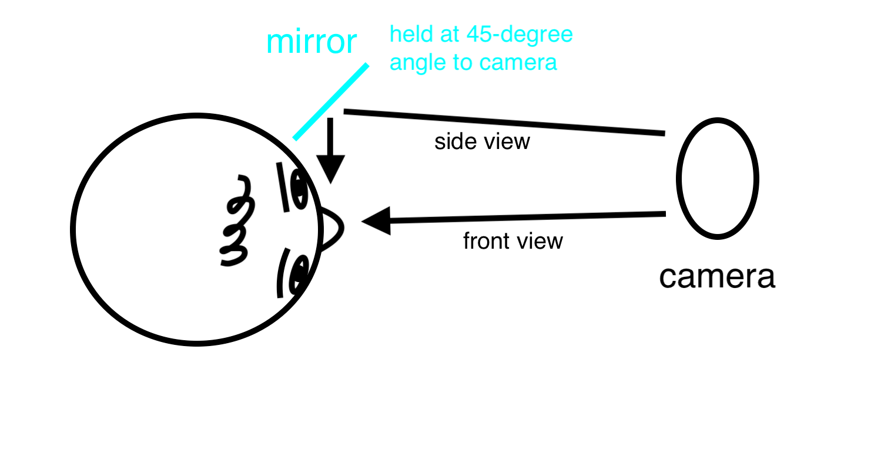
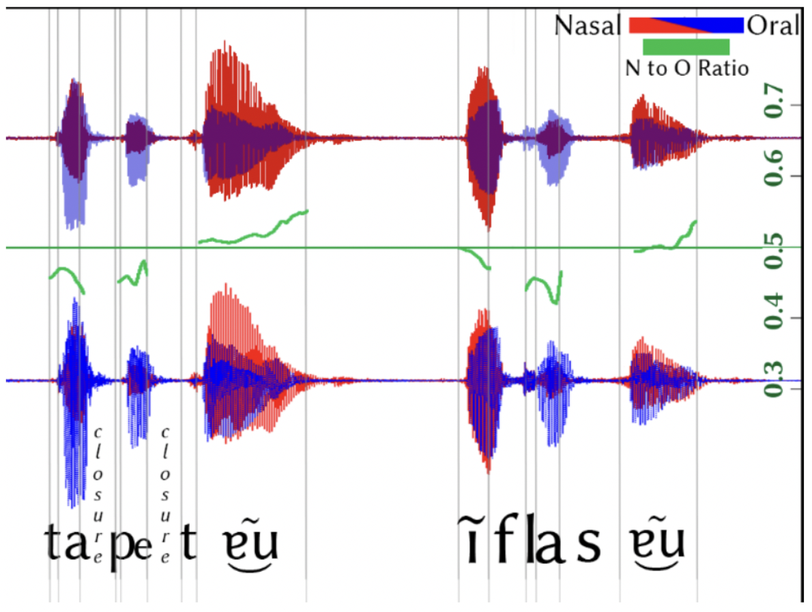
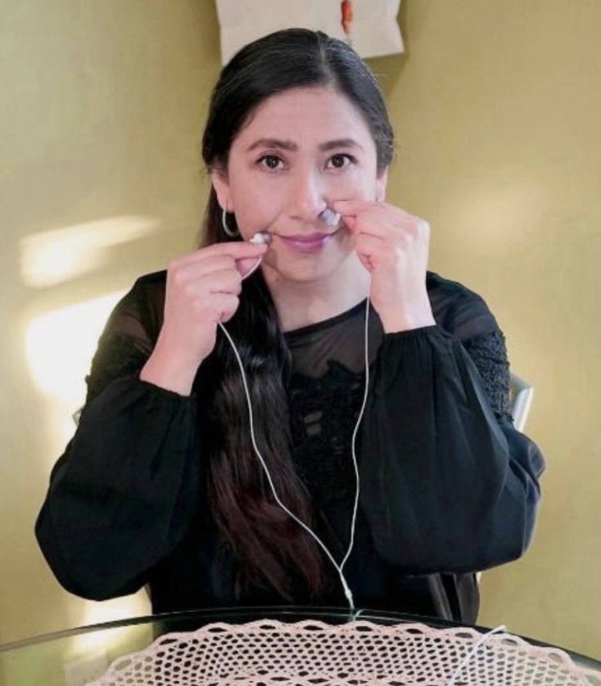
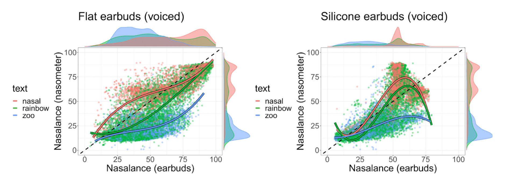

% Practical field phonetics II
% Matthew Faytak, LLACAN
% 4-5 June 2025

## Overview

Day 2 of the workshop is shorter, and focused on recording articulatory and quasi-articulatory data with practical methods

* Some practical considerations for video data
* Imaging lip articulation
* Static palatography
* Nasometry, mainly microphone-based nasometry 

There is an optional "hackathon" after we are finished with these slides

* Stimulus design 
* Material 

## Acoustics vs. articulation

Acoustics gives us an **indirect idea** of the movements of the articulators

Sometimes, though, we need to look *directly at* the articulators

* If there are multiple explanations for acoustics
* If the examined sounds are totally unfamiliar or especially unusual

We point out here that characterizing and measuring some articulations is **much easier** than usually expected

* Lip articulation
* Palatography
* Basically **photography**
	* With whichever resources are on hand
	* All of my personal examples shown here are shot on a phone camera

# Lip articulation

## Lip articulation

Lips can easily be filmed or photographed during speech, since they are on the exterior of the face

* Mirror positioned 45 degree angle provides an additional side view of the lips
* Stabilizing the speaker's head and the camera are the only challenges (so that they remain in view of the mirror)

## Vowel postures

Example: Babanki lip articulation during vowels Faytak & Akumbu (2021)

* Rounded [u] (right) can be contrasted with labiodental [ʉᵛ] (left) and bilabial compressed [ʉᵝ] (center)
* Superscripted letters are ad-hoc diacritics to indicate lip posture

## Vowel postures

Lip activity during Medumba [ʉ]: *compressed* in the direction of a bilabial stop Olson & Meynadier (2015)

* Relaxed lower lip often leads to bilabial trill [ʙ] during vowel figure from Olson & Meynadier (2015)
* Compression vs. rounding totally unexplored for most Bantoid languages with a so-called /ʉ/, but in many cases this has proven to be a lip-compressed vowel
	* More people should look into this!

Subtle lip posture differences also known to occur on various fricatives and approximants

* Differences in posture *enhance* the contrast between labiodental /f, v/ and bilabial fricatives /ɸ, β/ in Ewe, Kwangali, ruGciriku, etc. Ladefoged 1968, 1990; Utman & Blumstein 1994
* 

## Model use

For faster articulations, short videos can also be useful

* Video of a Mono speaker producing a labial flap Olson & Hajek 1999
* Word is [àⱱétòɾò] "stick used in animal trap" (video repeats)

<iframe width="1264" height="552" src="https://www.youtube.com/embed/3j1i1dVDqgs?rel=0&Version=3&loop=1&playlist=3j1i1dVDqgs" frameborder="0" allow="autoplay; encrypted-media" allowfullscreen></iframe>

# Palatography

## Palatography

A "tongue-print" on the roof of the mouth which shows where articulatory activity takes place Anderson (2008)

* Stop and fricative place
* Certain aspects of vowel articulation

The method is more involved than simple photography:

1. Paint tongue with mixture of oil and dark edible powder (unsweetened chocolate or charcoal)
2. Speaker produces a single token of a word with *one* lingual consonant
3. Open mouth, insert mirror, photograph or take short video
4. Clean the speaker's mouth (eating some pineapple is very effective)

## Examples

Frequently used for clear evidence of **place** for coronal consonants

* Dental vs. (post)alveolar stop contrast in Lusoga Nabirye et al. (2016)

## Examples

<audio id="goat" src="./assets/media/kom-goat.wav"></audio>

<audio id="kola" src="./assets/media/kom-kola.wav"></audio>

Kom exhibits a contrast between two vowels which can be illuminated by palatography

* Regular [i], as in <button onclick="document.getElementById('kola').play()"> [ībi᷇] 'kola nut'</button>
* Fronted, fricativized [i̟], as in <button onclick="document.getElementById('goat').play()"> [ə̄bí̟] 'goat'</button>

* Contrasts like these turn out to be quite frequent in the northern Cameroon Grassfields area (as well as other adjacent areas such as Lower Fungom)
* Compare the [z͡i] vowels observed in Len Mambila and Limbum Fransen (1995); Nforgwei (2004); Connell (2007); Lewis & Shittu (2014)

## Deriving measures from images

How to handle multiple images, if you manage to take a lot? You might convert these to **tabular data** for further analysis

* Measure the size of some physical attribute and enter that into a spreadsheet
* For example, measure *ratio* of lip opening width to lip width in pixels
	* This normalizes for speaker size and for position (head tilt, here) figure from Olson & Meynadier (2015)
* Can also then make a plot in R, or similar software

# Nasometry

## Ratio measure of nasalance

Provides a measure of nasalance, or proportion of acoustic signal received by nasal channel

* Separately record acoustics of oral and nasal channels with two microphones:
* Normalize channel intensity (to adjust for microphone position, etc.)
* Calculate the ratio of nasal to oral channel intensity

This measure is very generally used to gauge acoustic nasality, sometimes on band-pass filtered signals Fletcher 1970; Audibert & Amelot 2011

* There are other, more complicated, ways to measure the acoustics of a signal to determine whether it is nasal Styler 2017; Carignan 2021

## Example

Green line tracks the ratio of nasal to oral: higher means more nasalized (louder acoustic signal in the nasal channel)
Stewart & Kohlberger 2017

## "Classic" acoustic nasalance hardware

The most important part of this is the hardware, which should ensure good separation of the oral and nasal signals, and record them at the appropriate gains

Kay Pentax Nasometer: two precisely calibrated microphones separated by an ergonomic baffle plate (to separate the nasal and oral signals)

<iframe width="601" height="339" src="https://www.youtube.com/embed/7FHBeia2x9E" title="Nasometer Video" frameborder="0" allow="accelerometer; autoplay; clipboard-write; encrypted-media; gyroscope; picture-in-picture; web-share" referrerpolicy="strict-origin-when-cross-origin" allowfullscreen></iframe>

## Less expensive approaches

It's possible to manufacture a baffle plate and provide your own microphones

Homemade versions e.g. Alves de Oliveira 2022

Nosey: 3D printed version of the Nasometer Dewhurst et al. 2025

## Earbuds method

A somewhat more radical approach: earbud headphones, held up to the face or (in the case of the oral channel) stuck into one nostril Audibert & Amelot 2011; Stewart & Kohlberger 2017; Bruil & Stewart 2022

* Earbuds can be configured as an audio input rather than an output, effectively acting as two microphones
* Details in Stewart & Kohlberger (2017)
* Silicone tip earbuds specifically recommended

## Earbuds method, pros/cons

Pro: 

* Robust to the demands of fieldwork scenarios
* Cheap, easily replaced, extremely portable
* Similar in setup and concept to more complex nasometers, though lacking the acoustic baffle plate
* Simple to learn and not intimidating for participants

Con:

* Earbuds aren’t assessed for fit with ground truth measures (nasometer); basically no calibration
* Different nasometer setups are also subject to similar consistency issues, though they can be fixed using special calibration software Awan & Virani 2013; Bressman & Tang 2024 
* Earbuds could introduce much larger inconsistencies (variability in placement, manufacturing quality, etc)

Because this could become a popular field phonetic method, any **biases** in collected data could be a huge issue for our understanding of under-studied languages

## Validation of the earbud method

Carignan (2024) checks earbuds against the measurements of a nasometer 

* Glottal Enterprises NAS-1 sep handheld nasometer, signal recorded with earbuds also attached to face
* Two types: silicone and flat: taped below, rather than placed inside, the nostril
	* Taping is probably better than holding them up to the face! Consistent placement; prevent speaker fatigue 
* Recorded with and without the nasometer also raised to the face

## Results

**Flat** earbuds (not silicone tipped) have a generally more accurate response

Flat earbuds are also better at tracking change over time

# Equipment

## Equipment

Most of what we've talked about today involves **minimal equipment**

* Smartphone camera, digital camera, or digital camcorder
* **Dental mirror**: or hand-held metal mirror, about 6cm wide and 12cm long
  * Held outside for lip angles
  * Inserted against upper molars for palatography
* Edible pigment (chocolate powder, edible charcoal) for palatography, plus oil, small cups (etc)
* A brush for painting the tongue (I prefer a narrow paintbrush or a makeup brush)

Optional:

* Phone tripod or camera tripod
* Photography lighting

## Nasometry details

Based on Carignan (2024): 

* Use flat earbuds; provide a more accurate assessment of nasality compared to silicone earbuds: opposite conclusion of Stewart & Kohlberger (2017)
* Consider manufacturing a baffle plate as well
* Specific brands/makes of earbuds may need to be tested; *very* cheap ones may not be worth using due to variable manufacturing quality
	* Treat like the microphones they are: use the *same earbuds* for an entire study 
	* Mark the specific earbuds always used for nasal/oral (do not swap!)

## References

Alves de Oliveira, R. (2022). *Fonética e fonologia da Língua Aikanã.* PhD Dissertation, Universidade Federale de Pernambuco. https://repositorio.ufpe.br/handle/123456789/49913

Anderson, V. (2008). Static palatography for language fieldwork. *Language Documentation & Conservation*, 2(1), 1-27. <a href="https://scholarspace.manoa.hawaii.edu/handle/10125/1808">PDF</a>

Audibert, Nicolas, and Angélique Amelot. 2011. Comparison of nasalance measurements from accelerometers and microphones and preliminary development of novel features. *INTERSPEECH 2011 - 12th Annual Conference of the International Speech Communication Association.*

Awan, S. N., & Virani, A. (2013). Nasometer 6200 versus Nasometer II 6400: Effect on measures of nasalance. The Cleft Palate-Craniofacial Journal, 50(3), 268-274.

Bressmann, T., & Tang, B. H. Y. (2024). Differences in nasalance scores obtained with different Nasometer headsets. Clinical Linguistics & Phonetics, 1-11.

Bruil, M., & Stewart, J. (2022). Phonetics and phonology of nasality in Ecuadorian Siona. Phonological Data and Analysis, 4(3), 1-34.

Carignan, C. (2021). A practical method of estimating the time-varying degree of vowel nasalization from acoustic features. The Journal of the Acoustical Society of America, 149(2), 911-922.

Carignan, C. (2024). Ground-truth validation of the “earbuds method” for measuring acoustic nasalance. The Journal of the Acoustical Society of America, 156(2), 851-864.

Connell, B. (2007). Mambila fricative vowels and Bantu spirantisation. *Africana Linguistica*, 13(1), 7-31. <a href="https://www.persee.fr/doc/aflin_2033-8732_2007_num_13_1_969">Article</a>

Dewhurst, M., Collins, J., Lo, J., Alderton, R., and Kirkham, S. (2025). Nosey: Open-source hardware for acoustic nasalance. arXiv preprint, to appear in Proceedings of Interspeech 2025, Rotterdam: 
https://doi.org/10.48550/arXiv.2505.23339 

Faytak, M., & Akumbu, P. W. (2021). Kejom (Babanki). *Journal of the International Phonetic Association*, 51(2), 333-354. <a href="https://doi.org/10.1017/S0025100319000264">Article</a>

Fletcher, S. G. (1970). Theory and instrumentation for quantitative measurement for nasality. The Cleft palate journal, 7(2), 601-609.

Fransen, M. (1995). A Grammar of Limbum: A Grassfields Bantu Language Spoken in the North-West Province of Cameroon. PhD dissertation, Vrije Universitet Amsterdam.

Ladefoged, P. (1968). *A phonetic study of West African languages: An auditory-instrumental survey.* Cambridge University Press. 

Ladefoged, P. (1990). What do we symbolize? Thoughts prompted by bilabial and labiodental fricatives. *Journal of the International Phonetic Association*, 20(2), 32-36. <a href="https://doi.org/10.1017/S0025100300004254">Abstract</a> &nbsp;&nbsp;&nbsp; <a href="https://escholarship.org/content/qt8j00q68c/qt8j00q68c.pdf#page=11">Preprint PDF</a>

Lewis, D., & Shittu, S. (2014). Phonemic Status of Len Fricative-Vowels. *Ibadan Journal of Humanities Studies*, 24, 27-45. <a href="https://d1wqtxts1xzle7.cloudfront.net/58083355/Lewis-Shittu_Fricative-Vowels-with-cover-page-v2.pdf?Expires=1647723825&Signature=Na3aiC4CnjsqrlzOpWavRK62Me6X0qua9u5-rENtVXcw9Kc-dYEeTPz9QdgVH-M7ItxnzH024r4yndu8wHw~p1wY4CrAKFzDx566C~h8N8prQozt8mtuY6nnF4Q7VLO9-bLyRyS-NyELxQpNdqHXIaS2-EZc3GPGTdTgC9NXew~Sy9nx6JZ~EyWZLLRJ0-6Vs-M53Jw35TTD1tJEK7aXx8oQXFcYdes6AvQ5dSBMJ-auwVKYagml3V9IHt1cwHm5aw6G-bb5vfpEgl1o1SoVKxoaOKJjzKU~cv3NU~hP1yFlaY8hrMXIg-pRf~pVLNNlMsQXguo5eSmuzDnonz-KzQ__&Key-Pair-Id=APKAJLOHF5GGSLRBV4ZA">PDF</a>

Nabirye, M., de Schryver, G., & Verhoeven, J. (2016). Lusoga (Lutenga). *Journal of the International Phonetic Association*, 46(2), 219-228. <a href="https://doi.org/10.1017/S0025100315000249">Abstract & PDF</a>

Nforgwei, S. (2004). A study of the phonological and syntactic processes in the standardisation of Limbum. PhD dissertation, Université de Yaoundé. <a href="https://pure.mpg.de/rest/items/item_403491/component/file_403490/content">PDF</a>

Olson, K. S., & Hajek, J. (1999). The phonetic status of the labial flap. *Journal of the International Phonetic Association*, 29(2), 101-114.

Olson, K. & Meynadier, Y. (2015) On Medumba bilabial trills and vowels. *Proceedings of ICPhS 18*, Glasgow. <a href="https://hal.archives-ouvertes.fr/hal-01211220/file/2015_ICPhS_Olson.pdf">PDF</a>

Stewart, Jesse & Martin Kohlberger. 2017. Earbuds: A Method for Analyzing Nasality in the Field. Language Documentation & Conservation 11. 49-80.

Styler, W. (2017). On the acoustical features of vowel nasality in English and French. The Journal of the Acoustical Society of America, 142(4), 2469-2482.

Utman, J., & Blumstein, S. (1994). The influence of language on the acoustic properties of phonetic features: A study of the feature [strident] in Ewe and English. *Phonetica*, 51(4), 221-238. <a href="https://doi.org/10.1159/000261978">Abstract</a>

